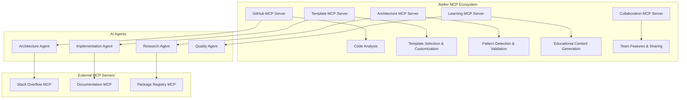

# MCP Servers & AI Agents Integration Strategy for Atelier

## What are MCP Servers and AI Agents?

### Model Context Protocol (MCP)
MCP is an open standard that enables developers to build secure, two-way connections between their data sources and AI-powered tools. Think of MCP like a USB-C port for AI applications - it provides a standardized way to connect AI models to external data sources and systems.

### AI Agents
AI agents are autonomous software entities that perceive environments, make decisions, and act to achieve goals. In 2025, these agents are becoming fully autonomous AI programs that can scope out projects and complete them with all necessary tools.

## Why This is Revolutionary for Atelier

### Current vs. MCP-Powered Architecture

**Traditional Approach:**
```
User Request → AI Model → Response
(Limited context, no tool access)
```

**MCP-Powered Approach:**
```
User Request → AI Agent → MCP Server → External Tools/Data → Intelligent Action
(Rich context, tool integration, autonomous execution)
```

## Strategic Integration Plan for Atelier

### Phase 1: Core MCP Server Implementation (Months 1-3)

#### 1. **GitHub MCP Server**
```typescript
// Custom GitHub MCP Server for Atelier
class AtelierGitHubMCPServer {
  async analyzeRepository(repoUrl: string) {
    return {
      architecture: await this.detectArchitecture(),
      dependencies: await this.analyzeDependencies(),
      codeQuality: await this.assessCodeQuality(),
      suggestions: await this.generateSuggestions()
    };
  }
  
  async generateRefactorPlan(currentState: any, targetPattern: string) {
    return {
      steps: [...],
      fileChanges: [...],
      migrationGuide: [...]
    };
  }
}
```

#### 2. **Template Management MCP Server**
```typescript
class TemplatesMCPServer {
  async selectBestTemplate(requirements: ProjectRequirements) {
    // AI agent analyzes requirements and selects optimal template
    return await this.aiAgent.analyze({
      requirements,
      availableTemplates: this.templateRegistry,
      bestPractices: this.knowledgeBase
    });
  }
  
  async customizeTemplate(template: Template, customizations: any) {
    // Autonomous template modification based on specific needs
    return await this.templateEngine.customize(template, customizations);
  }
}
```

### Phase 2: Autonomous Architecture Agent (Months 4-6)

#### **The Architecture Analyst Agent**
```typescript
class ArchitectureAnalystAgent {
  private mcpServers: MCPServer[];
  
  async analyzeProject(projectPath: string): Promise<ArchitectureReport> {
    const tasks = [
      this.codeAnalysisMCP.scanCodebase(projectPath),
      this.dependencyMCP.analyzeDependencies(projectPath),
      this.patternMCP.detectPatterns(projectPath),
      this.qualityMCP.assessQuality(projectPath)
    ];
    
    const results = await Promise.all(tasks);
    
    return {
      currentArchitecture: this.synthesizeFindings(results),
      issues: this.identifyIssues(results),
      recommendations: await this.generateRecommendations(results),
      migrationPlan: await this.createMigrationPlan(results)
    };
  }
  
  async executeRefactoring(plan: RefactoringPlan): Promise<RefactoringResult> {
    // Autonomous code refactoring with human approval gates
    for (const step of plan.steps) {
      const approval = await this.requestHumanApproval(step);
      if (approval) {
        await this.fileSystemMCP.executeChanges(step.changes);
        await this.testingMCP.runTests();
      }
    }
  }
}
```

### Phase 3: Multi-Agent Ecosystem (Months 7-9)

#### **Specialized Agent Squad**

```typescript
// Agent orchestration system
class AtelierAgentOrchestrator {
  private agents = {
    architect: new ArchitectureAgent(),
    researcher: new ResearchAgent(),
    implementer: new ImplementationAgent(),
    tester: new TestingAgent(),
    documenter: new DocumentationAgent()
  };
  
  async handleFeatureRequest(request: FeatureRequest) {
    // Research phase
    const research = await this.agents.researcher.investigate({
      feature: request.description,
      currentArchitecture: request.projectContext,
      constraints: request.constraints
    });
    
    // Architecture planning
    const architecturePlan = await this.agents.architect.design({
      feature: request,
      research: research,
      existingSystem: request.projectContext
    });
    
    // Implementation planning
    const implementationPlan = await this.agents.implementer.plan({
      architecture: architecturePlan,
      codebase: request.projectContext
    });
    
    // Testing strategy
    const testingStrategy = await this.agents.tester.strategize({
      implementation: implementationPlan,
      existingTests: request.projectContext.tests
    });
    
    return {
      research,
      architecturePlan,
      implementationPlan,
      testingStrategy,
      documentation: await this.agents.documenter.create({
        feature: request,
        architecture: architecturePlan,
        implementation: implementationPlan
      })
    };
  }
}
```

### Phase 4: Advanced Autonomous Features (Months 10-12)

#### **Self-Healing Architecture Agent**
```typescript
class SelfHealingAgent {
  async monitorProjectHealth(projectId: string) {
    const healthCheck = await this.performHealthCheck(projectId);
    
    if (healthCheck.issues.length > 0) {
      const healingPlan = await this.generateHealingPlan(healthCheck.issues);
      
      // Auto-fix low-risk issues
      const autoFixable = healingPlan.filter(issue => issue.risk === 'low');
      await this.autoFix(autoFixable);
      
      // Suggest fixes for medium/high-risk issues
      await this.notifyUser({
        issues: healingPlan.filter(issue => issue.risk !== 'low'),
        suggestions: await this.generateSuggestions(healingPlan)
      });
    }
  }
}
```

## MCP Server Architecture for Atelier

### Core MCP Servers You Should Build



### Implementation Strategy

#### 1. **Start with GitHub MCP Server**
```bash
# Install MCP SDK
npm install @modelcontextprotocol/sdk

# Create your first MCP server
mkdir atelier-github-mcp
cd atelier-github-mcp
npx create-mcp-server@latest
```

#### 2. **Build Custom MCP Servers**
```typescript
// Example: Architecture Analysis MCP Server
import { MCPServer } from '@modelcontextprotocol/sdk';

class ArchitectureMCPServer extends MCPServer {
  constructor() {
    super({
      name: "atelier-architecture-server",
      version: "1.0.0"
    });
    
    this.addTool({
      name: "analyze_architecture",
      description: "Analyze project architecture and suggest improvements",
      inputSchema: {
        type: "object",
        properties: {
          projectPath: { type: "string" },
          analysisType: { type: "string", enum: ["full", "quick", "security"] }
        }
      }
    });
  }
  
  async handleToolCall(name: string, args: any) {
    switch (name) {
      case "analyze_architecture":
        return await this.analyzeArchitecture(args.projectPath, args.analysisType);
      default:
        throw new Error(`Unknown tool: ${name}`);
    }
  }
}
```

## Practical Implementation Timeline

### Month 1-2: Foundation
- ✅ Set up MCP development environment
- ✅ Create basic GitHub MCP server for repository analysis
- ✅ Implement simple architecture detection
- ✅ Connect MCP server to Claude for initial testing

### Month 3-4: Agent Development
- ✅ Build first autonomous agent for template selection
- ✅ Create architecture analysis agent with MCP integration
- ✅ Implement basic agent-to-agent communication
- ✅ Add human approval gates for agent actions

### Month 5-6: Multi-Agent System
- ✅ Deploy multi-agent architecture with specialized roles
- ✅ Implement agent orchestration system
- ✅ Create agent collaboration protocols
- ✅ Add advanced MCP servers for external data

### Month 7-8: Advanced Features
- ✅ Self-healing architecture monitoring
- ✅ Autonomous refactoring with safety checks
- ✅ Advanced learning and adaptation capabilities
- ✅ Community MCP server integration

## Cost and Resource Considerations

### Development Costs
```
MCP Server Development: $200-500/month
- Cloud hosting for MCP servers
- Development tools and testing
- External API integrations

AI Agent Infrastructure: $300-800/month
- Agent orchestration hosting
- Increased AI API usage
- Database for agent memory/context

Total Additional Cost: $500-1300/month at scale
```

### Resource Requirements
- **Development Time**: +40% for MCP/Agent features
- **Complexity**: Significant increase in system complexity
- **Maintenance**: Ongoing MCP server updates and agent tuning

## Benefits for Atelier Users

### Immediate Value
- **Autonomous Project Analysis**: Agents analyze entire codebases automatically
- **Smart Template Selection**: AI chooses optimal templates based on deep requirement analysis
- **Contextual Recommendations**: MCP servers provide rich context for better suggestions

### Advanced Capabilities
- **Self-Improving Architecture**: Systems that learn and adapt over time
- **Autonomous Refactoring**: Safe, AI-driven code improvements
- **Intelligent Feature Planning**: Agents that research and plan implementation strategies

## Risk Mitigation

### Technical Risks
- **Complexity Management**: Start simple, add complexity gradually
- **Agent Reliability**: Implement extensive testing and approval gates
- **MCP Server Stability**: Use established patterns and thorough error handling

### User Experience Risks
- **Over-Automation**: Always keep human control and oversight
- **Trust Building**: Transparent agent actions with clear explanations
- **Fallback Systems**: Manual overrides for all agent actions

## Conclusion

MCP servers and AI agents represent the future of developer tooling. For Atelier, they offer:

1. **Unprecedented Automation**: From project analysis to implementation guidance
2. **Rich Context Integration**: Connect to any external tool or data source
3. **Autonomous Learning**: Systems that improve with usage
4. **Scalable Architecture**: Modular, extensible design

The key is to implement these technologies thoughtfully, starting with simple use cases and gradually building more sophisticated autonomous capabilities while maintaining user control and trust.