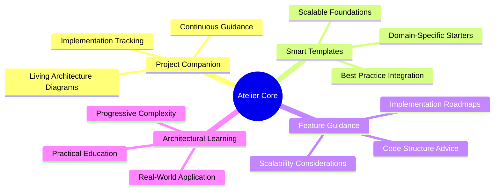
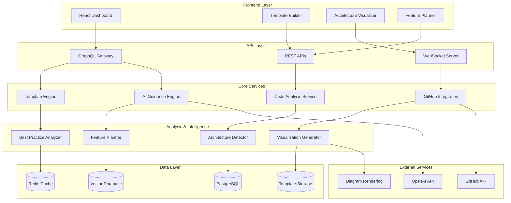
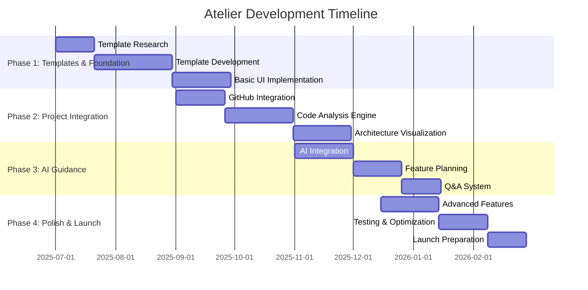
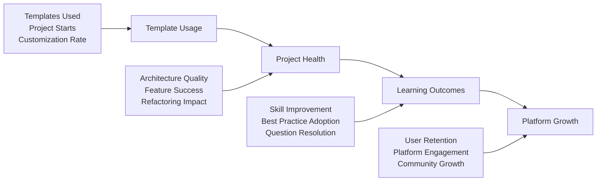

# 🏗️ Atelier: Intelligent Project Architecture Platform

**"Where Projects Evolve — Mastering Architecture Through Practice"**

*Transforming how developers learn and maintain architectural excellence in their personal projects*

---

🌟 **[Visit Atelier](#)** | 📖 **[Documentation](#)** | 🚀 **[Get Started](#)** | 💬 **[Community](#)**

---

## 🎯 Why "Atelier"?

The name **Atelier** (pronounced *ah-tel-YAY*) comes from the French word for "workshop" or "studio" — traditionally a space where artists, craftspeople, and apprentices gather to learn, create, and perfect their craft under the guidance of master artisans.

### The Perfect Metaphor for Modern Software Development

- **🎨 Living Workshop**: Your projects become ongoing learning environments where architecture evolves with guidance
- **👨‍🏫 Continuous Mentorship**: AI-powered architectural guidance that grows with your project
- **🔧 Hands-On Mastery**: Learn by doing, with real-time feedback on your actual code
- **📈 Progressive Learning**: Start simple, scale complex, always with best practices
- **⚡ Practical Craftsmanship**: Architecture skills learned through real project implementation

*Atelier embodies our refined vision: a companion platform where architectural mastery is developed through continuous practice on real projects.*

---

## 📑 Table of Contents

<strong>Click to expand full navigation</strong>

1. [🎯 Executive Summary](#-executive-summary)
2. [🌍 Background & Motivation](#-background--motivation)
3. [🎯 Core Vision & Objectives](#-core-vision--objectives)
4. [🗺️ Development Roadmap](#️-development-roadmap)
5. [🏗️ System Architecture](#️-system-architecture)
6. [⏱️ Implementation Timeline](#️-implementation-timeline)
7. [👥 Resource Requirements](#-resource-requirements)
8. [⚠️ Risk Analysis & Mitigations](#️-risk-analysis--mitigations)
9. [📊 Success Metrics](#-success-metrics)
10. [🔄 Evaluation & Iteration](#-evaluation--iteration)
11. [🎉 Conclusion & Next Steps](#-conclusion--next-steps)

---

## 🎯 Executive Summary

### The Refined Vision
Atelier is your project's architectural companion — a platform that maintains, visualizes, and guides the architectural evolution of your personal projects. Instead of starting from scratch each time, developers get continuous architectural mentorship that ensures they build and scale with best practices from day one.

### The Core Solution
A focused platform that:
- 🏗️ **Architectural Visualization**: Maintains living architecture diagrams of your projects
- 🤖 **Smart Guidance**: AI-powered answers to architectural questions and implementation doubts
- 📋 **Feature Implementation Guides**: Detailed, scalable implementation plans for new features
- 🎯 **Template-Driven Start**: Curated project templates for different domains (web, mobile, etc.)

### The Focused Impact
- **For Developers**: Learn architecture through continuous practice on real projects
- **For Projects**: Maintain architectural integrity as complexity grows
- **For Learning**: Bridge theory and practice through hands-on guidance

---

## 🌍 Background & Motivation

### 🚀 The Real Problem with Personal Projects

<table>
<tr>
<th>Current Reality</th>
<th>Atelier Solution</th>
</tr>
<tr>
<td>
• Start with messy code structure 
• No architectural planning 
• Hard to add features later 
• Projects become unmaintainable 
• Learning happens in isolation
</td>
<td>
• Start with proven templates 
• Continuous architectural guidance 
• Scalable feature implementation 
• Maintain clean architecture 
• Learn through guided practice
</td>
</tr>
</table>

### 🎯 Market Opportunity

> **2.5M+** developers work on personal projects annually  
> **60%** of personal projects are abandoned due to architectural debt  
> **80%** of developers learn architecture through trial and error  
> **$450M** market size for developer productivity tools

### 🔍 The Specific Problem We Solve

**Developers Struggle With:**
- 🏗️ Starting projects with good architectural foundations
- 📈 Maintaining clean architecture as projects grow
- ❓ Knowing the "right way" to implement new features
- 🔄 Refactoring without breaking existing functionality
- 📚 Connecting architectural theory to real implementation

**Our Solution Provides:**
- 🎯 Template-driven project initialization with best practices
- 📊 Visual architecture maintenance and evolution tracking
- 🤖 On-demand architectural guidance for any question
- 📋 Scalable feature implementation roadmaps
- 🎓 Learn-by-doing architectural education integrated into workflow

---

## 🎯 Core Vision & Objectives

### 🎯 Primary Mission

### 🔧 Core Technical Objectives

1. **🎯 Template-Driven Project Initialization**
   - Curated templates for web, mobile, API, and full-stack projects
   - Domain-specific best practices built-in
   - Scalable folder structures and architectural patterns

2. **📊 Living Architecture Visualization**
   - Auto-generated architecture diagrams from code analysis
   - Real-time updates as projects evolve
   - Component relationship mapping and dependency tracking

3. **🤖 Contextual Architectural Guidance**
   - AI-powered answers to specific implementation questions
   - Project-aware recommendations based on current architecture
   - Best practice suggestions for common architectural decisions

4. **📋 Scalable Feature Implementation Plans**
   - Detailed guides for adding new features
   - Consideration of existing architecture and scalability
   - Step-by-step implementation with code examples

5. **🔄 Continuous Architectural Health Monitoring**
   - Detect architectural debt and suggest refactoring
   - Monitor complexity growth and recommend improvements
   - Track adherence to established patterns and conventions

---

## 🗺️ Development Roadmap

### 🚀 Phase-by-Phase Evolution

<strong>Phase 1: Foundation & Core Templates (Months 1-3)</strong>

#### 🎯 Focus: Project Template System
- **Template Library**: 5 high-quality templates (React SPA, Node.js API, Full-stack, Mobile React Native, Python API)
- **Template Engine**: Interactive questionnaire system for project customization
- **Architecture Patterns**: Built-in best practices for each template type
- **Basic Visualization**: Simple architecture diagrams for template structures

#### 📊 Success Criteria
- ✅ 5 production-ready templates with different complexity levels
- ✅ Template customization through guided questionnaires
- ✅ Basic architecture visualization for template structures
- ✅ 50+ developers successfully start projects using templates

#### 🛠️ Technical Implementation
- Template management system with version control
- Interactive questionnaire UI with conditional logic
- Basic code generation and project scaffolding
- Simple architecture diagram generation

<strong>Phase 2: Project Integration & Tracking (Months 4-6)</strong>

#### 🎯 Focus: Project Connection & Monitoring
- **GitHub Integration**: Connect existing projects for architectural analysis
- **Code Analysis**: Automatic architecture detection and visualization
- **Project Dashboard**: Overview of project health and architecture
- **Basic Guidance**: Simple Q&A system for architectural questions

#### 📊 Success Criteria
- ✅ Seamless GitHub repository integration
- ✅ Automatic architecture analysis for common patterns
- ✅ Project health dashboard with key metrics
- ✅ 200+ projects connected and analyzed

#### 🛠️ Technical Implementation
- GitHub OAuth and webhook integration
- Static code analysis for architecture detection
- Architecture visualization engine
- Basic AI integration for Q&A

<strong>Phase 3: Intelligent Guidance System (Months 7-9)</strong>

#### 🎯 Focus: AI-Powered Architectural Assistance
- **Smart Q&A**: Context-aware answers to architectural questions
- **Feature Planning**: AI-generated implementation guides for new features
- **Best Practice Suggestions**: Proactive recommendations for improvements
- **Learning Integration**: Educational content linked to real implementation

#### 📊 Success Criteria
- ✅ AI system provides relevant, project-specific architectural advice
- ✅ Feature implementation guides with 85%+ satisfaction rate
- ✅ Proactive suggestions leading to measurable code quality improvements
- ✅ 70% of users report learning new architectural concepts

#### 🛠️ Technical Implementation
- Advanced AI integration with project context
- Feature planning and implementation guide generation
- Learning content management system
- User feedback and recommendation improvement loop

<strong>Phase 4: Advanced Features & Scaling (Months 10-12)</strong>

#### 🎯 Focus: Enhanced Capabilities & Growth
- **Advanced Visualizations**: Interactive architecture diagrams and dependency maps
- **Refactoring Guidance**: Intelligent suggestions for architectural improvements
- **Team Collaboration**: Basic sharing and collaboration features
- **Template Marketplace**: Community-contributed templates and patterns

#### 📊 Success Criteria
- ✅ Advanced visualization tools with interactive exploration
- ✅ Successful refactoring guidance with measurable improvements
- ✅ Active community contributing templates and patterns
- ✅ 1,000+ active projects using the platform

#### 🛠️ Technical Implementation
- Advanced visualization rendering engine
- Refactoring analysis and suggestion system
- Community features and template sharing
- Performance optimization for scale

---

## 🏗️ System Architecture

### 🎨 High-Level Architecture Overview

### 🔧 Refined Technology Stack

<table>
<tr>
<th>Layer</th>
<th>Technology</th>
<th>Purpose</th>
</tr>
<tr>
<td><strong>Frontend</strong></td>
<td>React 18 + TypeScript Next.js for SSR Tailwind CSS React Flow for diagrams</td>
<td>Modern UI with server-side rendering Interactive architecture visualization</td>
</tr>
<tr>
<td><strong>Backend</strong></td>
<td>Node.js + Express tRPC for type-safe APIs Prisma ORM</td>
<td>Type-safe full-stack development Database management</td>
</tr>
<tr>
<td><strong>Analysis</strong></td>
<td>Tree-sitter for code parsing Custom AST analysis OpenAI GPT-4 for guidance</td>
<td>Code structure analysis Intelligent recommendations</td>
</tr>
<tr>
<td><strong>Database</strong></td>
<td>PostgreSQL Redis for caching S3 for file storage</td>
<td>Relational data Performance optimization Template and asset storage</td>
</tr>
<tr>
<td><strong>Infrastructure</strong></td>
<td>Vercel for frontend Railway for backend GitHub Actions for CI/CD</td>
<td>Scalable hosting Automated deployments</td>
</tr>
</table>

---

## ⏱️ Implementation Timeline

### 📅 12-Month Student Development Schedule

### 🎯 Detailed Phase Implementation

<strong>Phase 1: Template Foundation (Months 1-3)</strong>

#### 🎯 Focus: High-Quality Template System
**Time Commitment**: 15-20 hours/week

**Key Activities**:
- Research and analyze 20+ popular project structures
- Create 5 production-ready templates with best practices
- Build interactive template customization system
- Implement basic architecture visualization

**Deliverables**:
- ✅ 5 templates: React SPA, Node.js API, Full-stack (MERN), React Native, Python FastAPI
- ✅ Template questionnaire system for customization
- ✅ Basic architecture diagram generation
- ✅ Template preview and comparison interface

**Student Budget**: $50-100/month (hosting, design tools)

**Tech Focus**: React, Node.js, template engines, basic visualization

<summary"><strong>Phase 2: Project Integration (Months 4-6)</strong>

#### 🎯 Focus: Real Project Connection
**Time Commitment**: 20-25 hours/week

**Key Activities**:
- Implement GitHub OAuth and repository integration
- Build code analysis engine for architecture detection
- Create project dashboard with health metrics
- Develop architecture visualization system

**Deliverables**:
- ✅ GitHub repository connection and analysis
- ✅ Automatic architecture detection for common patterns
- ✅ Interactive architecture diagrams
- ✅ Project health dashboard

**Student Budget**: $100-150/month (AI APIs, enhanced hosting)

**Tech Focus**: GitHub API, AST parsing, visualization libraries, database design

<strong>Phase 3: AI Guidance Engine (Months 7-9)</strong>

#### 🎯 Focus: Intelligent Architectural Assistance
**Time Commitment**: 20-25 hours/week

**Key Activities**:
- Integrate AI for project-specific architectural guidance
- Build feature implementation planning system
- Create contextual Q&A interface
- Develop learning content integration

**Deliverables**:
- ✅ AI-powered architectural Q&A system
- ✅ Feature implementation guide generation
- ✅ Contextual best practice recommendations
- ✅ Integrated learning content

**Student Budget**: $150-200/month (increased AI usage)

**Tech Focus**: OpenAI API integration, prompt engineering, context management

<strong>Phase 4: Advanced Features & Launch (Months 10-12)</strong>

#### 🎯 Focus: Polish and Scale Preparation
**Time Commitment**: 25-30 hours/week

**Key Activities**:
- Implement advanced visualization features
- Add refactoring guidance capabilities
- Build community features for template sharing
- Optimize performance and prepare for scale

**Deliverables**:
- ✅ Interactive architecture exploration tools
- ✅ Refactoring suggestions and guidance
- ✅ Community template marketplace
- ✅ Production-ready platform launch

**Student Budget**: $200-250/month (scaling infrastructure)

**Tech Focus**: Performance optimization, community features, advanced visualizations

### 💰 Refined Budget Breakdown

**Total Investment Over 12 Months**: $1,500 - $2,500

| Phase | Monthly Cost | Key Expenses |
|-------|-------------|--------------|
| **Months 1-3** | $50-100 | Domain, hosting, basic tools |
| **Months 4-6** | $100-150 | Enhanced hosting, GitHub API, database |
| **Months 7-9** | $150-200 | AI APIs, advanced features |
| **Months 10-12** | $200-250 | Scaling, optimization, launch |

### 🎯 Key Success Milestones

| Milestone | Target Date | Success Criteria |
|-----------|-------------|------------------|
| **Template System** | Month 3 | ✅ 5 working templates, 20+ test projects created |
| **Project Integration** | Month 6 | ✅ 50+ GitHub repos analyzed, architecture visualization working |
| **AI Guidance** | Month 9 | ✅ 100+ Q&A interactions, 80% satisfaction rate |
| **Platform Launch** | Month 12 | ✅ 500+ registered users, 100+ active projects |

---

## 👥 Resource Requirements

### 🧑‍💻 Team Structure (Recommended)

**Solo Development (Months 1-6)**:
- Full-stack development
- Template creation and curation
- Basic AI integration

**Small Team Expansion (Months 7-12)**:
- **Lead Developer (You)**: Architecture, AI integration, backend
- **Frontend Developer**: UI/UX, visualization, user experience
- **Optional: Designer**: UI/UX design, template aesthetics

### 🛠️ Technical Infrastructure

**Development Tools**:
- VS Code with extensions for full-stack development
- GitHub for version control and project management
- Figma for UI/UX design
- Linear or Notion for project management

**Core Services**:
- Vercel for frontend hosting (free tier initially)
- Railway or Render for backend hosting
- Supabase or PlanetScale for database
- OpenAI API for AI features

---

## ⚠️ Risk Analysis & Mitigations

### 🎯 Technical Risks

<strong>🔧 Code Analysis Complexity</strong>

**Risk**: Difficulty accurately analyzing diverse project structures and generating meaningful architecture insights.

**Probability**: Medium | **Impact**: High

**Mitigation Strategies**:
- ✅ Start with common, well-defined patterns (React, Node.js, etc.)
- ✅ Build template-first approach to establish known structures
- ✅ Use established AST parsing libraries (Tree-sitter, Babel parser)
- ✅ Implement fallback to manual architecture definition
- ✅ Focus on popular frameworks with predictable patterns

**Contingency Plan**: Manual architecture definition interface, gradual automation of analysis

<strong>💸 AI Cost Management</strong>

**Risk**: Uncontrolled AI API costs as usage scales.

**Probability**: Medium | **Impact**: Medium

**Mitigation Strategies**:
- ✅ Implement intelligent caching for similar questions
- ✅ Use tiered pricing with usage limits
- ✅ Batch non-urgent requests
- ✅ Implement cost monitoring and alerts
- ✅ Offer freemium model with AI usage limits

**Contingency Plan**: Rate limiting, premium AI features, rule-based fallbacks

### 🏢 Product Risks

<strong>🎯 Template Quality & Maintenance</strong>

**Risk**: Templates become outdated or don't reflect current best practices.

**Probability**: Medium | **Impact**: Medium

**Mitigation Strategies**:
- ✅ Regular template updates with community input
- ✅ Version control for templates with migration guides
- ✅ Community contribution system for template improvements
- ✅ Automated testing for template generation
- ✅ Expert review process for template changes

**Contingency Plan**: Community-driven template maintenance, expert advisory board

<strong>🔄 Feature Scope Creep</strong>

**Risk**: Expanding beyond core mission and losing focus.

**Probability**: High | **Impact**: Medium

**Mitigation Strategies**:
- ✅ Clear product roadmap with defined scope
- ✅ Regular feature priority reviews
- ✅ User feedback to validate new features
- ✅ Focus on core value proposition
- ✅ Phased feature rollout with success metrics

**Contingency Plan**: Feature sunset process, core product refocus

---

## 📊 Success Metrics

### 🎯 Core Success Indicators

### 📈 Key Performance Indicators

**Template & Project Metrics**:
- **📊 Template Adoption**: 500+ projects started from templates in first 6 months
- **🎯 Project Success Rate**: 70% of projects remain active after 30 days
- **📋 Feature Implementation**: 85% satisfaction rate with AI-generated feature guides
- **🏗️ Architecture Quality**: 60% improvement in code organization metrics

**Learning & Engagement Metrics**:
- **🎓 Skill Development**: 40% improvement in architecture knowledge assessments
- **❓ Guidance Effectiveness**: 90% of architectural questions answered satisfactorily
- **🔄 Best Practice Adoption**: 65% of recommendations implemented by users
- **📈 Platform Engagement**: 4+ sessions per user per month average

**Growth & Retention Metrics**:
- **👥 User Growth**: 1,000+ registered users by month 12
- **🔄 Monthly Retention**: 60% of users active month-over-month
- **⭐ User Satisfaction**: 4.5+ star rating with 80% recommendation rate
- **🚀 Viral Coefficient**: 0.3+ (every 10 users bring 3 new users)

---

## 🔄 Evaluation & Iteration

### 📊 Continuous Improvement Process

**Monthly Reviews**:
- User analytics and behavior analysis
- Template usage patterns and success rates
- AI guidance quality assessment
- Technical performance metrics

**Quarterly Planning**:
- Feature prioritization based on user feedback
- Template library expansion and updates
- Technical debt assessment and resolution
- Growth strategy adjustment

**User Feedback Integration**:
- In-app feedback collection for all major features
- Regular user interviews and surveys
- Community feedback through Discord/forums
- A/B testing for major feature changes

---

## 🎉 Conclusion & Next Steps

### 🎯 Refined Vision Summary

Atelier's focused approach addresses the core problem of architectural learning through practical application. By maintaining project architecture, providing intelligent guidance, and offering quality templates, we create a sustainable learning loop that improves with each project.

### 🚀 Immediate Next Steps

1. **📝 Validate the Concept** (Week 1-2)
   - Survey 20+ developers about their project architecture challenges
   - Analyze popular project templates and identify patterns
   - Research existing solutions and identify gaps

2. **🛠️ Technical Preparation** (Week 3-4)
   - Set up development environment and tools
   - Create initial project structure and repository
   - Design database schema for templates and projects

3. **🎯 Template Development** (Month 1)
   - Create first high-quality template (React + Node.js)
   - Implement basic template customization system
   - Test template with 5+ real project implementations

4. **📊 Architecture Foundation** (Month 2)
   - Build code analysis engine for template-based projects
   - Create basic architecture visualization
   - Implement project dashboard interface

### 🎯 Long-Term Success Factors

- **Focus on Quality**: Better to have 5 excellent templates than 20 mediocre ones
- **User-Centric Development**: Regular feedback and iteration based on real usage
- **Sustainable Growth**: Gradual feature expansion without losing core value
- **Community Building**: Foster a community of practice around architectural excellence

### 🌟 Final Thought

This refined approach transforms Atelier from a complex, multi-faceted platform into a focused, valuable tool that solves a specific problem exceptionally well. By maintaining this focus while gradually expanding capabilities, you'll build a sustainable platform that truly helps developers master architectural thinking through practice.

The key to success lies in execution excellence on the core features rather than trying to build everything at once. Start small, validate quickly, and iterate based on real user needs and feedback.