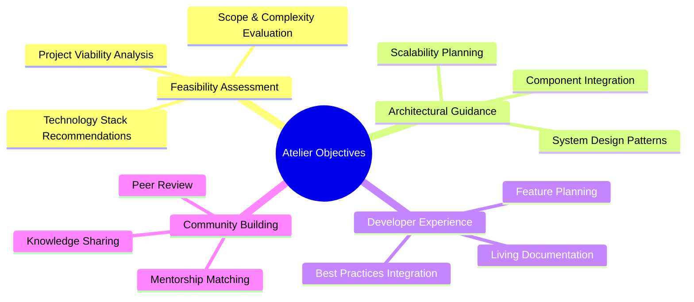
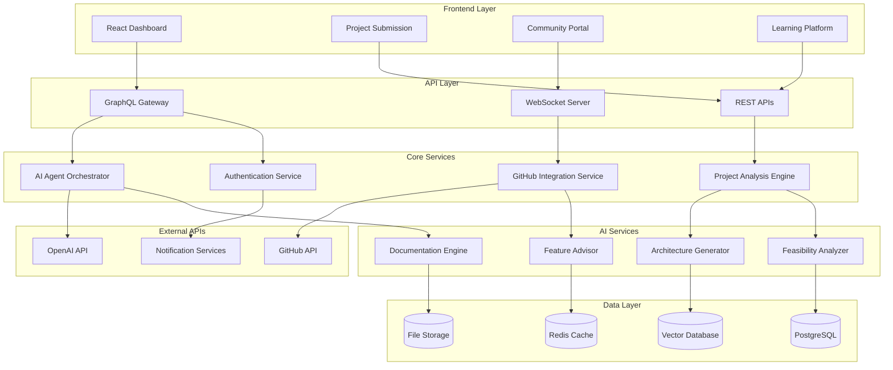
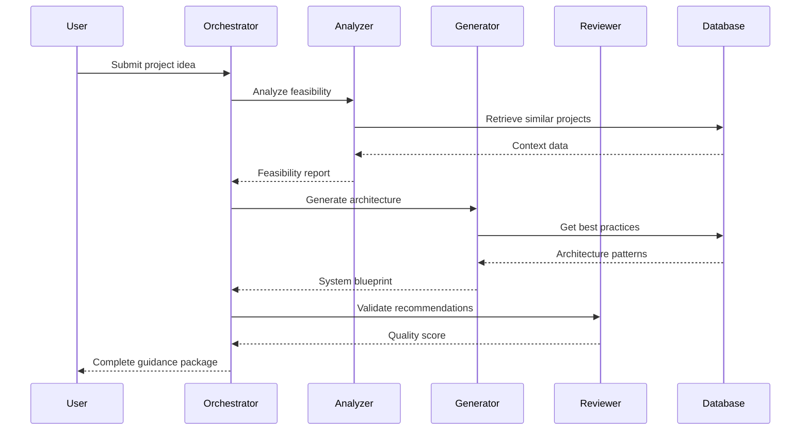
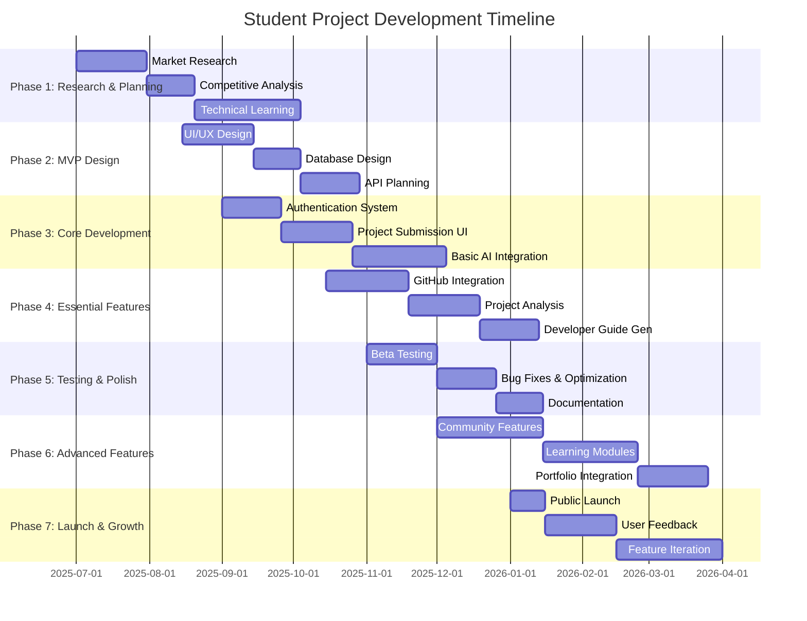
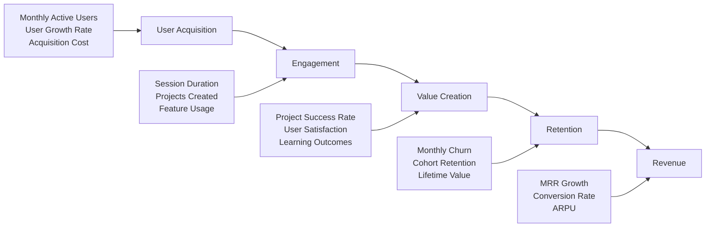

# 🏗️ Atelier: Intelligent Project Architecture Platform

**"Where Ideas Take Shape — Crafting Tomorrow's Software Architects"**

*Transforming the way students and developers learn, design, and implement software architecture in the age of AI*

---

🌟 **[Visit Atelier](#)** | 📖 **[Documentation](#)** | 🚀 **[Get Started](#)** | 💬 **[Community](#)**

---

## 🎯 Why "Atelier"?

The name **Atelier** (pronounced *ah-tel-YAY*) comes from the French word for "workshop" or "studio" — traditionally a space where artists, craftspeople, and apprentices gather to learn, create, and perfect their craft under the guidance of master artisans.

### The Perfect Metaphor for Modern Software Development

- **🎨 Creative Workshop**: Just as painters learn composition and technique in an atelier, developers learn architectural patterns and design principles
- **👨‍🏫 Master-Apprentice Model**: Our AI-powered guidance acts as the experienced mentor, providing personalized instruction and feedback
- **🔧 Hands-On Learning**: Theory meets practice in a supportive environment where ideas transform into tangible projects
- **🤝 Community of Practice**: Peer learning, collaboration, and knowledge sharing are fundamental to the atelier experience
- **⚡ Modern Craftsmanship**: In the AI era, software architecture becomes the new artisanal skill — requiring creativity, judgment, and deep understanding

*Atelier embodies our vision: a digital workshop where the craft of software architecture is learned, practiced, and perfected.*

---

## 📑 Table of Contents

<strong>Click to expand full navigation</strong>

1. [🎯 Executive Summary](#-executive-summary)
2. [🌍 Background & Motivation](#-background--motivation)
3. [🎯 Core Objectives](#-core-objectives)
4. [🗺️ Development Roadmap](#️-development-roadmap)
5. [🏗️ System Architecture](#️-system-architecture)
6. [⏱️ Implementation Timeline](#️-implementation-timeline)
7. [👥 Resource Requirements](#-resource-requirements)
8. [⚠️ Risk Analysis & Mitigations](#️-risk-analysis--mitigations)
9. [📊 Success Metrics](#-success-metrics)
10. [🔄 Evaluation & Iteration](#-evaluation--iteration)
11. [🎉 Conclusion & Next Steps](#-conclusion--next-steps)

---

## 🎯 Executive Summary

### The Vision
Atelier is revolutionizing how developers transition from coding to architecting. As AI handles routine implementation, the industry demands professionals who can design, orchestrate, and reason about complex systems. Our platform bridges this gap through intelligent guidance, real-world practice, and community-driven learning.

### The Solution
A comprehensive platform that:
- 🤖 **AI-Powered Analysis**: Transforms project ideas into actionable architectural blueprints
- 🔗 **GitHub Integration**: Maintains living documentation and provides contextual guidance
- 👥 **Community Learning**: Facilitates peer review, mentorship, and knowledge sharing
- 🎓 **Structured Pathways**: Offers curated learning modules and certification programs

### The Impact
- **For Students**: Bridge the gap between academic theory and industry practice
- **For Educators**: Scalable tool for teaching architectural thinking
- **For Industry**: Pipeline of architecture-ready developers

---

## 🌍 Background & Motivation

### 🚀 The Great Shift in Software Development

<table>
<tr>
<th>Traditional Development (Pre-AI)</th>
<th>Modern Development (AI Era)</th>
</tr>
<tr>
<td>
• Manual coding dominates 
• Syntax knowledge critical 
• Individual contribution focus 
• Implementation-heavy roles
</td>
<td>
• AI handles routine coding 
• Architectural thinking essential 
• System orchestration focus 
• Design and strategy roles
</td>
</tr>
</table>

### 🎯 Market Opportunity

> **650,000+** computer science students graduate annually in North America  
> **70%** of student projects fail due to poor architectural planning  
> **85%** of recruiters prioritize system design skills over coding ability  
> **$2.3B** market size for developer education platforms by 2025

### 🔍 The Problem We Solve

**Students Face:**
- 💭 Difficulty translating ideas into technical implementations
- 🏗️ Limited understanding of system architecture principles
- 📚 Gap between academic coursework and industry requirements
- 🤷 Uncertainty about technology choices and design patterns

**The Industry Needs:**
- 🧠 Developers who think architecturally, not just implementationally
- 🔧 Professionals who can integrate AI/ML into existing systems
- 📈 Scalable solutions for upskilling existing workforce
- 🎯 Reliable indicators of architectural competency

---

## 🎯 Core Objectives

### 🎯 Primary Goals

### 🔧 Technical Objectives

1. **🤖 Intelligent Feasibility Assessment**
   - Analyze project descriptions using advanced NLP
   - Evaluate scope against skill level and constraints
   - Provide realistic timeline and resource estimates

2. **🏗️ Architectural Blueprint Generation**
   - Recommend system components and data flow
   - Suggest appropriate technology stacks
   - Design API structures and integration points

3. **📖 Living Developer Guide Automation**
   - GitHub integration for automatic documentation
   - Real-time updates based on code changes
   - Visual architecture diagrams and flowcharts

4. **🚀 Feature Planning Assistance**
   - Context-aware implementation guidance
   - Code location suggestions and scaffolding
   - Integration with existing system architecture

5. **🤖 AI Agent Orchestration**
   - Modular agent services for complex workflows
   - Multi-step coordination with clear input/output schemas
   - Context-aware prompt engineering and retrieval

6. **🧠 Advanced Context Management**
   - Vector database for architectural knowledge
   - Retrieval-augmented generation for personalized advice
   - Historical project analysis and pattern recognition

---

## 🗺️ Development Roadmap

### 🚀 Phase-by-Phase Evolution

<strong>Phase 1: Foundation & Validation (Months 1-3)</strong>

#### 🔍 Research & Concept Validation
- **User Research**: 100+ interviews with CS students and junior developers
- **Competitive Analysis**: Deep dive into existing solutions and gaps
- **Persona Development**: Detailed user profiles and journey mapping
- **Market Validation**: Demand confirmation through surveys and focus groups

#### 📊 Success Criteria
- ✅ Validated product-market fit with target personas
- ✅ Competitive differentiation strategy defined
- ✅ Initial user feedback incorporated into design

<strong>Phase 2: MVP Design & Prototyping (Months 4-6)</strong>

#### 🎨 Prototype Development
- **Scope Narrowing**: Focus on web development stacks (React + Node.js)
- **Template Library**: 5 curated architecture patterns (CRUD, real-time, e-commerce, etc.)
- **UI/UX Design**: Interactive mockups and user flow optimization
- **Technical Architecture**: System design and technology stack selection

#### 📊 Success Criteria
- ✅ Functional prototype with core user flows
- ✅ Template-driven recommendations working
- ✅ Basic GitHub OAuth integration

<strong>Phase 3: MVP Implementation (Months 7-9)</strong>

#### ⚙️ Core Platform Development
- **Frontend**: React SPA with modern UI components
- **Backend**: Node.js/Express with PostgreSQL database
- **AI Integration**: OpenAI API with custom prompt engineering
- **GitHub API**: Repository analysis and basic integration

#### 📊 Success Criteria
- ✅ Deployable MVP with user authentication
- ✅ Project submission and analysis workflow
- ✅ Basic architectural recommendations

<strong>Phase 4: Beta Testing & Iteration (Months 10-12)</strong>

#### 🧪 User Testing & Refinement
- **Beta Program**: 500+ early adopters from partner universities
- **Feedback Collection**: In-app surveys, analytics, user interviews
- **Iterative Improvement**: UI/UX refinements, prompt optimization
- **Performance Optimization**: Speed, reliability, and cost optimization

#### 📊 Success Criteria
- ✅ 70% user satisfaction rate
- ✅ 60% project completion rate
- ✅ Core user flows optimized

<strong>Phase 5: AI Agent Orchestration (Months 13-15)</strong>

#### 🤖 Advanced AI Capabilities
- **Agent Architecture**: Modular services for specialized tasks
- **Context Management**: Vector database integration for knowledge retrieval
- **Workflow Orchestration**: Event-driven pipelines for complex processes
- **Human-in-the-Loop**: Review checkpoints for critical recommendations

#### 📊 Success Criteria
- ✅ Multi-agent workflows operational
- ✅ Context-aware recommendations
- ✅ Quality assurance mechanisms in place

<strong>Phase 6: Enhanced GitHub Integration (Months 16-18)</strong>

#### 🔗 Deep Repository Integration
- **Webhook Automation**: Real-time repository monitoring
- **Living Documentation**: Automatic guide updates on code changes
- **Visual Diagrams**: Auto-generated architecture visualizations
- **Code Quality Checks**: Automated best practice recommendations

#### 📊 Success Criteria
- ✅ Seamless GitHub workflow integration
- ✅ Automated documentation generation
- ✅ Real-time project health monitoring

<strong>Phase 7: Community & Learning Platform (Months 19-21)</strong>

#### 👥 Community Features
- **Project Showcases**: Portfolio and demonstration capabilities  
- **Peer Review System**: Community-driven feedback mechanisms
- **Learning Modules**: Structured architectural education content
- **Mentorship Matching**: Expert-learner connection platform

#### 📊 Success Criteria
- ✅ Active community of 10,000+ members
- ✅ Peer review workflows operational  
- ✅ Learning pathways with completion tracking

<strong>Phase 8: Scale & Monetization (Months 22-24)</strong>

#### 💰 Business Model Implementation
- **Freemium Tiers**: Free, Pro, and Enterprise offerings
- **University Partnerships**: Institutional licensing programs
- **Expert Marketplace**: Professional consultation platform
- **Enterprise Solutions**: Custom integrations and training programs

#### 📊 Success Criteria
- ✅ Sustainable revenue model
- ✅ 50,000+ registered users
- ✅ 10+ institutional partnerships

---

## 🏗️ System Architecture

### 🎨 High-Level Architecture Overview

### 🔧 Technology Stack

<table>
<tr>
<th>Layer</th>
<th>Technology</th>
<th>Purpose</th>
</tr>
<tr>
<td><strong>Frontend</strong></td>
<td>React 18 + TypeScript Tailwind CSS D3.js for visualizations</td>
<td>Modern, responsive user interface Architecture diagram rendering</td>
</tr>
<tr>
<td><strong>Backend</strong></td>
<td>Node.js + Express GraphQL + REST APIs WebSocket.io</td>
<td>Scalable API layer Real-time features</td>
</tr>
<tr>
<td><strong>AI/ML</strong></td>
<td>OpenAI GPT-4 Anthropic Claude Custom embeddings</td>
<td>Natural language processing Architectural reasoning</td>
</tr>
<tr>
<td><strong>Database</strong></td>
<td>PostgreSQL Pinecone/Weaviate Redis</td>
<td>Relational data Vector embeddings Caching & sessions</td>
</tr>
<tr>
<td><strong>Infrastructure</strong></td>
<td>AWS/GCP Docker + Kubernetes GitHub Actions</td>
<td>Cloud hosting Container orchestration CI/CD pipeline</td>
</tr>
</table>

### 🤖 AI Agent Architecture

---## ⏱️ Implementation Timeline

### 📅 18-Month Student Development Schedule

### 🎯 Phase-by-Phase Breakdown for Students

<strong>Phase 1: Research & Foundation (Months 1-3)</strong>

#### 🔍 Market Research & Learning
**Time Commitment**: 10-15 hours/week

**Key Activities**:
- Survey 50+ CS students about their project struggles
- Research existing tools (GitHub Copilot, Cursor, etc.)
- Learn modern web development stack (React, Node.js, databases)
- Study AI/ML integration basics (OpenAI API, prompt engineering)

**Deliverables**:
- ✅ Market research report with user personas
- ✅ Competitive analysis document
- ✅ Technical skills assessment and learning plan
- ✅ Basic project architecture diagram

**Student Budget**: $0-100 (online courses, books)

<strong>Phase 2: MVP Design (Months 4-5)</strong>

#### 🎨 Design & Architecture Planning
**Time Commitment**: 15-20 hours/week

**Key Activities**:
- Create wireframes and user journey maps
- Design database schema for projects, users, guides
- Plan REST API endpoints
- Set up development environment and tools

**Deliverables**:
- ✅ UI/UX mockups in Figma
- ✅ Database design document
- ✅ API specification
- ✅ Development environment setup

**Student Budget**: $0-50 (design tools, domain name)

<strong>Phase 3: Core Development (Months 6-8)</strong>

#### ⚙️ MVP Implementation
**Time Commitment**: 20-25 hours/week (summer break recommended)

**Key Activities**:
- Build user authentication system
- Create project submission interface
- Implement basic AI analysis using OpenAI API
- Set up database and basic CRUD operations

**Deliverables**:
- ✅ Working authentication flow
- ✅ Project submission form with basic validation
- ✅ AI-powered feasibility analysis (basic version)
- ✅ User dashboard showing submitted projects

**Student Budget**: $50-150/month (hosting, AI API costs)

**Tech Stack**:
- Frontend: React + TypeScript
- Backend: Node.js + Express
- Database: PostgreSQL (free tier)
- AI: OpenAI API
- Hosting: Vercel/Netlify + Railway/Supabase

<strong>Phase 4: Essential Features (Months 9-11)</strong>

#### 🔗 Integration & Core Value
**Time Commitment**: 20-25 hours/week

**Key Activities**:
- Implement GitHub OAuth and repository integration
- Build project analysis engine with architectural recommendations
- Create automated developer guide generation
- Add feature request and implementation guidance

**Deliverables**:
- ✅ GitHub repository integration
- ✅ Architectural analysis and recommendations
- ✅ Auto-generated developer guides
- ✅ Feature implementation guidance system

**Student Budget**: $100-200/month (increased API usage)

**Consider Recruiting**: 1-2 friends with complementary skills (frontend/backend focus)

<strong>Phase 5: Testing & Polish (Months 12-13)</strong>

#### 🧪 Beta Testing & Refinement
**Time Commitment**: 15-20 hours/week

**Key Activities**:
- Recruit 20-50 beta testers from your university
- Implement user feedback and bug fixes
- Optimize performance and user experience
- Create comprehensive documentation

**Deliverables**:
- ✅ Beta testing program with real users
- ✅ Bug fixes and performance optimizations
- ✅ User feedback integration
- ✅ Complete documentation and help guides

**Student Budget**: $100-150/month

<strong>Phase 6: Advanced Features (Months 14-16)</strong>

#### 👥 Community & Learning Platform
**Time Commitment**: 20-25 hours/week

**Key Activities**:
- Build community features (project sharing, peer review)
- Create structured learning modules for architecture patterns
- Implement portfolio generation from completed projects
- Add mentorship matching system

**Deliverables**:
- ✅ Community platform with project showcases
- ✅ Learning modules and progress tracking
- ✅ Portfolio generation feature
- ✅ Basic mentorship system

**Student Budget**: $150-250/month (scaling costs)

**Team Expansion**: Consider 2-3 additional team members

<strong>Phase 7: Launch & Growth (Months 17-18)</strong>

#### 🚀 Public Launch & Iteration
**Time Commitment**: 25-30 hours/week

**Key Activities**:
- Launch marketing campaign targeting CS students
- Partner with university career centers
- Collect user feedback and iterate rapidly
- Plan monetization strategy (freemium model)

**Deliverables**:
- ✅ Public launch with marketing campaign
- ✅ University partnerships established
- ✅ User feedback collection system
- ✅ Monetization plan and basic implementation

**Student Budget**: $200-300/month

### 🎯 Key Milestones & Success Metrics

| Milestone | Target Date | Success Criteria |
|-----------|-------------|------------------|
| **Technical Validation** | Month 3 | ✅ Working prototype with AI integration |
| **MVP Launch** | Month 8 | ✅ 10+ users successfully analyzing projects |
| **GitHub Integration** | Month 11 | ✅ 50+ repositories connected and analyzed |
| **Beta Program** | Month 13 | ✅ 100+ users, 70% satisfaction rate |
| **Community Features** | Month 16 | ✅ 500+ users, active project sharing |
| **Public Launch** | Month 18 | ✅ 1,000+ users, basic revenue generation |

### 💰 Student Budget Breakdown

**Total Investment Over 18 Months**: $2,000 - $3,500

| Phase | Monthly Cost | Total Cost | Key Expenses |
|-------|-------------|------------|--------------|
| **Months 1-3** | $30-50 | $100-150 | Learning resources, domain |
| **Months 4-8** | $100-150 | $500-750 | Hosting, AI APIs, tools |
| **Months 9-13** | $150-200 | $750-1,000 | Scaling infrastructure |
| **Months 14-18** | $200-300 | $1,000-1,500 | Growth, marketing, features |

### 🔧 Recommended Tech Stack for Students

**Development Tools** (Free/Student Discounts):
- IDE: VS Code (free)
- Design: Figma (free tier)
- Version Control: GitHub (free for students)
- Project Management: Notion (free tier)

**Production Stack** (Budget-Friendly):
- Frontend: React + Vercel (free tier)
- Backend: Node.js + Railway ($5-20/month)
- Database: PostgreSQL via Supabase (free tier)
- AI: OpenAI API ($10-100/month based on usage)
- Monitoring: LogRocket/Sentry (free tiers)

### ⚠️ Student-Specific Considerations

**Time Management**:
- Plan major development phases during summer breaks
- Adjust timeline based on course load during semesters
- Consider final exams and major project deadlines

**Skill Development**:
- Budget 20-30% of time for learning new technologies
- Join relevant Discord communities and forums
- Find a mentor in the industry for guidance

**Resource Constraints**:
- Start with free tiers and scale gradually
- Apply for student credits (AWS, GCP, Azure)
- Consider revenue generation by Month 12-15

**Team Building**:
- Recruit friends with complementary skills
- Clearly define roles and responsibilities
- Establish communication and collaboration workflows

### 🎓 Learning Outcomes

By completing this project, you'll gain:
- **Technical Skills**: Full-stack development, AI integration, cloud deployment
- **Product Skills**: User research, design thinking, project management
- **Business Skills**: Market analysis, monetization, growth strategies
- **Soft Skills**: Leadership, communication, problem-solving

This timeline provides a realistic path to building your architecture learning platform while managing your studies. The key is starting small, validating early, and iterating based on real user feedback.

### 🔧 Technology Infrastructure

**Development Environment:**
- GitHub for version control and project management
- Docker for containerized development
- Figma for design collaboration
- Notion for documentation and knowledge management

**Production Infrastructure:**
- **Hosting**: AWS or Google Cloud Platform
- **Databases**: Managed PostgreSQL, Redis cluster
- **AI Services**: OpenAI API, custom model hosting
- **Monitoring**: DataDog, Sentry for error tracking
- **Security**: Auth0 for authentication, SSL certificates

**Estimated Monthly Costs (at scale):**
- Cloud infrastructure: $2,000-5,000
- AI API calls: $3,000-8,000  
- Third-party services: $1,000-2,000
- **Total**: $6,000-15,000/month

---

## ⚠️ Risk Analysis & Mitigations

### 🎯 Technical Risks

<strong>🤖 AI Model Reliability</strong>

**Risk**: Inconsistent or incorrect architectural recommendations leading to user frustration and project failures.

**Probability**: Medium | **Impact**: High

**Mitigation Strategies**:
- ✅ Curated template library as fallback options
- ✅ Multi-model validation (OpenAI + Anthropic + custom rules)
- ✅ Human expert review for complex projects
- ✅ User feedback loops to continuously improve recommendations
- ✅ Confidence scoring and uncertainty communication

**Contingency Plan**: Manual review process for all critical recommendations, gradual automation as confidence improves.

<strong>💸 API Cost Escalation</strong>

**Risk**: Uncontrolled AI API costs leading to unsustainable unit economics.

**Probability**: High | **Impact**: High

**Mitigation Strategies**:
- ✅ Intelligent caching to avoid redundant API calls
- ✅ User rate limiting and quota management
- ✅ Batch processing for non-urgent requests  
- ✅ Custom model hosting for common scenarios
- ✅ Real-time cost monitoring and alerts

**Contingency Plan**: Emergency cost controls, premium gating of expensive features, pivot to rule-based systems if necessary.

<strong>🔧 System Complexity</strong>

**Risk**: Over-engineering leading to maintenance overhead and development delays.

**Probability**: Medium | **Impact**: Medium

**Mitigation Strategies**:
- ✅ Start with simple, synchronous workflows
- ✅ Clear service boundaries and APIs
- ✅ Comprehensive testing and monitoring
- ✅ Regular architecture reviews and refactoring
- ✅ Documentation-first development approach

**Contingency Plan**: Simplify architecture, reduce feature scope, focus on core value proposition.

### 🏢 Business Risks

<strong>🥊 Competitive Response</strong>

**Risk**: Major players (GitHub, Google, Microsoft) launching similar integrated features.

**Probability**: High | **Impact**: High

**Mitigation Strategies**:
- ✅ Focus on educational and community aspects (harder to replicate)
- ✅ Build strong network effects through community features
- ✅ Develop proprietary datasets and specialized models
- ✅ Create switching costs through integrated workflows
- ✅ Move fast and establish market leadership

**Contingency Plan**: Pivot to specialized verticals, B2B focus, or white-label partnerships.

<strong>📈 Slow User Adoption</strong>

**Risk**: Difficulty gaining traction with target user segments.

**Probability**: Medium | **Impact**: High

**Mitigation Strategies**:
- ✅ Extensive user research and validation before building
- ✅ Partner with universities for built-in distribution
- ✅ Free tier to reduce adoption barriers
- ✅ Content marketing and thought leadership
- ✅ Influencer partnerships with prominent developers

**Contingency Plan**: Pivot target market, adjust value proposition, or focus on B2B sales.

### 🔒 Security & Compliance Risks

<strong>🔐 Data Security</strong>

**Risk**: Security breaches exposing user code and personal information.

**Probability**: Low | **Impact**: Very High

**Mitigation Strategies**:
- ✅ End-to-end encryption for all sensitive data
- ✅ Regular security audits and penetration testing
- ✅ Minimal data retention policies
- ✅ SOC 2 Type II compliance
- ✅ Bug bounty program for ongoing security testing

**Contingency Plan**: Incident response procedures, cyber insurance, transparent communication with users.

---

## 📊 Success Metrics

### 🎯 Primary KPIs

### 🎓 Educational Impact Metrics

- **📚 Learning Progression**: Pre/post assessments showing 40%+ improvement in architectural knowledge
- **🏆 Certification Achievement**: 500+ verified architectural competency certificates issued
- **💼 Career Outcomes**: 30% of active users report job improvements within 6 months
- **🎯 Skill Application**: 80% of users successfully implement learned patterns in personal projects

### 🔍 Operational Excellence Metrics

- **⚡ System Performance**: 99.9% uptime, <200ms average response time
- **🤖 AI Quality**: 90%+ user satisfaction with recommendations, <5% flagged suggestions  
- **💸 Unit Economics**: LTV:CAC ratio >3:1, gross margin >75%
- **🛡️ Security**: Zero major security incidents, SOC 2 compliance maintained

---

