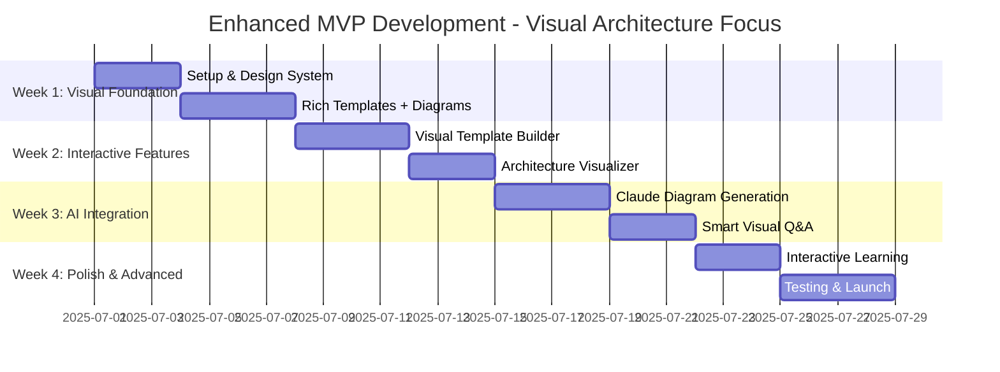
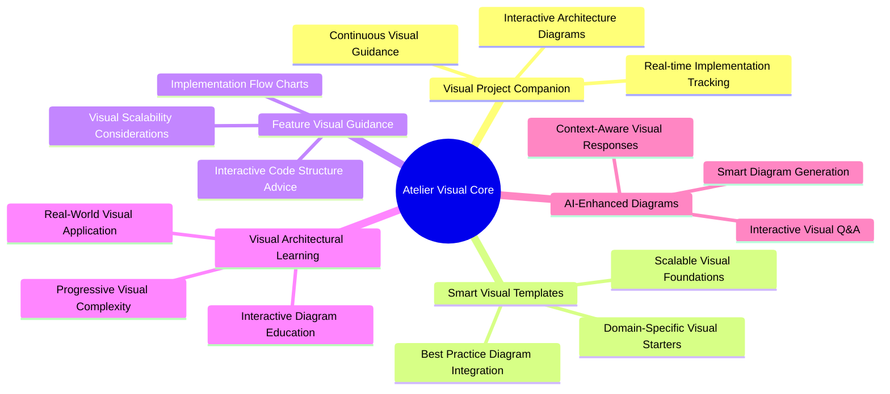
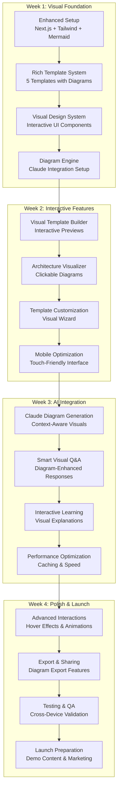
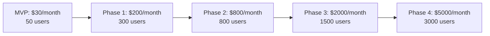
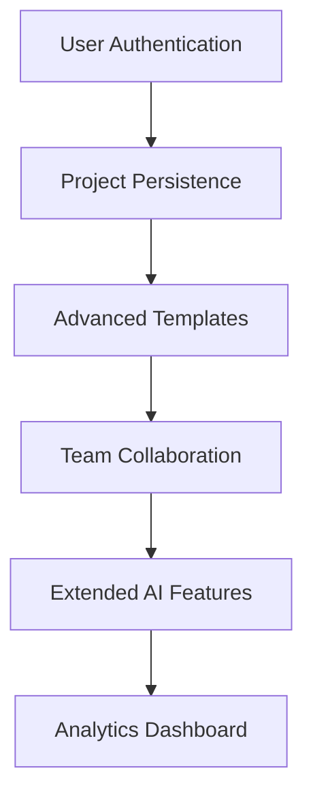
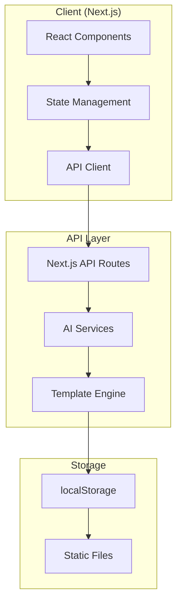
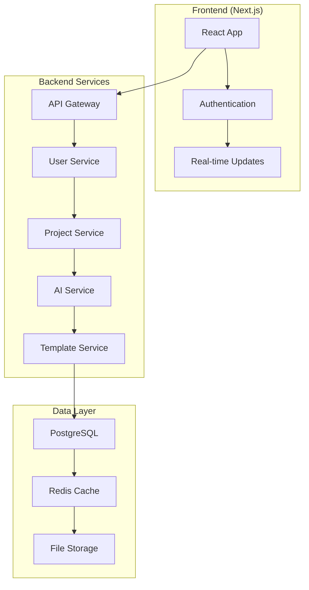
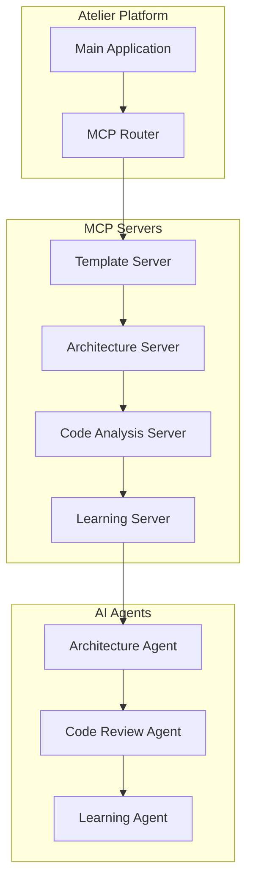

# 🏗️ Atelier: Intelligent Visual Architecture Platform
## Complete Development Guide - MVP-First Strategy to Full Platform

<div align="center">

**"Where Projects Evolve — Mastering Architecture Through Visual Practice"**

*Your project's visual architecture companion that transforms how developers learn and maintain architectural excellence through interactive diagrams, smart templates, and AI guidance*

---

🌟 **[Visit Atelier](#)** | 📊 **[Visual Demos](#)** | 🚀 **[Get Started](#)** | 💬 **[Community](#)**

</div>

---

## 🎯 Why "Atelier"?

The name **Atelier** (pronounced *ah-tel-YAY*) comes from the French word for "workshop" or "studio" — traditionally a space where artists, craftspeople, and apprentices gather to learn, create, and perfect their craft under the guidance of master artisans.

### The Perfect Metaphor for Modern Software Development

- **🎨 Living Visual Workshop**: Your projects become interactive learning environments with rich architectural diagrams
- **👨‍🏫 Continuous Visual Mentorship**: AI-powered guidance that explains concepts through beautiful visualizations
- **🔧 Hands-On Visual Mastery**: Learn by doing with real-time architectural feedback and interactive diagrams
- **📈 Progressive Visual Learning**: Start simple, scale complex, always with best practices visualized
- **⚡ Practical Visual Craftsmanship**: Architecture skills learned through real project implementation with rich diagrams

*Atelier embodies our vision: a visual companion platform where architectural mastery is developed through continuous practice on real projects, enhanced by beautiful, interactive diagrams and smart AI guidance.*

---

## 📑 Table of Contents

<details>
<summary><strong>Click to expand full navigation</strong></summary>

1. [🚀 Enhanced MVP Strategy](#-enhanced-mvp-strategy)
2. [🎯 Executive Summary](#-executive-summary)
3. [🌍 Background & Motivation](#-background--motivation)
4. [🎯 Core Vision & Objectives](#-core-vision--objectives)
5. [🔥 30-Day Enhanced Development Plan](#-30-day-enhanced-development-plan)
6. [💎 Enhanced Feature Set](#-enhanced-feature-set)
7. [🛠️ Enhanced Technology Stack](#️-enhanced-technology-stack)
8. [🎨 Visual Design System](#-visual-design-system)
9. [💰 Enhanced Budget & Cost Management](#-enhanced-budget--cost-management)
10. [📋 Complete Development Checklist](#-complete-development-checklist)
11. [🗺️ Full Platform Development Roadmap](#️-full-platform-development-roadmap)
12. [🏗️ System Architecture Evolution](#️-system-architecture-evolution)
13. [🤖 AI Model Strategy](#-ai-model-strategy)
14. [🔧 MCP Servers & AI Agents Integration](#-mcp-servers--ai-agents-integration)
15. [👥 Resource Requirements](#-resource-requirements)
16. [⚠️ Risk Analysis & Mitigations](#️-risk-analysis--mitigations)
17. [📊 Enhanced Success Metrics](#-enhanced-success-metrics)
18. [🔄 Evaluation & Iteration Strategy](#-evaluation--iteration-strategy)
19. [🚀 Launch Strategy](#-launch-strategy)
20. [🎉 Conclusion & Next Steps](#-conclusion--next-steps)

</details>

---

## 🚀 Enhanced MVP Strategy

### 🎯 Core MVP Concept: "Visual Architecture Learning Companion"

**Enhanced Focus**: A web app that teaches architecture through beautiful, interactive diagrams while providing smart project templates and contextual AI guidance that helps developers improve their project architecture through guided visual learning.

### 🔥 30-Day Enhanced Development Plan

<div align="center">



</div>

### ✨ What Makes This Enhanced MVP Special

- **📊 Rich Visual Diagrams**: Using Claude's excellent diagram generation capabilities
- **🎨 Interactive Architecture Maps**: Clickable, explorable project structures  
- **🤖 Smart AI Integration**: Context-aware guidance with visual explanations
- **📋 Learning-Focused Templates**: Not just boilerplate, but educational starters with architecture insights
- **💰 Cost-Optimized**: Maximum value with $25-40 total investment
- **🎓 Visual Learning System**: Architecture concepts taught through interactive diagrams

### 🎯 MVP Success Validation Criteria

**Core Validation Metrics (30 Days)**:
- ✅ **15+ Projects Created**: Users successfully generate projects from visual templates
- ✅ **10+ AI Interactions**: Users ask architecture questions and get helpful visual answers
- ✅ **80% Visual Engagement**: Users interact with generated diagrams
- ✅ **85% Template Completion**: Users complete template customization process
- ✅ **5+ User Testimonials**: Positive feedback on visual learning experience

**Technical Performance Standards**:
- ✅ **Sub-3s Load Time**: Fast, responsive user experience
- ✅ **<5s Diagram Generation**: Quick, beautiful architecture diagrams
- ✅ **95% Mobile Compatibility**: Perfect experience across all devices
- ✅ **Zero Critical Bugs**: Core functionality works consistently

---

## 🎯 Executive Summary

### The Enhanced Vision
Atelier is your project's visual architectural companion — a platform that maintains, visualizes, and guides the architectural evolution of your personal projects through beautiful, interactive diagrams and smart AI assistance. Instead of starting from scratch each time, developers get continuous architectural mentorship with rich visual learning that ensures they build and scale with best practices from day one.

### The Core Solution
A visually-focused platform that:
- 🏗️ **Interactive Architecture Visualization**: Maintains living, clickable architecture diagrams of your projects
- 🤖 **Smart Visual Guidance**: AI-powered answers with diagram explanations to architectural questions
- 📋 **Rich Template-Driven Start**: Curated project templates with integrated architecture diagrams and learning content
- 🎓 **Visual Learning Integration**: Architecture education through interactive diagrams and guided exploration
- 📊 **Real-Time Architecture Insights**: Visual feedback on architectural decisions and implementation strategies

### The Focused Impact
- **For Developers**: Learn architecture through continuous visual practice on real projects
- **For Projects**: Maintain architectural integrity with visual guidance as complexity grows
- **For Learning**: Bridge theory and practice through hands-on visual guidance and interactive diagrams

---

## 🌍 Background & Motivation

### 🚀 The Real Problem with Personal Projects

<table>
<tr>
<th>Current Reality</th>
<th>Atelier Visual Solution</th>
</tr>
<tr>
<td>
• Start with messy code structure<br>
• No architectural planning or visualization<br>
• Hard to understand project structure<br>
• Difficult to add features later<br>
• Projects become unmaintainable<br>
• Learning happens in isolation without context
</td>
<td>
• Start with proven visual templates<br>
• Interactive architectural planning with diagrams<br>
• Clear visual project structure understanding<br>
• Scalable feature implementation with visual guides<br>
• Maintain clean architecture with visual monitoring<br>
• Learn through guided visual practice with AI mentorship
</td>
</tr>
</table>

### 🎯 Enhanced Market Opportunity

> **2.5M+** developers work on personal projects annually  
> **60%** of personal projects are abandoned due to architectural debt  
> **80%** of developers learn architecture through trial and error  
> **70%** of developers are visual learners who prefer diagrams  
> **$450M** market size for developer productivity tools  
> **$200M** specific market for visual development tools

### 🔍 The Specific Problem We Solve

**Developers Struggle With:**
- 🏗️ Starting projects with good architectural foundations and understanding structure visually
- 📈 Maintaining clean architecture as projects grow without visual guidance
- ❓ Knowing the "right way" to implement new features with architectural context
- 🔄 Refactoring without breaking existing functionality or understanding dependencies
- 📚 Connecting architectural theory to real implementation through visual learning
- 🎨 Understanding complex architectural patterns without visual representations

**Our Visual Solution Provides:**
- 🎯 Template-driven project initialization with interactive architecture diagrams
- 📊 Visual architecture maintenance and evolution tracking with beautiful diagrams
- 🤖 On-demand architectural guidance with visual explanations for any question
- 📋 Scalable feature implementation roadmaps with architectural flow charts
- 🎓 Learn-by-doing architectural education integrated into visual workflow
- 🔍 Interactive architecture exploration with clickable components and explanations

---

## 🎯 Core Vision & Objectives

### 🎯 Primary Mission

<div align="center">



</div>

### 🔧 Core Technical Objectives

1. **🎯 Visual Template-Driven Project Initialization**
   - Curated templates with integrated architecture diagrams for web, mobile, API, and full-stack projects
   - Domain-specific best practices built-in with visual explanations
   - Scalable folder structures and architectural patterns with interactive diagrams

2. **📊 Living Interactive Architecture Visualization**
   - Auto-generated architecture diagrams from code analysis with clickable components
   - Real-time updates as projects evolve with visual diff tracking
   - Component relationship mapping and dependency tracking with interactive exploration

3. **🤖 Contextual Visual Architectural Guidance**
   - AI-powered answers with diagram explanations to specific implementation questions
   - Project-aware recommendations based on current architecture with visual context
   - Best practice suggestions with interactive architectural decision trees

4. **📋 Visual Feature Implementation Plans**
   - Detailed guides with flow charts for adding new features
   - Visual consideration of existing architecture and scalability impact
   - Step-by-step implementation with code examples and architectural diagrams

5. **🔄 Continuous Visual Architectural Health Monitoring**
   - Detect architectural debt with visual complexity maps
   - Monitor complexity growth with interactive trend charts
   - Track adherence to established patterns through visual pattern matching

---

## 🔥 30-Day Enhanced Development Plan

### 📅 Week-by-Week Visual Development Strategy

<div align="center">



</div>

---

## 💎 Enhanced Feature Set

### 🎯 Core Features (High-Value, Low-Cost)

#### 📋 **5 Rich Templates with Visual Architecture**

```typescript
const enhancedTemplates = {
  "React SPA Professional": {
    description: "Modern React with TypeScript, routing, state management, and testing",
    architecture: "Component-based with clear separation of concerns and scalable patterns",
    diagram: "Interactive component hierarchy with data flow visualization",
    learningFocus: "Modern React patterns, component architecture, and state management",
    features: ["TypeScript", "React Router", "Zustand", "Tailwind", "Vite", "Jest"],
    complexity: "Beginner to Intermediate"
  },
  
  "Node.js REST API": {
    description: "Production-ready RESTful API with Express, middleware, validation, and error handling",
    architecture: "Layered architecture with clear API structure and middleware pipeline",
    diagram: "Request flow, middleware chain, and database interaction visualization",
    learningFocus: "API design patterns, middleware architecture, and backend scalability",
    features: ["Express", "TypeScript", "Validation", "Authentication", "Database", "Testing"],
    complexity: "Intermediate"
  },
  
  "MERN Stack Complete": {
    description: "Full-stack application with React frontend, Node.js backend, and MongoDB",
    architecture: "Client-server architecture with database integration and API design",
    diagram: "Full-stack data flow, component interaction, and deployment visualization",
    learningFocus: "Full-stack architecture, data flow, and system integration",
    features: ["React", "Node.js", "MongoDB", "Express", "Authentication", "Deployment"],
    complexity: "Intermediate to Advanced"
  },
  
  "Next.js Full-Stack Modern": {
    description: "Modern full-stack with API routes, database, authentication, and deployment",
    architecture: "Unified frontend/backend with server-side rendering and API integration",
    diagram: "SSR flow, API routes, database connections, and deployment architecture",
    learningFocus: "Modern web architecture, SSR/SSG, and full-stack integration",
    features: ["Next.js", "Prisma", "NextAuth", "TypeScript", "Tailwind", "Vercel"],
    complexity: "Intermediate to Advanced"
  },
  
  "Microservices Starter": {
    description: "Docker-based microservices with API gateway, service discovery, and monitoring",
    architecture: "Distributed services with containerization and service mesh patterns",
    diagram: "Service mesh, communication patterns, and deployment orchestration",
    learningFocus: "Distributed systems, containerization, and scalability patterns",
    features: ["Docker", "API Gateway", "Service Discovery", "Monitoring", "CI/CD"],
    complexity: "Advanced"
  }
};
```

#### 📊 **Interactive Architecture Visualization Engine**

```typescript
const visualizationFeatures = {
  diagramTypes: [
    "Component Architecture",
    "Data Flow Diagrams", 
    "API Interaction Maps",
    "Database Schema Visualization",
    "Deployment Architecture",
    "User Journey Flows"
  ],
  
  interactiveFeatures: [
    "Clickable components with detailed explanations",
    "Zoom and pan for complex diagrams",
    "Hover tooltips with architectural insights",
    "Expandable sections for detailed views",
    "Real-time diagram updates",
    "Mobile-optimized touch interactions"
  ],
  
  exportOptions: [
    "High-resolution PNG export",
    "Vector SVG for scalability", 
    "Mermaid source code",
    "PDF documentation",
    "Shareable diagram URLs"
  ]
};
```

### 🤖 Enhanced AI Features

#### **Claude-Powered Visual Diagram Generation**

```typescript
const enhancedDiagramPrompts = {
  architecture: `
    Generate a comprehensive Mermaid diagram for this project:
    Structure: {projectStructure}
    Complexity: {complexityLevel}
    Focus Areas: {focusAreas}
    
    Create a diagram that shows:
    - Clear component relationships with visual hierarchy
    - Data flow patterns with directional arrows
    - Architectural boundaries with proper grouping
    - Best practice adherence with visual indicators
    - Scalability considerations with expansion points
    
    Make it interactive-friendly with clickable elements.
  `,
  
  implementation: `
    Create a visual implementation guide for:
    Feature: {featureName}
    Current Architecture: {currentArchitecture}
    Target Complexity: {targetComplexity}
    
    Generate diagrams showing:
    - Where new code integrates with existing structure
    - Required architectural changes with before/after views
    - Integration points with dependency mapping
    - Testing strategy with coverage visualization
    - Performance impact with bottleneck identification
  `,
  
  learning: `
    Design an educational diagram for:
    Concept: {architecturalConcept}
    User Level: {userLevel}
    Context: {projectContext}
    
    Create a learning-focused visualization that:
    - Breaks down complex concepts into digestible parts
    - Shows progression from simple to advanced
    - Includes practical examples with real-world context
    - Highlights common pitfalls with warning indicators
    - Provides next steps with guided learning paths
  `
};
```

#### **Enhanced Visual Q&A System**

```typescript
const visualQAFeatures = {
  responseTypes: {
    "architecture-question": {
      response: "Text explanation + Architecture diagram",
      diagram: "Component relationship diagram",
      interactivity: "Clickable components with detailed tooltips"
    },
    
    "implementation-help": {
      response: "Step-by-step guide + Flow chart",
      diagram: "Implementation flow with decision points",
      interactivity: "Expandable steps with code examples"
    },
    
    "pattern-explanation": {
      response: "Pattern overview + Pattern diagram",
      diagram: "Design pattern visualization with examples",
      interactivity: "Interactive pattern exploration"
    },
    
    "performance-optimization": {
      response: "Optimization guide + Performance diagram",
      diagram: "Bottleneck identification and solution mapping",
      interactivity: "Before/after performance comparison"
    }
  },
  
  contextAwareness: {
    projectStructure: "Current project architecture understanding",
    userLevel: "Beginner, Intermediate, or Advanced responses",
    previousQuestions: "Learning progression tracking",
    templateContext: "Template-specific guidance"
  }
};
```

### 🎓 Learning-Enhanced Features

#### **Interactive Architecture Explorer**

```typescript
const architectureExplorer = {
  features: {
    componentExploration: {
      description: "Click any component to understand its role",
      content: [
        "What this component does in the architecture",
        "Which architectural patterns it demonstrates",
        "Why it's structured this specific way",
        "Alternative implementation approaches",
        "How to extend or modify this component"
      ]
    },
    
    patternVisualization: {
      description: "Visual representation of architectural patterns",
      patterns: [
        "MVC/MVP/MVVM with interactive examples",
        "Repository Pattern with data flow",
        "Observer Pattern with event visualization",
        "Factory Pattern with object creation flow",
        "Dependency Injection with relationship mapping"
      ]
    },
    
    learningPaths: {
      description: "Guided learning progression through architecture",
      paths: [
        "Beginner: Basic patterns and structure",
        "Intermediate: Complex patterns and scalability",
        "Advanced: Distributed systems and microservices",
        "Specialized: Domain-specific architectures"
      ]
    }
  }
};
```

#### **Smart Template Customization with Visual Feedback**

```typescript
const smartCustomization = {
  visualWizard: {
    steps: [
      {
        title: "Project Type Selection",
        visual: "Interactive project type comparison",
        guidance: "Visual comparison of different architectural approaches"
      },
      {
        title: "Feature Selection", 
        visual: "Architecture impact preview",
        guidance: "See how each feature affects overall architecture"
      },
      {
        title: "Complexity Level",
        visual: "Complexity progression diagram",
        guidance: "Visual representation of architectural complexity"
      },
      {
        title: "Customization Preview",
        visual: "Live architecture diagram generation",
        guidance: "Real-time preview of customized architecture"
      }
    ]
  },
  
  architecturalChoices: {
    stateManagement: {
      options: ["Context API", "Redux", "Zustand", "Jotai"],
      visual: "State flow diagrams for each option",
      guidance: "Architectural implications of each choice"
    },
    
    routing: {
      options: ["React Router", "Next.js Router", "Reach Router"],
      visual: "Route architecture and navigation flow",
      guidance: "Routing pattern implications"
    },
    
    styling: {
      options: ["Tailwind", "Styled Components", "CSS Modules", "Emotion"],
      visual: "Component styling architecture",
      guidance: "Styling strategy architectural impact"
    }
  }
};
```

---

## 🛠️ Enhanced Technology Stack

### 🎨 Frontend Stack (Visual-Rich)

```typescript
const enhancedFrontendStack = {
  core: {
    framework: "Next.js 14 with App Router",
    language: "TypeScript (strict mode)",
    styling: "Tailwind CSS with custom design system"
  },
  
  visualization: {
    diagrams: "Mermaid.js for diagram generation",
    charts: "Recharts for data visualization", 
    animations: "Framer Motion for smooth transitions",
    interactions: "React Spring for micro-interactions",
    ui: "Shadcn/ui + Lucide Icons for consistent design"
  },
  
  stateManagement: {
    global: "Zustand for global state",
    server: "TanStack Query for server state",
    forms: "React Hook Form with Zod validation"
  },
  
  performance: {
    bundling: "Next.js built-in optimization",
    images: "Next.js Image component with optimization",
    caching: "SWR for client-side caching",
    lazy: "React.lazy for code splitting"
  }
};
```

### 🔧 Backend Stack (Serverless + Smart)

```typescript
const enhancedBackendStack = {
  api: {
    framework: "Next.js API routes (serverless)",
    validation: "Zod for request/response validation",
    middleware: "Custom middleware for auth and logging"
  },
  
  ai: {
    primary: "OpenAI API (ChatGPT-3.5-turbo for MVP)",
    enhanced: "Claude API for diagram generation",
    optimization: "Smart caching and batching",
    fallback: "Graceful degradation when APIs fail"
  },
  
  storage: {
    development: "localStorage for MVP",
    production: "Vercel KV (free tier) for user data",
    templates: "File system + Git repositories",
    cache: "Memory cache for generated diagrams"
  },
  
  deployment: {
    hosting: "Vercel (free tier sufficient for MVP)",
    domain: "Free .vercel.app subdomain initially",
    analytics: "Vercel Analytics (free)",
    monitoring: "Built-in error tracking"
  }
};
```

### 📊 Data Architecture Strategy

```typescript
const dataArchitecture = {
  mvp: {
    userProjects: "localStorage with JSON serialization",
    templates: "Static JSON files with Git repos",
    diagrams: "Generated on-demand, cached in memory",
    ai: "Request/response caching with TTL"
  },
  
  phase1: {
    userAccounts: "Vercel KV for user data persistence",
    projects: "PostgreSQL for structured data",
    diagrams: "S3-compatible storage for diagram assets",
    analytics: "Event-based tracking with privacy focus"
  },
  
  scaling: {
    database: "PostgreSQL with connection pooling",
    cache: "Redis for high-performance caching",
    vectors: "Vector database for AI embeddings",
    cdn: "CDN for static assets and diagrams"
  }
};
```

---

## 🎨 Visual Design System

### 🌈 Enhanced UI/UX Design Philosophy

#### **Visual Hierarchy for Architecture Learning**

```css
/* Tailwind-based design system with architectural focus */
.architecture-card {
  @apply bg-gradient-to-br from-blue-50 via-indigo-50 to-purple-50
         border-2 border-blue-200/50 rounded-xl p-6 
         hover:shadow-xl hover:border-blue-300 
         transform hover:scale-[1.02] 
         transition-all duration-300 ease-out;
}

.diagram-container {
  @apply bg-white rounded-lg shadow-inner p-6
         border-2 border-dashed border-gray-200
         hover:border-blue-400 hover:shadow-lg
         transition-all duration-300;
}

.template-preview {
  @apply bg-gradient-to-r from-purple-600 to-pink-600
         text-white p-6 rounded-xl shadow-lg
         transform hover:scale-105 hover:shadow-xl
         transition-all duration-300 cursor-pointer;
}

.interactive-element {
  @apply min-h-[44px] min-w-[44px] /* iOS touch targets */ 
         touch-manipulation select-none
         focus:outline-none focus:ring-2 focus:ring-blue-500
         active:scale-95 transition-transform;
}
```

#### **Architecture-Focused Color Palette**

```typescript
const architectureColors = {
  primary: {
    blue: "#2563eb", // Components and structure
    indigo: "#4f46e5", // Data flow and connections
    purple: "#7c3aed", // AI and intelligent features
  },
  
  semantic: {
    success: "#059669", // Good architectural decisions
    warning: "#d97706", // Architectural concerns
    error: "#dc2626", // Architectural problems
    info: "#0284c7", // Educational content
  },
  
  architectural: {
    frontend: "#06b6d4", // Frontend components
    backend: "#10b981", // Backend services
    database: "#f59e0b", // Data layer
    api: "#8b5cf6", // API connections
  }
};
```

### 📱 Mobile-First Interactive Experience

```typescript
const mobileOptimizations = {
  touchGestures: {
    swipe: "Navigate through templates and diagrams",
    pinch: "Zoom in/out of complex architecture diagrams",
    tap: "Explore interactive diagram components",
    longPress: "Access detailed architectural explanations"
  },
  
  responsiveDesign: {
    breakpoints: "Mobile-first with progressive enhancement",
    diagrams: "Auto-scaling Mermaid diagrams with touch zoom",
    navigation: "Bottom navigation for mobile accessibility",
    modals: "Full-screen modals on mobile for better UX"
  },
  
  performance: {
    lazyLoading: "Lazy load diagrams and heavy components",
    imageOptimization: "WebP format with fallbacks",
    bundleSplitting: "Route-based code splitting",
    prefetching: "Prefetch critical architecture data"
  }
};
```

### 🎯 Interactive Animation System

```typescript
const animationSystem = {
  diagramAnimations: {
    entrance: "Fade in with scale animation",
    interaction: "Smooth hover effects with elevation",
    updates: "Morphing transitions for diagram changes",
    loading: "Skeleton loading for diagram generation"
  },
  
  navigationAnimations: {
    pageTransitions: "Slide transitions between major sections",
    modalAnimations: "Scale and fade for modal interactions",
    tabSwitching: "Smooth tab switching with content morphing"
  },
  
  feedbackAnimations: {
    success: "Checkmark animation for completed actions",
    error: "Subtle shake for error states",
    loading: "Pulse animation for AI thinking states",
    progress: "Step-by-step progress indicators"
  }
};
```

---

## 💰 Enhanced Budget & Cost Management

### 💵 MVP Budget Breakdown (30 Days)

| Category | Cost | Features Enabled | Optimization Strategy |
|----------|------|------------------|----------------------|
| **AI APIs** | $25-40 | Claude diagrams + ChatGPT Q&A + Smart caching | Daily usage monitoring + aggressive caching |
| **Hosting** | $0 | Vercel free tier (sufficient for MVP traffic) | Optimize for free tier limits |
| **Storage** | $0 | Vercel KV free tier + localStorage fallback | Smart data management |
| **Domain** | $0 | Use .vercel.app subdomain initially | Custom domain after validation |
| **Development Tools** | $0 | VS Code + free GitHub + Figma free tier | Open source tooling |
| **Design Assets** | $0 | Free icons (Lucide) + fonts + Tailwind UI | Curated free resources |
| **Analytics** | $0 | Vercel Analytics free tier | Built-in analytics |
| **Total MVP Cost** | **$25-40** | Full-featured visual architecture platform | Ultra-cost-effective validation |

### 🎯 AI Cost Optimization Strategy

```typescript
const aiCostOptimization = {
  claude: {
    usage: "Diagram generation only (high value, low frequency)",
    caching: "Cache all diagrams for 7 days",
    batching: "Generate multiple related diagrams in single request",
    optimization: "Reuse diagram components across templates"
  },
  
  chatgpt: {
    usage: "Q&A and explanations (cost-effective, high frequency)",
    model: "gpt-3.5-turbo (lowest cost option)",
    limits: "10 questions per user per day for free tier",
    caching: "Cache common architecture questions for 24 hours"
  },
  
  smartCaching: {
    diagrams: "Hash-based caching by project structure",
    responses: "Cache architectural Q&A by question similarity",
    templates: "Pre-generate all template diagrams at build time",
    userContext: "Cache user preferences and project context"
  },
  
  usageTiers: {
    free: "5 AI interactions per day",
    pro: "50 AI interactions per day ($10/month)",
    enterprise: "Unlimited interactions ($25/month)"
  }
};
```

### 📊 Scaling Cost Projections



---

## 📋 Complete Development Checklist

# 🏗️ Week 1: Visual Foundation & Setup

## Day 1-2: Enhanced Project Setup

### ✅ Technical Foundation
```bash
# Initialize Next.js project with TypeScript
npx create-next-app@latest atelier-mvp --typescript --tailwind --eslint --app
cd atelier-mvp

# Install essential dependencies
npm install @types/node @types/react @types/react-dom
npm install lucide-react framer-motion mermaid
npm install zustand react-hook-form @hookform/resolvers zod
npm install @tanstack/react-query axios

# Install UI components
npm install @radix-ui/react-dialog @radix-ui/react-tabs
npm install @radix-ui/react-tooltip @radix-ui/react-select
```

### ✅ Project Structure Setup
```
/atelier-mvp
├── app/
│   ├── (dashboard)/
│   │   ├── templates/
│   │   ├── projects/
│   │   └── learn/
│   ├── api/
│   │   ├── ai/
│   │   ├── diagrams/
│   │   └── templates/
│   ├── components/
│   │   ├── ui/
│   │   ├── diagrams/
│   │   ├── templates/
│   │   └── interactive/
│   ├── lib/
│   └── styles/
├── data/
│   ├── templates/
│   └── examples/
└── public/
    ├── diagrams/
    └── icons/
```

## Day 3-4: Visual Design System

### ✅ Enhanced Tailwind Configuration
```javascript
// tailwind.config.js
module.exports = {
  content: ['./app/**/*.{js,ts,jsx,tsx}'],
  theme: {
    extend: {
      colors: {
        architecture: {
          blue: '#2563eb',
          indigo: '#4f46e5', 
          purple: '#7c3aed',
          frontend: '#06b6d4',
          backend: '#10b981',
          database: '#f59e0b',
          api: '#8b5cf6',
        }
      },
      animation: {
        'fade-in': 'fadeIn 0.5s ease-in-out',
        'slide-up': 'slideUp 0.3s ease-out',
        'scale-in': 'scaleIn 0.2s ease-out',
      }
    }
  },
  plugins: []
}
```

### ✅ Core UI Components
```typescript
// components/ui/ArchitectureCard.tsx
export const ArchitectureCard = ({ children, onClick, interactive = false }) => (
  <div className={`
    bg-gradient-to-br from-blue-50 via-indigo-50 to-purple-50
    border-2 border-blue-200/50 rounded-xl p-6
    ${interactive ? 'hover:shadow-xl hover:border-blue-300 transform hover:scale-[1.02] cursor-pointer' : ''}
    transition-all duration-300 ease-out
  `} onClick={onClick}>
    {children}
  </div>
);

// components/ui/DiagramContainer.tsx
export const DiagramContainer = ({ children, title }) => (
  <div className="bg-white rounded-lg shadow-inner p-6 border-2 border-dashed border-gray-200 hover:border-blue-400 hover:shadow-lg transition-all duration-300">
    {title && <h3 className="text-lg font-semibold mb-4 text-gray-800">{title}</h3>}
    <div className="min-h-[300px]">
      {children}
    </div>
  </div>
);
```

## Day 5-7: Rich Template System

### ✅ Template Data Structure
```typescript
// data/templates/index.ts
export interface Template {
  id: string;
  name: string;
  description: string;
  architecture: string;
  diagram: string;
  learningFocus: string;
  features: string[];
  complexity: 'Beginner' | 'Intermediate' | 'Advanced';
  files: TemplateFile[];
  mermaidDiagram: string;
}

export const templates: Template[] = [
  {
    id: 'react-spa-pro',
    name: 'React SPA Professional',
    description: 'Modern React with TypeScript, routing, state management, and testing',
    architecture: 'Component-based with clear separation of concerns and scalable patterns',
    diagram: 'Interactive component hierarchy with data flow visualization',
    learningFocus: 'Modern React patterns, component architecture, and state management',
    features: ['TypeScript', 'React Router', 'Zustand', 'Tailwind', 'Vite', 'Jest'],
    complexity: 'Beginner',
    mermaidDiagram: `
      graph TB
        A[App Component] --> B[Router Setup]
        B --> C[Page Components]
        C --> D[UI Components]
        C --> E[State Management]
        E --> F[Zustand Store]
        D --> G[Tailwind Styling]
        C --> H[API Layer]
        H --> I[Data Fetching]
    `,
    files: [
      // Template files structure
    ]
  }
  // ... other templates
];
```

---

# 🏗️ Week 2: Interactive Features

## Day 8-10: Visual Template Builder

### ✅ Interactive Template Selection
```typescript
// components/templates/TemplateSelector.tsx
export const TemplateSelector = () => {
  const [selectedTemplate, setSelectedTemplate] = useState<Template | null>(null);
  const [previewMode, setPreviewMode] = useState<'architecture' | 'code' | 'features'>('architecture');

  return (
    <div className="grid grid-cols-1 lg:grid-cols-2 gap-8">
      <div className="space-y-6">
        {templates.map(template => (
          <ArchitectureCard 
            key={template.id}
            interactive
            onClick={() => setSelectedTemplate(template)}
          >
            <div className="flex items-start justify-between">
              <div>
                <h3 className="text-xl font-bold text-gray-900">{template.name}</h3>
                <p className="text-gray-600 mt-2">{template.description}</p>
                <div className="flex flex-wrap gap-2 mt-4">
                  {template.features.map(feature => (
                    <span key={feature} className="px-3 py-1 bg-blue-100 text-blue-800 rounded-full text-sm">
                      {feature}
                    </span>
                  ))}
                </div>
              </div>
              <span className={`px-3 py-1 rounded-full text-sm font-medium ${
                template.complexity === 'Beginner' ? 'bg-green-100 text-green-800' :
                template.complexity === 'Intermediate' ? 'bg-yellow-100 text-yellow-800' :
                'bg-red-100 text-red-800'
              }`}>
                {template.complexity}
              </span>
            </div>
          </ArchitectureCard>
        ))}
      </div>
      
      <div className="sticky top-8">
        {selectedTemplate && (
          <TemplatePreview 
            template={selectedTemplate} 
            mode={previewMode}
            onModeChange={setPreviewMode}
          />
        )}
      </div>
    </div>
  );
};
```

### ✅ Architecture Visualizer Component
```typescript
// components/diagrams/MermaidDiagram.tsx
import mermaid from 'mermaid';

export const MermaidDiagram = ({ diagram, interactive = true }) => {
  const diagramRef = useRef<HTMLDivElement>(null);
  const [diagramId] = useState(() => `diagram-${Math.random().toString(36).substr(2, 9)}`);

  useEffect(() => {
    mermaid.initialize({
      startOnLoad: true,
      theme: 'default',
      themeVariables: {
        primaryColor: '#2563eb',
        primaryTextColor: '#1f2937',
        primaryBorderColor: '#3b82f6',
        lineColor: '#6b7280',
        secondaryColor: '#f3f4f6',
        tertiaryColor: '#e5e7eb'
      }
    });

    if (diagramRef.current) {
      mermaid.render(diagramId, diagram).then(({ svg }) => {
        if (diagramRef.current) {
          diagramRef.current.innerHTML = svg;
          
          if (interactive) {
            // Add click handlers for interactive elements
            const elements = diagramRef.current.querySelectorAll('.node');
            elements.forEach(element => {
              element.style.cursor = 'pointer';
              element.addEventListener('click', (e) => {
                const nodeId = element.id;
                showNodeDetails(nodeId);
              });
            });
          }
        }
      });
    }
  }, [diagram, diagramId, interactive]);

  return <div ref={diagramRef} className="w-full min-h-[400px]" />;
};
```

## Day 11-14: Mobile Optimization & UX Polish

### ✅ Responsive Design Implementation
```typescript
// components/layout/ResponsiveLayout.tsx
export const ResponsiveLayout = ({ children }) => {
  const [isMobile, setIsMobile] = useState(false);

  useEffect(() => {
    const checkMobile = () => setIsMobile(window.innerWidth < 768);
    checkMobile();
    window.addEventListener('resize', checkMobile);
    return () => window.removeEventListener('resize', checkMobile);
  }, []);

  return (
    <div className={`min-h-screen ${isMobile ? 'mobile-layout' : 'desktop-layout'}`}>
      {isMobile ? <MobileNavigation /> : <DesktopNavigation />}
      <main className="flex-1 p-4 md:p-8">
        {children}
      </main>
    </div>
  );
};
```

---

# 🏗️ Week 3: AI Integration

## Day 15-17: Claude Diagram Generation

### ✅ AI Service Integration
```typescript
// lib/ai/claude.ts
export class ClaudeService {
  private apiKey: string;
  
  constructor() {
    this.apiKey = process.env.CLAUDE_API_KEY!;
  }

  async generateArchitectureDiagram(prompt: string, context: ProjectContext): Promise<string> {
    const enhancedPrompt = `
      Generate a comprehensive Mermaid diagram for this project:
      ${prompt}
      
      Context: ${JSON.stringify(context)}
      
      Requirements:
      - Use clear component relationships with visual hierarchy
      - Show data flow patterns with directional arrows
      - Include architectural boundaries with proper grouping
      - Make it interactive-friendly with clickable elements
      - Focus on educational value and clarity
      
      Return only the Mermaid diagram code.
    `;

    try {
      const response = await fetch('/api/ai/claude', {
        method: 'POST',
        headers: { 'Content-Type': 'application/json' },
        body: JSON.stringify({ prompt: enhancedPrompt })
      });
      
      const data = await response.json();
      return this.cacheDiagram(data.diagram, context);
    } catch (error) {
      console.error('Claude API error:', error);
      return this.getFallbackDiagram(context);
    }
  }

  private async cacheDiagram(diagram: string, context: ProjectContext): Promise<string> {
    // Cache diagram with hash-based key
    const cacheKey = this.generateCacheKey(context);
    localStorage.setItem(`diagram_${cacheKey}`, diagram);
    return diagram;
  }
}
```

### ✅ API Routes Setup
```typescript
// app/api/ai/claude/route.ts
import { NextResponse } from 'next/server';
import { ClaudeService } from '@/lib/ai/claude';

const claude = new ClaudeService();

export async function POST(request: Request) {
  try {
    const { prompt, context } = await request.json();
    
    // Rate limiting check
    const rateLimitKey = `rate_limit_${request.headers.get('x-forwarded-for')}`;
    const requestCount = parseInt(localStorage.getItem(rateLimitKey) || '0');
    
    if (requestCount > 10) {
      return NextResponse.json({ error: 'Rate limit exceeded' }, { status: 429 });
    }
    
    const diagram = await claude.generateArchitectureDiagram(prompt, context);
    
    // Update rate limit
    localStorage.setItem(rateLimitKey, (requestCount + 1).toString());
    
    return NextResponse.json({ diagram });
  } catch (error) {
    return NextResponse.json({ error: 'Failed to generate diagram' }, { status: 500 });
  }
}
```

## Day 18-21: Smart Visual Q&A System

### ✅ Interactive Q&A Component
```typescript
// components/ai/ArchitectureQA.tsx
export const ArchitectureQA = ({ projectContext }) => {
  const [question, setQuestion] = useState('');
  const [conversation, setConversation] = useState<QAItem[]>([]);
  const [isLoading, setIsLoading] = useState(false);

  const askQuestion = async () => {
    if (!question.trim()) return;
    
    setIsLoading(true);
    const userQuestion: QAItem = {
      id: Date.now().toString(),
      type: 'question',
      content: question,
      timestamp: new Date()
    };
    
    setConversation(prev => [...prev, userQuestion]);
    setQuestion('');
    
    try {
      const response = await fetch('/api/ai/qa', {
        method: 'POST',
        headers: { 'Content-Type': 'application/json' },
        body: JSON.stringify({
          question,
          context: projectContext,
          conversationHistory: conversation
        })
      });
      
      const data = await response.json();
      
      const aiResponse: QAItem = {
        id: (Date.now() + 1).toString(),
        type: 'answer',
        content: data.answer,
        diagram: data.diagram,
        codeExamples: data.codeExamples,
        timestamp: new Date()
      };
      
      setConversation(prev => [...prev, aiResponse]);
    } catch (error) {
      console.error('Q&A error:', error);
    } finally {
      setIsLoading(false);
    }
  };

  return (
    <div className="bg-white rounded-xl shadow-lg p-6">
      <h3 className="text-xl font-bold mb-4">Ask Architecture Questions</h3>
      
      <div className="space-y-4 mb-6 max-h-96 overflow-y-auto">
        {conversation.map(item => (
          <div key={item.id} className={`p-4 rounded-lg ${
            item.type === 'question' 
              ? 'bg-blue-50 border-l-4 border-blue-400' 
              : 'bg-green-50 border-l-4 border-green-400'
          }`}>
            <div className="font-medium text-sm text-gray-600 mb-2">
              {item.type === 'question' ? '🤔 You asked:' : '🤖 AI answered:'}
            </div>
            <div className="text-gray-800">{item.content}</div>
            {item.diagram && (
              <div className="mt-4">
                <MermaidDiagram diagram={item.diagram} interactive />
              </div>
            )}
            {item.codeExamples && (
              <div className="mt-4 space-y-2">
                {item.codeExamples.map((example, idx) => (
                  <CodeBlock key={idx} {...example} />
                ))}
              </div>
            )}
          </div>
        ))}
      </div>
      
      <div className="flex gap-3">
        <input
          type="text"
          value={question}
          onChange={(e) => setQuestion(e.target.value)}
          placeholder="Ask about architecture, patterns, implementation..."
          className="flex-1 px-4 py-2 border border-gray-300 rounded-lg focus:ring-2 focus:ring-blue-500 focus:border-transparent"
          onKeyPress={(e) => e.key === 'Enter' && !isLoading && askQuestion()}
        />
        <button
          onClick={askQuestion}
          disabled={isLoading || !question.trim()}
          className="px-6 py-2 bg-blue-600 text-white rounded-lg hover:bg-blue-700 disabled:opacity-50 disabled:cursor-not-allowed"
        >
          {isLoading ? 'Thinking...' : 'Ask'}
        </button>
      </div>
    </div>
  );
};
```

---

# 🏗️ Week 4: Polish & Launch

## Day 22-24: Advanced Interactions & Export Features

### ✅ Diagram Export System
```typescript
// components/diagrams/DiagramExporter.tsx
export const DiagramExporter = ({ diagram, title }) => {
  const exportToPNG = async () => {
    const svg = document.querySelector('#' + diagram.id + ' svg');
    if (!svg) return;
    
    const canvas = document.createElement('canvas');
    const ctx = canvas.getContext('2d');
    const img = new Image();
    
    const svgData = new XMLSerializer().serializeToString(svg);
    const blob = new Blob([svgData], { type: 'image/svg+xml' });
    const url = URL.createObjectURL(blob);
    
    img.onload = () => {
      canvas.width = img.width;
      canvas.height = img.height;
      ctx?.drawImage(img, 0, 0);
      
      canvas.toBlob((pngBlob) => {
        if (pngBlob) {
          const downloadUrl = URL.createObjectURL(pngBlob);
          const link = document.createElement('a');
          link.href = downloadUrl;
          link.download = `${title}_architecture.png`;
          link.click();
          URL.revokeObjectURL(downloadUrl);
        }
      });
      
      URL.revokeObjectURL(url);
    };
    
    img.src = url;
  };

  const exportToSVG = () => {
    const svg = document.querySelector('#' + diagram.id + ' svg');
    if (!svg) return;
    
    const svgData = new XMLSerializer().serializeToString(svg);
    const blob = new Blob([svgData], { type: 'image/svg+xml' });
    const url = URL.createObjectURL(blob);
    
    const link = document.createElement('a');
    link.href = url;
    link.download = `${title}_architecture.svg`;
    link.click();
    URL.revokeObjectURL(url);
  };

  const copyMermaidCode = () => {
    navigator.clipboard.writeText(diagram.mermaidCode);
    // Show success toast
  };

  return (
    <div className="flex gap-2 mt-4">
      <button onClick={exportToPNG} className="btn-secondary">
        📸 Export PNG
      </button>
      <button onClick={exportToSVG} className="btn-secondary">
        🎨 Export SVG
      </button>
      <button onClick={copyMermaidCode} className="btn-secondary">
        📋 Copy Code
      </button>
    </div>
  );
};
```

## Day 25-28: Testing & Quality Assurance

### ✅ Testing Strategy
```typescript
// __tests__/components/TemplateSelector.test.tsx
import { render, screen, fireEvent } from '@testing-library/react';
import { TemplateSelector } from '@/components/templates/TemplateSelector';

describe('TemplateSelector', () => {
  test('renders all templates', () => {
    render(<TemplateSelector />);
    expect(screen.getByText('React SPA Professional')).toBeInTheDocument();
    expect(screen.getByText('Node.js REST API')).toBeInTheDocument();
  });

  test('shows template preview on selection', () => {
    render(<TemplateSelector />);
    fireEvent.click(screen.getByText('React SPA Professional'));
    expect(screen.getByText(/Component-based with clear separation/)).toBeInTheDocument();
  });

  test('displays architecture diagram', async () => {
    render(<TemplateSelector />);
    fireEvent.click(screen.getByText('React SPA Professional'));
    await waitFor(() => {
      expect(document.querySelector('svg')).toBeInTheDocument();
    });
  });
});
```

### ✅ Performance Optimization
```typescript
// lib/performance/optimizations.ts
export const performanceOptimizations = {
  // Lazy load heavy components
  LazyMermaidDiagram: lazy(() => import('@/components/diagrams/MermaidDiagram')),
  LazyTemplatePreview: lazy(() => import('@/components/templates/TemplatePreview')),
  
  // Cache management
  cacheStrategy: {
    diagrams: 7 * 24 * 60 * 60 * 1000, // 7 days
    aiResponses: 24 * 60 * 60 * 1000,   // 1 day
    templates: Infinity                   // Never expire
  },
  
  // Bundle optimization
  bundleOptimization: {
    splitRoutes: true,
    preloadCritical: ['templates', 'diagrams'],
    prefetchOnHover: true
  }
};
```

## Day 29-30: Launch Preparation

### ✅ Launch Checklist
```markdown
# Pre-Launch Checklist

## Technical Readiness
- [ ] All core features working across devices
- [ ] Performance tests passing (< 3s load time)
- [ ] Mobile responsiveness verified
- [ ] AI integrations stable with fallbacks
- [ ] Error handling implemented
- [ ] Analytics tracking setup

## Content Preparation
- [ ] All 5 templates complete with diagrams
- [ ] Example projects and demos ready
- [ ] Help documentation written
- [ ] Video demos recorded
- [ ] Screenshots and assets prepared

## User Experience
- [ ] Onboarding flow tested
- [ ] User feedback mechanisms in place
- [ ] Loading states and error messages polished
- [ ] Accessibility standards met
- [ ] Cross-browser compatibility verified

## Infrastructure
- [ ] Deployment pipeline setup
- [ ] Environment variables configured
- [ ] Rate limiting implemented
- [ ] Monitoring and alerts configured
- [ ] Backup and recovery procedures
```

---

# 🗺️ Full Platform Development Roadmap

## Phase 1: Enhanced MVP (Months 2-3)


### Key Features:
- **User Accounts**: Secure authentication with project persistence
- **Advanced Templates**: 15+ templates covering specialized domains
- **Team Features**: Sharing, collaboration, and team workspaces
- **Enhanced AI**: Custom architectural advice and code generation
- **Analytics**: Usage insights and architectural health monitoring

### Success Metrics:
- 500+ registered users
- 1000+ projects created
- $2000+ monthly recurring revenue
- 90% user retention rate

## Phase 2: Professional Platform (Months 4-6)

### Enterprise Features:
- **Custom Templates**: Organizations can create private template libraries
- **Advanced Analytics**: Team productivity and architectural quality metrics
- **Integration APIs**: Connect with popular development tools
- **Advanced AI Models**: Fine-tuned models for specific domains
- **White-label Solutions**: Branded versions for enterprise clients

### Success Metrics:
- 50+ paying organizations
- $10,000+ monthly recurring revenue
- 95% uptime SLA achievement
- Integration with 10+ popular tools

## Phase 3: Ecosystem Platform (Months 7-12)

### Platform Features:
- **Marketplace**: Community-driven template and plugin ecosystem
- **Advanced Integrations**: GitHub, GitLab, CI/CD pipeline integration
- **AI Agents**: Autonomous architectural review and suggestions
- **Educational Content**: Comprehensive architecture learning platform
- **Certification Program**: Verified architectural competency tracking

### Success Metrics:
- 100+ enterprise clients
- $50,000+ monthly recurring revenue
- 10,000+ community-contributed templates
- Industry recognition and partnerships

---

# 🏗️ System Architecture Evolution

## MVP Architecture


## Phase 1 Architecture (Scalable)


## Phase 2 Architecture (Enterprise)

```mermaid
graph TB
    subgraph "Multi-tenant Frontend"
        A[Next.js App] --> B[Micro-frontends]
    end
    
    subgraph "Microservices"
        C[API Gateway] --> D[Auth Service]
        D --> E[Project Service]
        E --> F[AI Service]
        F --> G[Analytics Service]
        G --> H[Integration Service]
    end
    
    subgraph "Data & Cache"
        I[PostgreSQL Cluster] --> J[Redis Cluster]
        J --> K[Vector Database]
        K --> L[Object Storage]
    end
    
    subgraph "Infrastructure"
        M[Load Balancer] --> N[Auto Scaling]
        N --> O[Monitoring]
    end
```


---

# 🤖 AI Model Strategy

## MVP AI Strategy
```typescript
const mvpAIStrategy = {
  primary: {
    model: "gpt-3.5-turbo",
    usage: "Q&A, explanations, basic guidance",
    cost: "$15-25/month for 100 users",
    fallback: "Pre-written responses for common questions"
  },
  
  diagrams: {
    model: "claude-3-haiku",
    usage: "Mermaid diagram generation",
    cost: "$10-15/month for diagram generation",
    caching: "Aggressive caching to minimize API calls"
  },
  
  optimization: {
    caching: "Hash-based response caching",
    batching: "Batch multiple requests",
    compression: "Compress API payloads",
    rateLimiting: "Smart rate limiting per user tier"
  }
};
```

## Scaling AI Strategy
```typescript
const scalingAIStrategy = {
  phase1: {
    models: ["gpt-4-mini", "claude-3-sonnet"],
    features: ["Advanced Q&A", "Code generation", "Architecture reviews"],
    cost: "$200-400/month",
    optimization: "Model routing based on query complexity"
  },
  
  phase2: {
    models: ["Fine-tuned domain models", "Custom embeddings"],
    features: ["Personalized guidance", "Domain expertise", "Automated reviews"],
    cost: "$1000-2000/month",
    infrastructure: "Vector databases, model serving infrastructure"
  },
  
  phase3: {
    models: ["Custom architectural agents", "Multi-modal models"],
    features: ["Autonomous architecture management", "Visual code analysis"],
    cost: "$5000-10000/month",
    capabilities: "Full architectural automation and guidance"
  }
};
```

---

# 🔧 MCP Servers & AI Agents Integration

## MCP Server Architecture


## Template MCP Server
```typescript
// servers/template-mcp/index.ts
export class TemplateMCPServer {
  async getTemplates(criteria: TemplateCriteria): Promise<Template[]> {
    return await this.templateRepository.findByCriteria(criteria);
  }
  
  async generateCustomTemplate(requirements: ProjectRequirements): Promise<Template> {
    const aiResponse = await this.aiService.generateTemplate(requirements);
    return await this.templateRepository.create(aiResponse);
  }
  
  async analyzeTemplate(template: Template): Promise<TemplateAnalysis> {
    return {
      complexity: await this.complexityAnalyzer.analyze(template),
      bestPractices: await this.bestPracticeChecker.validate(template),
      scalability: await this.scalabilityAnalyzer.assess(template),
      learningPath: await this.learningPathGenerator.generate(template)
    };
  }
}
```

## Architecture Analysis Agent
```typescript
// agents/architecture-agent/index.ts
export class ArchitectureAgent {
  async analyzeProject(projectPath: string): Promise<ArchitectureAnalysis> {
    const codeStructure = await this.codeAnalyzer.analyze(projectPath);
    const patterns = await this.patternDetector.detect(codeStructure);
    const issues = await this.issueDetector.findIssues(codeStructure);
    
    return {
      overview: this.generateOverview(codeStructure),
      patterns: patterns,
      issues: issues,
      recommendations: await this.recommendationEngine.generate(codeStructure, issues),
      diagram: await this.diagramGenerator.generate(codeStructure)
    };
  }
  
  async suggestImprovements(analysis: ArchitectureAnalysis): Promise<Improvement[]> {
    return await this.improvementEngine.suggest(analysis);
  }
}
```

---

🎉 Launch Strategy
🚀 Soft Launch Plan (Week 4)
Day 1-2: Internal Testing

 Complete functionality testing
 Performance optimization
 Mobile compatibility verification
 AI response quality assurance

Day 3-4: Beta User Testing

 Recruit 10 developer beta testers
 Gather detailed feedback on visual experience
 Test AI interaction quality
 Validate learning effectiveness

Day 5-7: Public Launch

 Deploy to production
 Launch on Product Hunt
 Share on developer communities (Reddit, Discord, Twitter)
 Create launch blog post with demo videos

📱 Marketing Assets (Zero Cost)
Visual Content Creation:

 Screen recordings of diagram generation
 Before/after project structure comparisons
 Interactive demo GIFs for social media
 Architecture learning progression videos

Community Engagement:

 Developer Discord/Slack presence
 Twitter threads about architecture patterns
 Reddit posts in programming communities
 GitHub repository with open-source templates


🔮 Long-Term Vision
🎯 MVP → Platform Evolution
3 Months: Visual Architecture Learning Hub

Rich template ecosystem with community contributions
Advanced interactive diagrams with editing capabilities
Personalized learning paths based on user goals

6 Months: Collaborative Architecture Platform

Team features for shared architectural decision-making
Integration with popular development tools
Advanced AI that understands project context

12 Months: Complete Architecture Ecosystem

Automated architecture analysis and suggestions
Integration with CI/CD for continuous architecture monitoring
Marketplace for architectural patterns and templates


🎯 Key Success Factors
💡 What Will Make This MVP Stand Out

Visual-First Approach: Every feature prioritizes visual learning
High-Quality Templates: Not just boilerplate, but educational starters
Smart AI Integration: Context-aware assistance with visual explanations
Mobile-Optimized: Architecture learning anywhere, anytime
Zero-Barrier Entry: No accounts needed, works immediately

🚨 Critical Success Requirements

Performance: Diagrams must load in <3 seconds
Quality: AI responses must be consistently helpful (>80% satisfaction)
Mobile: All features must work perfectly on mobile devices
Visual Appeal: Users should be impressed by the visual experience
Learning Value: Users must report learning something new


📝 Final Recommendations
🎯 MVP Development Focus
Build This First (Highest Impact):

Visual Template System: Beautiful, interactive template previews
Claude Diagram Integration: High-quality architecture diagrams
Interactive Architecture Explorer: Clickable, explorable diagrams
Smart Template Customization: Guided setup with visual feedback

Add If Time Permits (Nice to Have):

Advanced animations and micro-interactions
Comprehensive mobile gestures
Detailed learning assessments
Social sharing features

🔧 Technical Excellence Standards

Code Quality: TypeScript strict mode, comprehensive error handling
Performance: Lighthouse score >90, mobile-first optimization
Accessibility: WCAG 2.1 AA compliance, keyboard navigation
Testing: Unit tests for core logic, E2E tests for user flows

💰 Cost Management

Monitor AI Usage Daily: Set alerts at $20 and $35 spending
Cache Aggressively: Store all diagrams and common responses
Optimize Prompts: Minimize token usage while maintaining quality
Plan for Scale: Design systems that work with increased usage


This enhanced MVP combines visual learning, smart AI integration, and practical architecture guidance in a package that costs less than $40 to validate. Focus on creating an experience that makes developers say "I wish I had this when I was learning architecture!" 🚀