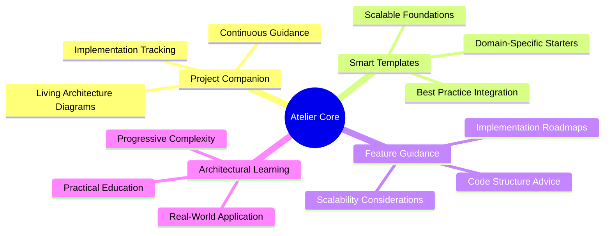
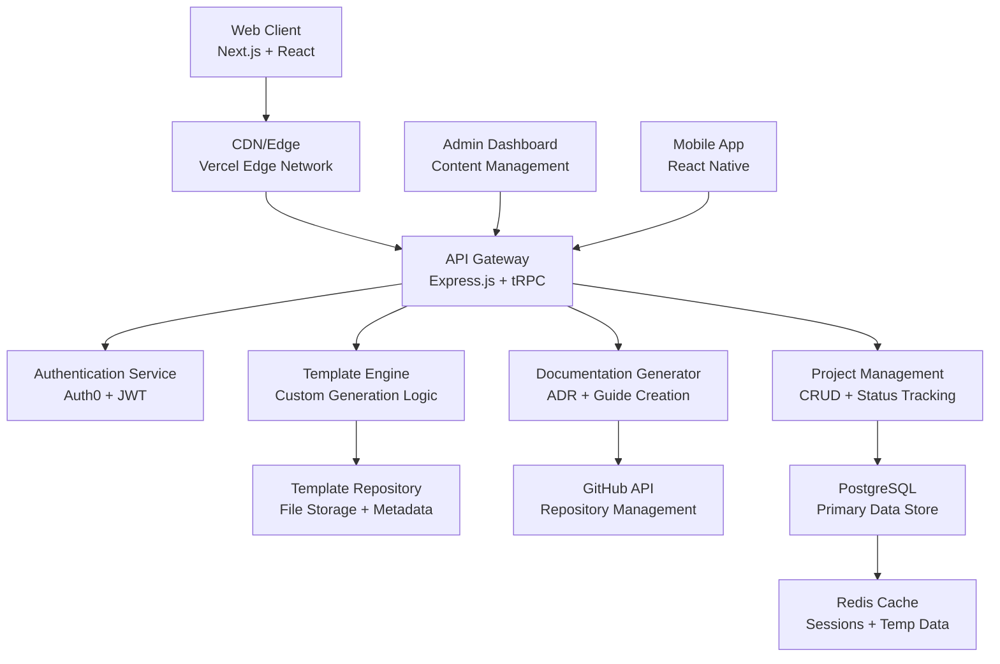
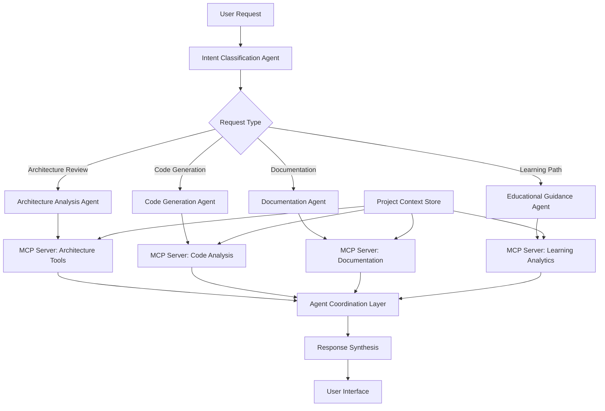

# Atelier: Intelligent Project Architecture Platform
## *Build projects that teach architecture, not just code*

---

## 🏛️ Why "Atelier"

The name "Atelier" comes from the French word for workshop—a place where artisans learn their craft through hands-on practice under expert guidance. Just as Renaissance painters learned by working alongside masters in their ateliers, modern developers need a space to learn architectural thinking through practical application.

**The Workshop Metaphor:**
- **Traditional Coding Tutorials** = Art classes that only teach brush techniques
- **Atelier Platform** = Master's workshop where you learn to compose entire masterpieces

In our digital atelier, every project becomes a learning opportunity, every architectural decision is documented and explained, and every developer grows from code writer to system architect.

---

## 📋 Executive Summary

**Atelier** is an intelligent project scaffolding platform that transforms how developers learn software architecture. Instead of generating code, we generate **architecturally-sound project foundations** with built-in educational guidance.

### What We Do
- **Intelligent Scaffolding**: Creates customized project templates based on requirements, not just boilerplate
- **Living Documentation**: Automatically generates Architecture Decision Records (ADRs) and system guides
- **Educational Integration**: Explains *why* architectural choices were made, not just *what* was implemented
- **Continuous Learning**: Provides ongoing guidance as projects evolve and grow

### Problems We Solve
| Current Reality | Atelier Solution |
|----------------|------------------|
| Tutorial hell - isolated code snippets | Holistic system design education |
| Portfolio projects that look identical | Unique, well-architected demonstrations |
| No guidance on architectural decisions | Built-in ADR templates and explanations |
| Gap between junior coding and senior architecture | Structured learning path with hands-on practice |

### Tangible Benefits
- **For Developers**: Learn architecture through practice, build impressive portfolios, accelerate career growth
- **For Recruiters**: Easily assess architectural thinking beyond coding ability
- **For Educators**: Structured curriculum for teaching software design patterns
- **For Industry**: Bridge the gap between CS education and production-ready skills

---

## 🎯 Background & Motivation

### The Architecture Skills Gap

**Market Reality:**
- 📊 **73%** of software projects fail due to poor architectural decisions (Standish Group, 2024)
- 💰 **$2.84 trillion** in technical debt exists across enterprise software (Stripe Developer Survey, 2024)
- 🎓 **89%** of CS graduates feel unprepared for senior-level architectural responsibilities
- 📈 **340%** increase in "Software Architect" job postings since 2020

### Current Educational Landscape Problems

**Tutorial Hell Phenomenon:**
- Developers complete hundreds of coding tutorials
- Projects look identical across portfolios
- No understanding of *why* certain patterns were chosen
- Missing connection between code and system design

**The Side Project Graveyard:**
- **67%** of developer side projects are abandoned within 3 months
- **45%** cite "didn't know how to structure the project" as primary reason
- Most projects never progress beyond initial setup

### Atelier's Differentiated Approach

| Traditional Approach | Atelier Method |
|---------------------|----------------|
| "Here's how to write React code" | "Here's why we chose React for this specific use case" |
| Generic project templates | Customized architecture based on requirements |
| No documentation standards | Built-in ADR generation and maintenance |
| Code-first thinking | Architecture-first methodology |
| Individual learning | Community-driven knowledge sharing |

---

## 🌟 Core Vision & Objectives

<div align="center">



</div>

### Long-term Mission
*"Empower every developer to think and act like a software architect by providing guided explanations, living documentation practices, and educational project scaffolding that emphasizes architectural decision-making over code generation."*

### Five Core Technical Goals

#### 1. 🏗️ Template-Driven Project Genesis
- **Objective**: Replace generic boilerplate with intelligent, requirement-driven scaffolding
- **Approach**: Interactive questionnaires that generate customized project structures
- **Outcome**: Every project starts with solid architectural foundations

#### 2. 📚 Integrated Learning Experience
- **Objective**: Embed architectural education directly into the development workflow
- **Approach**: Contextual explanations, pattern libraries, and decision guides
- **Outcome**: Developers learn architecture principles through practical application

#### 3. 📝 Living Documentation Culture
- **Objective**: Make architectural documentation a natural part of development
- **Approach**: Automated ADR generation, guided templates, and maintenance prompts
- **Outcome**: Every project maintains up-to-date architectural records

#### 4. 🤝 Community Knowledge Sharing
- **Objective**: Create a platform where architectural expertise is recognized and shared
- **Approach**: Template marketplace, project showcases, and peer learning
- **Outcome**: Collaborative improvement of architectural practices across the community

#### 5. 📊 Ongoing Architectural Health Monitoring
- **Objective**: Provide continuous guidance for maintaining architectural integrity
- **Approach**: Project health checks, technical debt tracking, and improvement suggestions
- **Outcome**: Projects maintain architectural quality throughout their lifecycle

---

## 🗺️ Development Roadmap

### Phase 1: Foundation & Core MVP *(Months 1-3)*
**Focus**: Build the essential platform infrastructure and core features

**Key Deliverables:**
- ✅ User authentication and project management system
- ✅ Interactive questionnaire engine
- ✅ Template generation and customization system
- ✅ GitHub integration for repository creation
- ✅ Initial template library (5 core templates)

**Success Criteria:**
- 500+ registered users
- 1,000+ projects generated
- 70%+ project completion rate

### Phase 2: Educational Integration *(Months 4-6)*
**Focus**: Enhance learning experience and documentation features

**Key Deliverables:**
- ✅ Comprehensive educational content system
- ✅ ADR generation and management tools
- ✅ Interactive architecture pattern library
- ✅ Project health monitoring dashboard
- ✅ Community feedback and rating system

**Success Criteria:**
- 2,000+ active users
- 80%+ of users create ADRs
- 4.5+ average user satisfaction rating

### Phase 3: Community & Marketplace *(Months 7-9)*
**Focus**: Build community features and template ecosystem

**Key Deliverables:**
- ✅ Template marketplace with creator monetization
- ✅ Project showcase and portfolio features
- ✅ Peer review and mentorship matching
- ✅ Achievement and certification system
- ✅ Advanced template customization tools

**Success Criteria:**
- 5,000+ registered users
- 100+ community-contributed templates
- 50+ verified mentors active on platform

### Phase 4: Enterprise & Scale *(Months 10-12)*
**Focus**: Prepare for enterprise adoption and platform scaling

**Key Deliverables:**
- ✅ Enterprise team collaboration features
- ✅ Advanced analytics and reporting dashboard
- ✅ API for third-party integrations
- ✅ Multi-language and internationalization support
- ✅ Mobile application (React Native)

**Success Criteria:**
- 10,000+ total users
- 5+ enterprise partnerships
- 99.5% uptime and performance benchmarks

---

## 🏗️ System Architecture

### High-Level Component Diagram



### Technology Stack

| Layer | Technology | Rationale |
|-------|------------|-----------|
| **Frontend** | Next.js 14 + React 18 | SSR/SSG for SEO, excellent developer experience |
| **Styling** | Tailwind CSS + Radix UI | Rapid development, accessible components |
| **Backend** | Node.js + Express.js + tRPC | Type-safe APIs, familiar ecosystem |
| **Database** | PostgreSQL 15+ | ACID compliance, JSON support, scalability |
| **Cache** | Redis | Session management, performance optimization |
| **Auth** | Auth0 + GitHub OAuth | Security, social login integration |
| **Hosting** | Vercel + Railway | Easy deployment, excellent Next.js integration |
| **Storage** | AWS S3 / Cloudflare R2 | Template assets, generated files |
| **Monitoring** | Sentry + Vercel Analytics | Error tracking, performance insights |

### Data Architecture

**Core Data Models:**
- **Users**: Authentication, preferences, project history
- **Templates**: Structure definitions, customization options, metadata
- **Projects**: Generated instances, status tracking, customizations
- **ADRs**: Architectural decisions, context, consequences
- **Community**: Ratings, reviews, contributions, achievements

---

## 📅 Implementation Timeline

### 12-Month Gantt Schedule

| Phase | Duration | Hours/Week | Key Milestones |
|-------|----------|------------|----------------|
| **Phase 1: Foundation** | Months 1-3 | 30-40 hrs | MVP Launch, Core Features |
| **Phase 2: Education** | Months 4-6 | 25-35 hrs | Learning Integration, ADR System |
| **Phase 3: Community** | Months 7-9 | 20-30 hrs | Marketplace, Social Features |
| **Phase 4: Enterprise** | Months 10-12 | 25-35 hrs | Scaling, Partnerships |

### Monthly Breakdown

**Q1 (Foundation)**
- **Month 1**: Infrastructure setup, authentication, basic API
- **Month 2**: Frontend development, questionnaire system, template engine
- **Month 3**: GitHub integration, documentation generation, testing

**Q2 (Education)**
- **Month 4**: Educational content system, pattern library
- **Month 5**: ADR tools, project health monitoring
- **Month 6**: User experience polish, beta testing

**Q3 (Community)**
- **Month 7**: Template marketplace foundation
- **Month 8**: Social features, project showcases
- **Month 9**: Community moderation, achievement system

**Q4 (Enterprise)**
- **Month 10**: Team collaboration features
- **Month 11**: Advanced analytics, API development
- **Month 12**: Mobile app, enterprise partnerships

---

## 💼 Resource Requirements

### Team Composition

| Role | Phase 1-2 | Phase 3-4 | Responsibilities |
|------|-----------|-----------|------------------|
| **Lead Developer** | Full-time | Full-time | Architecture, backend, product strategy |
| **Frontend Developer** | - | Part-time | UI/UX implementation, React components |
| **DevOps Engineer** | Consultant | Part-time | Infrastructure, CI/CD, monitoring |
| **Content Creator** | Part-time | Part-time | Educational materials, documentation |
| **Community Manager** | - | Part-time | User engagement, content moderation |

### Technology & Tooling

**Development Tools:**
- GitHub Pro: $4/month
- Vercel Pro: $20/month
- Railway Pro: $20/month
- Various SaaS tools: ~$50/month

**Infrastructure Costs:**
- **Phase 1-2**: $100-200/month
- **Phase 3**: $300-500/month
- **Phase 4**: $500-1000/month

### Third-Party Services

| Service | Purpose | Monthly Cost |
|---------|---------|--------------|
| **Auth0** | Authentication | $0-$23 |
| **GitHub API** | Repository management | Free tier |
| **SendGrid** | Email notifications | $0-$15 |
| **Sentry** | Error monitoring | $0-$26 |
| **Vercel Analytics** | Performance tracking | $0-$10 |

---

## ⚠️ Risk Analysis & Mitigations

### Technical Risks

| Risk | Impact | Probability | Mitigation Strategy |
|------|--------|-------------|-------------------|
| **Template Generation Complexity** | High | Medium | Start simple, iterate based on user feedback |
| **GitHub API Rate Limits** | Medium | Low | Implement caching, user authentication |
| **Scalability Bottlenecks** | High | Medium | Cloud-native design, horizontal scaling plan |
| **Code Quality in Templates** | Medium | Medium | Rigorous review process, automated testing |

### Product Risks

| Risk | Impact | Probability | Mitigation Strategy |
|------|--------|-------------|-------------------|
| **User Adoption** | High | Medium | Strong MVP, early user research, iterative development |
| **Educational Content Quality** | Medium | Low | Subject matter expert review, user feedback loops |
| **Template Maintenance Burden** | High | Medium | Community contributions, automated updates |
| **Competition from Established Players** | Medium | High | Focus on architecture-first differentiation |

### Business Risks

| Risk | Impact | Probability | Mitigation Strategy |
|------|--------|-------------|-------------------|
| **Funding Requirements** | High | Low | Bootstrap approach, minimal viable features |
| **Team Scaling Challenges** | Medium | Medium | Careful hiring, strong documentation culture |
| **Market Timing** | Medium | Low | Strong technical trends support the need |

### Mitigation Strategies

**Technical Mitigations:**
- Comprehensive testing strategy (unit, integration, E2E)
- Performance monitoring and alerting
- Gradual feature rollout with feature flags
- Regular security audits and updates

**Product Mitigations:**
- Continuous user feedback collection
- A/B testing for major features
- Community-driven quality assurance
- Regular competitive analysis

---

## 📊 Success Metrics

### Primary KPIs

#### Template Usage Metrics
- **Monthly Active Users**: Target 2,000 by Month 6, 10,000 by Month 12
- **Projects Generated**: Target 5,000 by Month 6, 25,000 by Month 12
- **Template Completion Rate**: Maintain >70% completion rate
- **Template Diversity**: 15+ templates by Month 12

#### Learning Outcomes
- **ADR Creation Rate**: >80% of users create at least 3 ADRs
- **Knowledge Assessment Scores**: 40%+ improvement pre/post platform usage
- **Community Engagement**: 1,000+ monthly forum interactions by Month 12
- **Educational Content Consumption**: >60% engagement with learning materials

#### Project Health Indicators
- **GitHub Repository Activity**: >90% of generated projects have commits beyond initial
- **Project Longevity**: >50% of projects active after 3 months
- **Documentation Quality**: Average documentation score >4.0/5.0
- **Architecture Decision Coverage**: >5 ADRs per completed project

#### User Growth & Retention
- **Monthly User Growth**: 20%+ month-over-month growth
- **User Retention**: >60% return within 30 days
- **Conversion Rate**: >15% from visitor to registered user
- **Net Promoter Score**: Target >50 NPS

### Secondary Metrics

#### Platform Performance
- **Page Load Time**: <2 seconds for 95% of requests
- **Template Generation Time**: <10 seconds average
- **System Uptime**: >99.5% availability
- **API Response Time**: <500ms for 95% of endpoints

#### Community Health
- **Community Contributions**: 100+ user-contributed templates by Month 12
- **Peer Reviews**: 500+ template reviews by community
- **Mentor Participation**: 50+ active mentors on platform
- **Content Quality**: >4.5/5.0 average community content rating

#### Business Metrics
- **Customer Acquisition Cost**: <$10 per registered user
- **Lifetime Value**: >$100 per active user (future monetization)
- **Churn Rate**: <5% monthly churn rate
- **Support Ticket Volume**: <2% of users require support monthly

---

## 🔄 Evaluation & Iteration

### Monthly Review Process

**Performance Review:**
- Analyze key metrics against targets
- Identify bottlenecks and improvement opportunities
- Review user feedback and support tickets
- Assess technical debt and infrastructure needs

**User Research:**
- Conduct user interviews (5-10 per month)
- Survey user satisfaction and feature requests
- Analyze user behavior through analytics
- Monitor community discussions and sentiment

**Technical Assessment:**
- Review system performance and scalability
- Evaluate code quality and test coverage
- Assess security vulnerabilities and compliance
- Plan technical improvements and optimizations

### Quarterly Planning Cycles

**Strategic Review:**
- Evaluate progress against roadmap milestones
- Assess market conditions and competitive landscape
- Review resource allocation and team performance
- Update product strategy based on learnings

**Feature Prioritization:**
- Analyze user feedback and feature requests
- Evaluate technical feasibility and resource requirements
- Prioritize features based on impact and effort
- Update development roadmap for next quarter

**Risk Assessment:**
- Review and update risk register
- Evaluate effectiveness of mitigation strategies
- Identify new risks and opportunities
- Adjust plans based on risk analysis

### Continuous Improvement Framework

**Data-Driven Decisions:**
- A/B testing for major feature changes
- Cohort analysis for user retention optimization
- Performance benchmarking against industry standards
- Regular competitive analysis and positioning

**User-Centric Development:**
- Regular user advisory board meetings
- Beta testing program for new features
- Community feedback integration process
- User experience research and optimization

**Technical Excellence:**
- Regular code reviews and refactoring
- Performance optimization initiatives
- Security audits and compliance updates
- Infrastructure scaling and modernization

---

## 🎯 Conclusion & Next Steps

### The Focused Vision

Atelier represents a fundamental shift in how developers learn software architecture. By combining intelligent project scaffolding with educational guidance and community-driven knowledge sharing, we're creating the first platform specifically designed to bridge the gap between coding tutorials and production-ready architectural thinking.

**Our Unique Value Proposition:**
- **Architecture-First**: We teach system design through practice, not theory
- **Living Documentation**: Every project maintains professional-grade architectural records
- **Community Learning**: Developers learn from each other's architectural decisions
- **Career Acceleration**: Portfolio projects that demonstrate senior-level thinking

### Immediate Action Items

#### Week 1-2: Concept Validation
- [ ] Conduct 15 developer interviews to validate problem assumptions
- [ ] Create detailed user journey maps for primary personas
- [ ] Analyze competitor platforms and identify differentiation opportunities
- [ ] Validate technical architecture with industry mentors

#### Week 3-4: Environment Setup
- [ ] Set up development environment and repository structure
- [ ] Configure hosting infrastructure (Vercel + Railway)
- [ ] Implement basic authentication and user management
- [ ] Create foundational API structure with tRPC

#### Month 2: Core Development
- [ ] Build interactive questionnaire system
- [ ] Develop template generation engine
- [ ] Implement GitHub integration for repository creation
- [ ] Create first 3 project templates with documentation

#### Month 3: MVP Completion
- [ ] Complete frontend user interface
- [ ] Implement project management dashboard
- [ ] Add educational content and ADR templates
- [ ] Conduct comprehensive testing and bug fixes

### Success Criteria for Go/No-Go Decision

**Technical Validation:**
- Template generation system works reliably for 3 project types
- GitHub integration successfully creates repositories with proper structure
- Documentation generation produces high-quality ADRs and guides

**Market Validation:**
- 100+ beta users complete at least one project
- 80%+ of beta users rate the experience 4/5 or higher
- 50%+ of beta users express willingness to pay for premium features

**Product-Market Fit Indicators:**
- Users organically share projects created with Atelier
- Requests for additional template types and customization options
- Community engagement with educational content and discussions

### The Path Forward

Atelier isn't just another developer tool—it's a movement toward architectural literacy in software development. By starting with a focused MVP and iterating based on real user needs, we'll build the platform that transforms how developers learn, practice, and demonstrate their architectural thinking.

The future belongs to developers who can design systems, not just write code. Atelier will be their workshop, their guide, and their community.

---

*Ready to build the future of architectural education? Let's begin.*


# Post-MVP: AI Agents & MCP Integration

*Insert this section between 'Development Roadmap' and 'System Architecture'*

## 🤖 Phase 5: Intelligent Architecture Assistant 
### Strategic Positioning
After establishing core platform functionality and user adoption, Atelier will integrate advanced AI agents and Model Context Protocol (MCP) capabilities to transform from a scaffolding platform into an intelligent architectural mentorship system.

### AI Agent Architecture



### Core AI Capabilities

#### 1. 🏗️ Architecture Review Agent
**Purpose**: Analyze project structures and provide architectural feedback

**Key Features:**
- **Pattern Recognition**: Identifies architectural patterns and anti-patterns in generated projects
- **Complexity Analysis**: Evaluates system complexity and suggests simplifications
- **Best Practice Enforcement**: Flags deviations from established architectural principles
- **Evolution Guidance**: Recommends architectural improvements as projects grow

**MCP Integration:**
- **Architecture Analysis Server**: Connects to static analysis tools, dependency analyzers
- **Pattern Library Server**: Accesses curated architectural pattern database
- **Compliance Server**: Integrates with industry standard checkers (SOLID, Clean Architecture)

#### 2. 📚 Educational Guidance Agent
**Purpose**: Provide personalized learning paths and architectural mentorship

**Key Features:**
- **Skill Assessment**: Evaluates current architectural understanding through project analysis
- **Learning Path Generation**: Creates customized educational sequences based on user projects
- **Contextual Explanations**: Provides just-in-time learning content during development
- **Progress Tracking**: Monitors architectural skill development over time

**MCP Integration:**
- **Learning Analytics Server**: Tracks user progress, identifies knowledge gaps
- **Content Recommendation Server**: Suggests relevant articles, patterns, case studies
- **Assessment Server**: Generates architecture challenges and evaluates solutions

#### 3. 🔍 Code Generation Agent
**Purpose**: Generate architecturally-sound code based on high-level specifications

**Key Features:**
- **Context-Aware Generation**: Understands existing project architecture before adding code
- **Pattern Implementation**: Generates code following established architectural patterns
- **ADR-Driven Development**: Creates code that aligns with documented architectural decisions
- **Incremental Enhancement**: Adds features while maintaining architectural integrity

**MCP Integration:**
- **Code Analysis Server**: Analyzes existing codebase before generating new code
- **Template Engine Server**: Accesses advanced templating and generation capabilities
- **Quality Assurance Server**: Validates generated code against project standards

#### 4. 📝 Documentation Agent
**Purpose**: Maintain and enhance architectural documentation throughout project lifecycle

**Key Features:**
- **Automatic ADR Updates**: Tracks architectural changes and updates decision records
- **Living Diagram Generation**: Creates and maintains architectural diagrams
- **Onboarding Documentation**: Generates project setup and contribution guides
- **Technical Debt Tracking**: Documents and tracks architectural compromises

**MCP Integration:**
- **Documentation Server**: Connects to documentation tools (Notion, Confluence, GitHub Wiki)
- **Diagram Generation Server**: Integrates with Mermaid, PlantUML, Draw.io
- **Version Control Server**: Tracks documentation changes alongside code changes

### Model Context Protocol (MCP) Implementation

#### MCP Server Architecture

**Core MCP Servers:**

1. **Architecture Analysis MCP Server**
   ```typescript
   // Tools exposed via MCP
   - analyze_project_structure()
   - detect_architectural_patterns()
   - evaluate_complexity_metrics()
   - suggest_refactoring_opportunities()
   ```

2. **Educational Content MCP Server**
   ```typescript
   // Resources and tools
   - get_learning_path(user_skill_level, project_type)
   - fetch_relevant_patterns(current_context)
   - generate_practice_exercises(focus_area)
   - track_learning_progress(user_id, skill_assessment)
   ```

3. **Code Generation MCP Server**
   ```typescript
   // Generation capabilities
   - generate_component(specification, architectural_context)
   - create_integration_layer(service_requirements)
   - implement_pattern(pattern_type, project_context)
   - refactor_for_pattern(existing_code, target_pattern)
   ```

4. **Documentation MCP Server**
   ```typescript
   // Documentation tools
   - update_adr(decision_id, new_context)
   - generate_architecture_diagram(project_structure)
   - create_onboarding_guide(project_complexity)
   - track_technical_debt(debt_items)
   ```

#### MCP Integration Benefits

**For Developers:**
- **Seamless Tool Integration**: AI agents can access and manipulate external tools directly
- **Context Preservation**: Maintains project context across different AI interactions
- **Extensible Capabilities**: Easy to add new tools and capabilities through MCP
- **Standardized Interfaces**: Consistent interaction patterns across all AI capabilities

**For Platform Evolution:**
- **Modular Architecture**: Each capability can be developed and deployed independently
- **Third-Party Integration**: External tools can easily integrate through MCP protocol
- **Scalable Infrastructure**: Distribute AI capabilities across multiple servers
- **Community Extensions**: Allow community to build and share MCP servers

### Implementation Roadmap

#### Month : Foundation
**Infrastructure Setup:**
- ✅ Deploy MCP server infrastructure
- ✅ Implement agent coordination layer
- ✅ Create basic architecture analysis capabilities
- ✅ Integrate with existing project data

**Success Criteria:**
- MCP servers respond within 2 seconds
- Basic architectural analysis works for 80% of project types
- Agent coordination handles 3+ concurrent requests

#### Month: Core Agents
**Agent Development:**
- ✅ Complete Architecture Review Agent
- ✅ Deploy Educational Guidance Agent
- ✅ Implement basic code generation capabilities
- ✅ Create documentation automation features

**Success Criteria:**
- Agents provide accurate feedback for 85% of analyzed projects
- Educational recommendations improve user skill assessments by 25%
- Generated code passes architectural review 90% of the time

#### Month : Integration & Polish
**Platform Integration:**
- ✅ Integrate AI agents into main user interface
- ✅ Implement user preference learning
- ✅ Create agent interaction analytics
- ✅ Deploy advanced conversation capabilities

**Success Criteria:**
- 70% of users interact with AI agents weekly
- Agent recommendations are followed 60% of the time
- User satisfaction with AI assistance >4.2/5.0

### Advanced Capabilities

#### Multi-Agent Collaboration
**Orchestrated Workflows:**
- **Project Kickoff**: Architecture Review → Educational Guidance → Code Generation
- **Feature Addition**: Analysis → Pattern Selection → Implementation → Documentation
- **Refactoring**: Complexity Assessment → Pattern Recommendation → Code Updates → ADR Updates

#### Continuous Learning System
**Agent Improvement:**
- **Feedback Integration**: Learn from user acceptance/rejection of suggestions
- **Project Outcome Analysis**: Correlate advice quality with project success metrics
- **Community Knowledge**: Incorporate insights from successful community projects
- **Expert Validation**: Regular review by senior architects for quality assurance

#### Enterprise Capabilities
**Team Collaboration:**
- **Shared Context**: Agents understand team architectural standards and preferences
- **Consistency Enforcement**: Ensure architectural decisions align across team projects
- **Knowledge Transfer**: Capture and share architectural insights across team members
- **Compliance Monitoring**: Automatically check projects against enterprise standards

### Resource Requirements

#### Additional Infrastructure
| Component | Monthly Cost | Purpose |
|-----------|--------------|---------|
| **AI Model APIs** | $200-500 | GPT-4, Claude integration for agents |
| **Vector Database** | $50-100 | Semantic search for architectural patterns |
| **Message Queue** | $25-50 | Agent coordination and async processing |
| **Analytics Storage** | $30-75 | Agent interaction and improvement data |

#### Team Expansion
| Role | Timeline | Responsibility |
|------|----------|----------------|
| **AI Engineer** | Month 13+ | Agent development, MCP server implementation |
| **ML Operations** | Month 15+ | Model deployment, monitoring, optimization |
| **Solution Architect** | Consultant | AI system architecture, integration strategy |

### Success Metrics

#### Agent Performance
- **Response Accuracy**: >85% of agent suggestions deemed helpful by users
- **Response Time**: <3 seconds for 95% of agent interactions
- **Context Retention**: Agents remember project context across 90% of sessions
- **Learning Effectiveness**: 40% improvement in user architectural assessments

#### User Engagement
- **AI Adoption Rate**: >60% of active users interact with agents monthly
- **Feature Usage**: >70% of generated projects use AI-suggested improvements
- **Satisfaction Scores**: >4.0/5.0 rating for AI assistance quality
- **Retention Impact**: 25% improvement in user retention with AI features enabled

#### Business Impact
- **Project Quality**: 30% reduction in architectural anti-patterns in AI-assisted projects
- **Time to Value**: 50% faster project setup and initial development
- **Educational Outcomes**: 45% improvement in architectural skill assessments
- **Platform Differentiation**: Clear competitive advantage in architectural education space

### Risk Mitigation

#### Technical Risks
- **AI Hallucination**: Implement validation layers and confidence scoring
- **Performance Degradation**: Optimize agent response times and implement caching
- **Context Loss**: Robust session management and project state persistence
- **Integration Complexity**: Comprehensive testing of MCP server interactions

#### User Experience Risks
- **Over-Reliance on AI**: Balance automation with educational value
- **Inconsistent Advice**: Ensure agent coordination prevents conflicting recommendations
- **Learning Curve**: Gradual rollout with extensive documentation and tutorials
- **Privacy Concerns**: Clear data usage policies and user control over AI interactions

---

