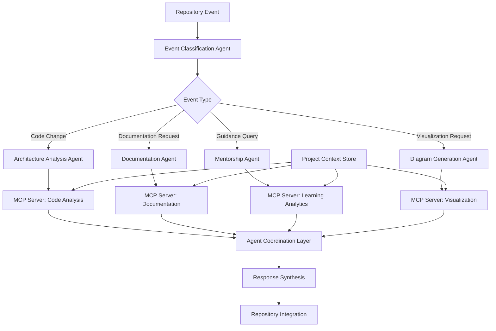

# Atelier: Intelligent Architectural Intelligence Platform
## *Connect your codebase, elevate your architecture*

---

## 🏛️ Why "Atelier"

The name "Atelier" comes from the French word for workshop—a place where artisans learn their craft through hands-on practice under expert guidance. Just as Renaissance painters learned by working alongside masters in their ateliers, modern developers need continuous architectural mentorship throughout their development journey.

**The Digital Workshop Metaphor:**
- **Traditional Development** = Working in isolation without architectural guidance
- **Atelier Platform** = Master architect constantly reviewing your work, providing insights, and maintaining living documentation

In our digital atelier, every commit becomes a learning opportunity, every architectural decision is analyzed and documented, and every developer grows from code writer to system architect through continuous, contextual guidance.

---

## 📋 Executive Summary

**Atelier** is a GitHub-integrated architectural intelligence platform that provides continuous guidance, automated documentation, and rich visualizations for your existing codebase. Rather than generating templates, we analyze your real projects to provide ongoing architectural mentorship and maintain living documentation as your code evolves.

### What We Do
- **Repository Integration**: Connects directly to your GitHub repositories for real-time codebase analysis
- **Continuous Architectural Guidance**: AI-powered insights that evolve with your project
- **Living Documentation**: Automatically generates and maintains Architecture Decision Records (ADRs) and system visualizations
- **Rich Visualizations**: Dynamic architecture diagrams, dependency maps, and complexity dashboards
- **Template Scaffolding**: Beginner-friendly project starters for those just beginning their architectural journey

### The AI Development Paradox We Solve

**Market Reality:**
As AI development tools accelerate project creation, industry leaders are raising the bar for architectural competency:
- **Google CEO Sundar Pichai**: "The future belongs to developers who understand systems, not just syntax"
- **Microsoft CEO Satya Nadella**: "AI will make coding faster, but architectural thinking more critical"
- **OpenAI CEO Sam Altman**: "Every developer needs to think like a software architect"

**The Paradox:**
- ⚡ **AI speeds up coding** → More projects created faster
- 📉 **Reduced learning time** → Less architectural understanding
- 📈 **Higher industry standards** → Recruiters expect architectural competency
- ❌ **Verification gap** → No way to prove real-world architectural skills

### Problems We Solve
| Current Reality | Atelier Solution |
|----------------|------------------|
| Fast AI-generated code with no architectural learning | Continuous guidance that explains architectural decisions |
| Documentation that becomes outdated immediately | Living documentation that updates with your code |
| No visibility into project architectural health | Rich visualizations and automated complexity analysis |
| Portfolio projects that don't demonstrate architectural thinking | Verified competency through analyzed real-world projects |
| Rising recruitment standards with no learning path | Structured architectural mentorship integrated into workflow |

---

## 🎯 Background & Motivation

### The Architecture Skills Crisis

**Industry Transformation Statistics:**
- 📊 **89%** of CS graduates feel unprepared for architectural responsibilities (Stack Overflow 2024)
- 💰 **$2.84 trillion** in technical debt exists due to poor architectural decisions (Stripe Survey 2024)
- 🚀 **340%** increase in "Software Architect" job postings since AI tools became mainstream
- 🎯 **73%** of recruiters now evaluate architectural thinking beyond coding ability

### The AI Development Paradox

**Accelerated Development, Reduced Learning:**
AI tools like GitHub Copilot, GPT-4, and Claude have transformed development speed, but created an unexpected challenge:

- **Faster Project Creation**: Developers can scaffold applications in minutes
- **Reduced Learning Time**: Less time spent understanding why architectural decisions were made
- **Higher Industry Expectations**: As basic coding becomes commoditized, architectural thinking becomes the differentiator
- **Verification Gap**: Unlike LeetCode for algorithms, no standardized way to demonstrate real-world architectural competency

### Current Educational Landscape Failures

**The Repository Analysis Gap:**
- **67%** of developer repositories show no architectural documentation
- **45%** of projects have no clear architectural patterns
- **78%** of side projects are abandoned when they become complex
- **89%** of developers report learning architecture "on the job" rather than systematically

**Portfolio Problem:**
- Projects look similar due to tutorial-following
- No evidence of architectural decision-making process
- Missing documentation of trade-offs and considerations
- Recruiters can't assess architectural thinking from code alone

---

## 🌟 Core Vision & Objectives

### Long-term Mission
*"Transform every developer into an architectural thinker by providing continuous, AI-powered guidance that analyzes real codebases, maintains living documentation, and creates rich visualizations that demonstrate genuine architectural competency."*

### Five Core Technical Goals

#### 1. 🔗 Repository Connection & Analysis Engine (40% Priority)
- **Objective**: Seamlessly integrate with existing GitHub repositories for real-time analysis
- **Approach**: Webhook-driven monitoring, comprehensive codebase parsing, and pattern recognition
- **Outcome**: Every code change triggers architectural analysis and guidance
- **Visualization Focus**: Automated dependency graphs, architecture evolution timelines

#### 2. 🧠 Continuous Architectural Guidance System (25% Priority)
- **Objective**: Provide ongoing, contextual architectural mentorship throughout development
- **Approach**: AI-powered analysis of code changes with historical context and best practice recommendations
- **Outcome**: Developers receive architectural insights when they need them most
- **Learning Integration**: Just-in-time architectural education based on actual code decisions

#### 3. 📊 Living Documentation & Rich Visualizations (25% Priority)
- **Objective**: Automatically generate and maintain comprehensive architectural documentation
- **Approach**: Dynamic ADR creation, interactive diagram generation, and real-time documentation updates
- **Outcome**: Documentation that evolves with the codebase and provides visual insights
- **Visualization Suite**: Mermaid diagrams, dependency maps, complexity heatmaps, architecture evolution dashboards

#### 4. 🏗️ Template Scaffolding for Beginners (10% Priority)
- **Objective**: Provide architecturally-sound starting points for new developers
- **Approach**: Curated templates that integrate with guidance system from day one
- **Outcome**: Beginners start with solid foundations and immediate access to architectural mentorship
- **Integration**: Templates immediately connect to continuous guidance system

#### 5. 🎓 Architectural Competency Verification
- **Objective**: Create verifiable proof of architectural thinking and decision-making
- **Approach**: Project analysis portfolios, architectural decision tracking, and competency scoring
- **Outcome**: Developers can demonstrate real-world architectural skills to recruiters

---

## 🗺️ Development Roadmap

### Phase 1: Repository Integration Foundation *(Months 1-3)*
**Focus**: Build core GitHub integration and codebase analysis engine

**Key Deliverables:**
- ✅ GitHub OAuth integration and repository access
- ✅ Webhook system for real-time code change monitoring
- ✅ Codebase analysis engine (dependency mapping, pattern recognition)
- ✅ Basic architectural insight generation
- ✅ User dashboard for repository management

**Success Criteria:**
- 500+ repositories connected
- 1,000+ architectural insights generated
- 85%+ accuracy in pattern recognition

### Phase 2: Continuous Guidance & Visualization *(Months 4-6)*
**Focus**: Implement AI-powered guidance system and rich visualizations

**Key Deliverables:**
- ✅ Real-time architectural guidance notifications
- ✅ Interactive architecture diagram generation (Mermaid integration)
- ✅ Dependency visualization and complexity analysis
- ✅ Automated ADR generation and maintenance
- ✅ Project health monitoring dashboard

**Success Criteria:**
- 2,000+ active connected repositories
- 80%+ of users act on architectural guidance
- 4.5+ average user satisfaction with visualizations

### Phase 3: Living Documentation & Learning Integration *(Months 7-9)*
**Focus**: Advanced documentation automation and educational content

**Key Deliverables:**
- ✅ Living documentation system with automatic updates
- ✅ Contextual learning content delivery
- ✅ Architectural decision tracking and history
- ✅ Team collaboration features for shared repositories
- ✅ Template scaffolding system for beginners

**Success Criteria:**
- 5,000+ repositories with active documentation
- 90%+ documentation accuracy and relevance
- 60%+ improvement in user architectural assessments

### Phase 4: Verification & Enterprise Scale *(Months 10-12)*
**Focus**: Competency verification system and enterprise features

**Key Deliverables:**
- ✅ Architectural competency scoring and certification
- ✅ Portfolio generation for job applications
- ✅ Enterprise team analytics and reporting
- ✅ Advanced visualization suite (3D architecture maps, interactive dashboards)
- ✅ Multi-platform integration (GitLab, Bitbucket support)

**Success Criteria:**
- 10,000+ total connected repositories
- 100+ verified architectural portfolios
- 5+ enterprise partnerships

---

## 🤖 AI Agents & MCP Integration

### Strategic Positioning
After establishing core platform functionality and user adoption, Atelier will integrate advanced AI agents and Model Context Protocol (MCP) capabilities to transform from a repository analysis platform into an intelligent architectural mentorship ecosystem.

### AI Agent Architecture

### Core AI Capabilities

#### 1. 🏗️ Repository Analysis Agent
**Purpose**: Continuously analyze repository changes and provide architectural insights

**Key Features:**
- **Real-time Pattern Recognition**: Identifies architectural patterns and anti-patterns in commits
- **Evolution Tracking**: Monitors how architectural decisions impact project complexity over time
- **Dependency Analysis**: Tracks coupling, cohesion, and architectural boundary violations
- **Technical Debt Detection**: Identifies architectural compromises and tracks their impact

**MCP Integration:**
- **Code Analysis Server**: Connects to static analysis tools, dependency analyzers, complexity metrics
- **Pattern Recognition Server**: Accesses architectural pattern database and best practices
- **Version Control Server**: Integrates deeply with Git history and branch analysis

#### 2. 📊 Visualization Generation Agent
**Purpose**: Create and maintain rich, interactive architectural visualizations

**Key Features:**
- **Dynamic Diagram Generation**: Creates Mermaid diagrams that update with code changes
- **Dependency Mapping**: Visualizes module dependencies and architectural layers
- **Complexity Heatmaps**: Shows code complexity and architectural hotspots
- **Evolution Timelines**: Tracks architectural changes over project history

**MCP Integration:**
- **Diagram Generation Server**: Integrates with Mermaid, PlantUML, and custom visualization tools
- **Data Visualization Server**: Connects to D3.js, Chart.js for interactive dashboards
- **Export Server**: Generates diagrams for documentation, presentations, and portfolios

#### 3. 📚 Continuous Learning Agent
**Purpose**: Provide contextual architectural education based on actual code decisions

**Key Features:**
- **Just-in-Time Learning**: Delivers relevant architectural content when code patterns are detected
- **Decision Context**: Explains why certain architectural choices are recommended for specific situations
- **Skill Assessment**: Evaluates architectural growth through repository analysis
- **Personalized Guidance**: Adapts recommendations based on developer experience and project type

**MCP Integration:**
- **Learning Content Server**: Accesses curated architectural education materials
- **Assessment Server**: Tracks learning progress and competency development
- **Recommendation Engine**: Suggests relevant patterns, articles, and best practices

#### 4. 📝 Living Documentation Agent
**Purpose**: Automatically maintain comprehensive architectural documentation

**Key Features:**
- **Automated ADR Generation**: Creates architectural decision records from code analysis
- **Documentation Synchronization**: Keeps documentation in sync with code changes
- **Onboarding Guide Generation**: Creates project setup and contribution guides
- **API Documentation**: Maintains up-to-date API documentation and examples

**MCP Integration:**
- **Documentation Server**: Connects to GitHub Wiki, Notion, Confluence
- **Template Engine**: Uses smart templates for consistent documentation formats
- **Change Detection Server**: Monitors code changes that require documentation updates

---

## 🏗️ System Architecture

### High-Level Component Diagram

### Technology Stack

| Layer | Technology | Rationale |
|-------|------------|-----------|
| **Frontend** | Next.js 14 + React 18 | SSR/SSG for SEO, excellent GitHub integration |
| **Styling** | Tailwind CSS + Radix UI | Rapid development, accessible visualization components |
| **Backend** | Node.js + Express.js + tRPC | Type-safe APIs, excellent GitHub API integration |
| **Database** | PostgreSQL 15+ | Complex repository data relationships, JSON support |
| **Cache** | Redis | Visualization caching, real-time analysis results |
| **Auth** | Auth0 + GitHub OAuth | Secure repository access, social login |
| **Repository Integration** | GitHub API + Webhooks | Real-time monitoring, comprehensive access |
| **Hosting** | Vercel + Railway | Excellent CI/CD, GitHub integration |
| **Visualization** | Mermaid + D3.js + Chart.js | Rich diagrams, interactive dashboards |
| **AI/ML** | OpenAI GPT-4 + Claude | Advanced code analysis and guidance |
| **Monitoring** | Sentry + Vercel Analytics | Error tracking, performance insights |

### Data Architecture

**Core Data Models:**
- **Users**: GitHub authentication, preferences, repository permissions
- **Repositories**: Connected repos, analysis history, architectural metrics
- **Analysis Results**: Pattern recognition, complexity metrics, architectural insights
- **Visualizations**: Generated diagrams, dependency maps, cached visualizations
- **Documentation**: ADRs, guides, automatically generated content
- **Learning Progress**: Architectural skill assessment, personalized guidance history

---

## 📅 Implementation Timeline

### 12-Month Gantt Schedule

| Phase | Duration | Hours/Week | Key Focus Areas |
|-------|----------|------------|-----------------|
| **Phase 1: Repository Integration** | Months 1-3 | 35-40 hrs | GitHub API, Analysis Engine, Basic UI |
| **Phase 2: Guidance & Visualization** | Months 4-6 | 30-35 hrs | AI Insights, Diagram Generation, Real-time Updates |
| **Phase 3: Living Documentation** | Months 7-9 | 25-30 hrs | ADR Automation, Learning Integration, Team Features |
| **Phase 4: Verification & Scale** | Months 10-12 | 30-35 hrs | Competency System, Enterprise Features, Multi-platform |

### Monthly Breakdown

**Q1 (Repository Integration Foundation)**
- **Month 1**: GitHub OAuth, webhook system, basic repository analysis
- **Month 2**: Pattern recognition engine, dependency mapping, user dashboard
- **Month 3**: Real-time analysis, notification system, basic visualizations

**Q2 (Continuous Guidance & Visualization)**
- **Month 4**: AI-powered guidance system, architectural insight generation
- **Month 5**: Rich visualization suite, interactive diagrams, complexity analysis
- **Month 6**: Living documentation foundation, automated ADR generation

**Q3 (Documentation & Learning Integration)**
- **Month 7**: Advanced documentation automation, learning content integration
- **Month 8**: Team collaboration features, shared repository analysis
- **Month 9**: Template scaffolding system, beginner onboarding

**Q4 (Verification & Enterprise)**
- **Month 10**: Competency scoring system, portfolio generation
- **Month 11**: Enterprise analytics, advanced team features
- **Month 12**: Multi-platform support, certification system launch

---

## 💼 Resource Requirements

### Team Composition

| Role | Phase 1-2 | Phase 3-4 | Responsibilities |
|------|-----------|-----------|------------------|
| **Lead Developer** | Full-time | Full-time | Repository integration, analysis engine, product strategy |
| **Frontend Developer** | Part-time | Full-time | Dashboard UI, visualization components, user experience |
| **DevOps Engineer** | Consultant | Part-time | GitHub integration, webhook infrastructure, monitoring |
| **AI/ML Engineer** | - | Part-time | Analysis algorithms, pattern recognition, AI agents |
| **Technical Writer** | Part-time | Part-time | Documentation templates, educational content |

### Infrastructure & Service Costs

**Repository Integration Services:**
- GitHub API (Enterprise): $21/month per user
- Webhook processing infrastructure: $50-100/month
- Real-time analysis computing: $200-400/month

**Visualization & Documentation:**
- Diagram generation services: $30-60/month
- Documentation storage and processing: $40-80/month
- CDN for visualization assets: $25-50/month

**AI & Analysis:**
- OpenAI API for code analysis: $200-500/month
- Pattern recognition computing: $100-200/month
- Learning content delivery: $50-100/month

### Third-Party Services

| Service | Purpose | Monthly Cost |
|---------|---------|--------------|
| **GitHub API** | Repository access and webhooks | $21+ per user |
| **OpenAI API** | AI-powered code analysis | $200-500 |
| **Auth0** | Authentication and GitHub OAuth | $23-100 |
| **Vercel** | Hosting and edge computing | $20-100 |
| **Railway** | Database and backend services | $20-80 |
| **Sentry** | Error monitoring and performance | $26-100 |

---

## ⚠️ Risk Analysis & Mitigations

### Technical Risks

| Risk | Impact | Probability | Mitigation Strategy |
|------|--------|-------------|-------------------|
| **GitHub API Rate Limits** | High | Medium | Implement intelligent caching, user-based rate limiting, webhook optimization |
| **Repository Analysis Complexity** | High | Medium | Start with popular languages/frameworks, gradual language support expansion |
| **Real-time Processing Scale** | High | Medium | Queue-based processing, horizontal scaling, intelligent batching |
| **Visualization Performance** | Medium | Low | Client-side rendering optimization, caching strategies, progressive loading |

### Product Risks

| Risk | Impact | Probability | Mitigation Strategy |
|------|--------|-------------|-------------------|
| **Repository Permission Concerns** | High | Medium | Transparent permission requests, minimal access requirements, clear privacy policy |
| **Analysis Accuracy** | High | Medium | Continuous validation, user feedback loops, expert review processes |
| **User Adoption of Repository Integration** | High | Medium | Seamless onboarding, immediate value demonstration, gradual feature introduction |
| **Competition from GitHub Native Features** | Medium | High | Focus on advanced analysis and visualization GitHub doesn't provide |

### Business Risks

| Risk | Impact | Probability | Mitigation Strategy |
|------|--------|-------------|-------------------|
| **GitHub API Policy Changes** | High | Low | Multi-platform support (GitLab, Bitbucket), own analysis capabilities |
| **AI/ML Service Dependencies** | Medium | Medium | Multiple AI provider integration, local analysis capabilities |
| **Privacy and Security Compliance** | High | Low | SOC 2 compliance, regular security audits, transparent data handling |

---

## 📊 Success Metrics

### Primary KPIs

#### Repository Integration Metrics
- **Connected Repositories**: Target 1,000 by Month 6, 10,000 by Month 12
- **Active Analysis Sessions**: Target 5,000 by Month 6, 25,000 by Month 12
- **Real-time Insight Delivery**: <5 seconds for 95% of code change analyses
- **Repository Coverage**: Cover 80% of popular language/framework combinations

#### Continuous Guidance Effectiveness
- **Guidance Acceptance Rate**: >70% of architectural suggestions followed
- **Code Quality Improvement**: 40%+ reduction in architectural anti-patterns
- **Developer Skill Growth**: 50%+ improvement in architectural assessment scores
- **Time to Architectural Insight**: <1 minute from code commit to guidance

#### Visualization & Documentation Quality
- **Documentation Coverage**: >90% of connected repositories have active ADRs
- **Visualization Usage**: >80% of users regularly view generated diagrams
- **Documentation Accuracy**: >85% of auto-generated documentation rated as accurate
- **Living Documentation Updates**: 95% of relevant code changes trigger documentation updates

#### User Growth & Retention
- **Monthly Active Repositories**: 20%+ month-over-month growth
- **User Retention**: >70% return within 30 days of repository connection
- **Premium Conversion**: >25% of users upgrade for advanced features
- **Net Promoter Score**: Target >60 NPS

### Secondary Metrics

#### Platform Performance
- **Analysis Processing Time**: <30 seconds for 95% of repository analyses
- **Visualization Generation**: <10 seconds for standard diagrams
- **System Uptime**: >99.9% availability for GitHub webhook processing
- **API Response Time**: <200ms for 95% of user interface requests

#### Educational Impact
- **Architectural Competency Growth**: 45%+ improvement in skill assessments
- **Learning Content Engagement**: >60% engagement with contextual educational content
- **Certification Completion**: 100+ verified architectural portfolios by Month 12
- **Recruiter Adoption**: 50+ companies using Atelier portfolios for technical assessment

#### Business Metrics
- **Repository Connection Rate**: >40% of trial users connect at least one repository
- **Feature Adoption**: >60% of connected repositories use visualization features
- **Support Efficiency**: <1% of users require technical support monthly
- **Revenue per Connected Repository**: Target $5+ monthly average

---

## 🔄 Evaluation & Iteration

### Weekly Analysis Cycle

**Repository Health Monitoring:**
- Track analysis accuracy and user feedback on architectural insights
- Monitor webhook processing performance and GitHub API usage
- Analyze visualization generation success rates and user engagement
- Review documentation quality and automated ADR accuracy

**User Behavior Analysis:**
- Track repository connection patterns and onboarding success
- Analyze feature adoption rates and user journey progression
- Monitor guidance acceptance rates and architectural improvements
- Assess learning content engagement and competency growth

### Monthly Strategic Review

**Product-Market Fit Assessment:**
- Evaluate user retention and repository connection growth
- Analyze feedback on architectural guidance quality and relevance
- Review competitive landscape and differentiation opportunities
- Assess enterprise interest and potential partnership opportunities

**Technical Performance Review:**
- Monitor system scalability and GitHub integration stability
- Evaluate AI analysis accuracy and processing efficiency
- Review visualization performance and user experience metrics
- Assess documentation automation quality and coverage

### Quarterly Platform Evolution

**Feature Prioritization:**
- Analyze user requests for new analysis capabilities
- Evaluate opportunities for additional repository platform support
- Review AI agent integration possibilities and MCP implementation
- Assess enterprise feature requirements and team collaboration needs

**Architectural Health Assessment:**
- Review platform architecture and scalability requirements
- Evaluate integration stability and third-party service dependencies
- Assess data architecture and analysis pipeline efficiency
- Plan infrastructure improvements and cost optimizations

---

## 🎯 Conclusion & Next Steps

### The Transformed Vision

Atelier represents a fundamental shift from template-based development to continuous architectural intelligence. By connecting directly to developers' existing repositories and providing real-time analysis, rich visualizations, and living documentation, we address the core challenge of the AI development era: maintaining architectural learning while accelerating development speed.

**Our Unique Value Proposition:**
- **Repository-Centric**: Analyzes real projects, not theoretical exercises
- **Continuous Intelligence**: Provides ongoing guidance as projects evolve
- **Rich Visualizations**: Automated diagrams and architectural insights
- **Verified Competency**: Demonstrates genuine architectural thinking to recruiters
- **AI Paradox Solution**: Ensures AI acceleration enhances rather than replaces architectural learning

### Immediate Action Items

#### Week 1-2: Technical Foundation
- [ ] Set up GitHub OAuth integration and repository access permissions
- [ ] Create webhook infrastructure for real-time repository monitoring
- [ ] Implement basic repository analysis for JavaScript/TypeScript projects
- [ ] Design database schema for repository data and analysis results

#### Week 3-4: Analysis Engine Development
- [ ] Build pattern recognition system for common architectural patterns
- [ ] Implement dependency analysis and architectural boundary detection
- [ ] Create basic visualization generation (Mermaid diagram integration)
- [ ] Develop user dashboard for repository management and insights

#### Month 2: Core Platform Development
- [ ] Implement real-time analysis pipeline and notification system
- [ ] Build comprehensive visualization suite (dependency maps, complexity analysis)
- [ ] Create automated ADR generation and documentation templates
- [ ] Develop user onboarding flow for repository connection

#### Month 3: AI Integration & Polish
- [ ] Integrate AI-powered architectural guidance and insight generation
- [ ] Implement living documentation system with automatic updates
- [ ] Create learning content delivery system based on code analysis
- [ ] Conduct comprehensive testing and performance optimization

### Success Criteria for Go/No-Go Decision

**Technical Validation:**
- Repository analysis accurately identifies architectural patterns in 85%+ of test cases
- Webhook processing handles real-time updates with <5 second latency
- Visualization generation produces accurate, useful diagrams for all major project types

**Market Validation:**
- 200+ developers connect repositories during beta testing
- 80%+ of beta users rate architectural insights as valuable (4/5 or higher)
- 60%+ of beta users demonstrate improved architectural understanding through analysis

**Product-Market Fit Indicators:**
- Users organically share architectural insights and visualizations from their projects
- Requests for additional repository platform support (GitLab, Bitbucket)
- Enterprise inquiries about team collaboration and advanced analytics features

### The Architectural Intelligence Future

Atelier isn't just another developer tool—it's the foundation for a new era of architectural intelligence. By starting with repository integration and continuous guidance, we're building the platform that ensures every developer can demonstrate genuine architectural competency in an AI-accelerated world.

The future belongs to developers who can design systems, not just write code. Atelier will be their continuous mentor, their documentation partner, and their verification system.

---

*Ready to transform how developers learn and demonstrate architectural thinking? Let's connect your first repository.*