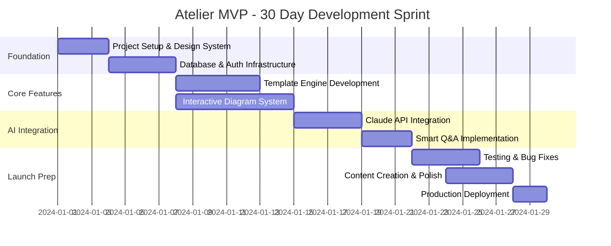
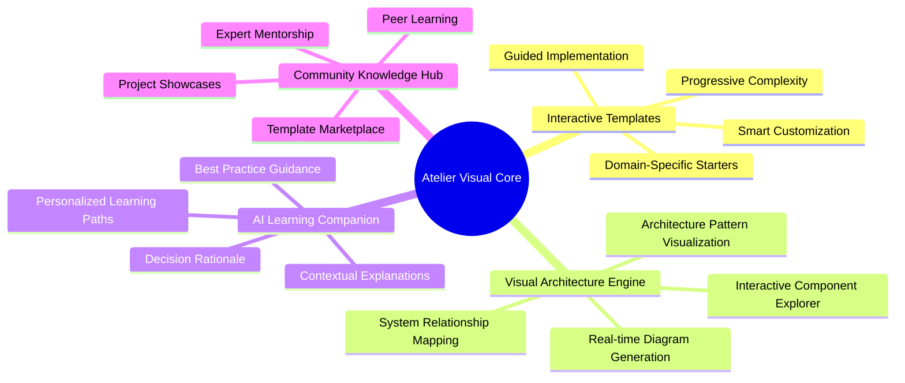
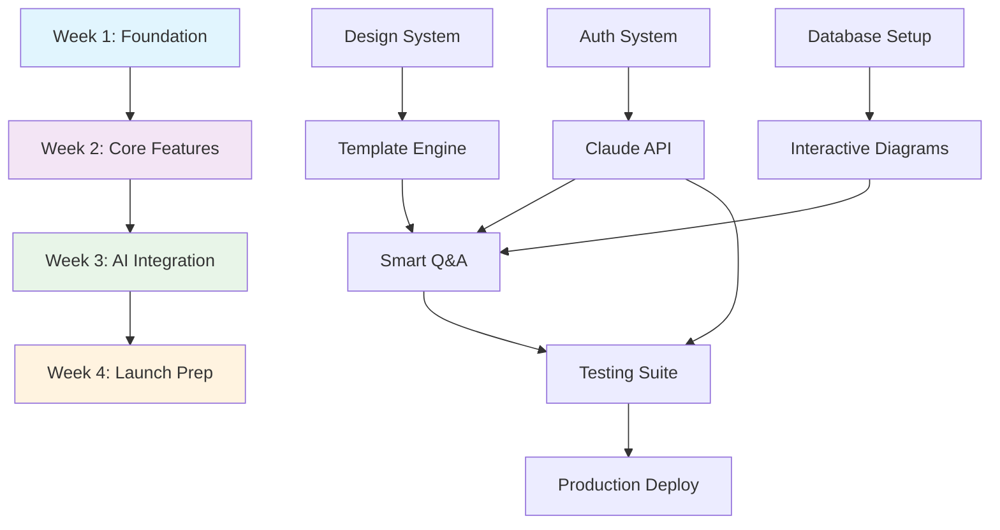
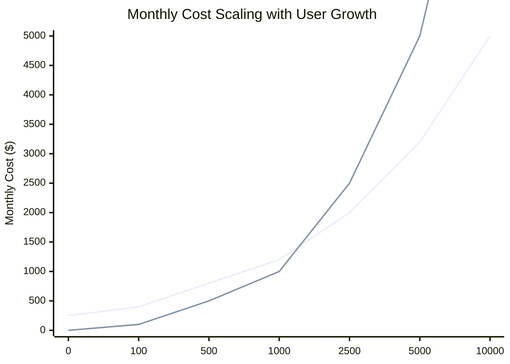
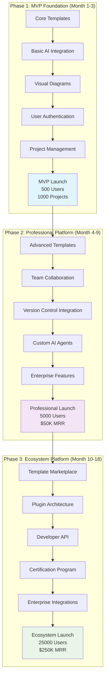
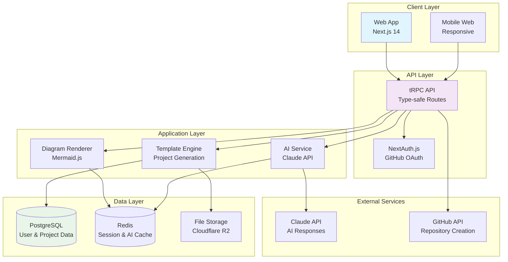
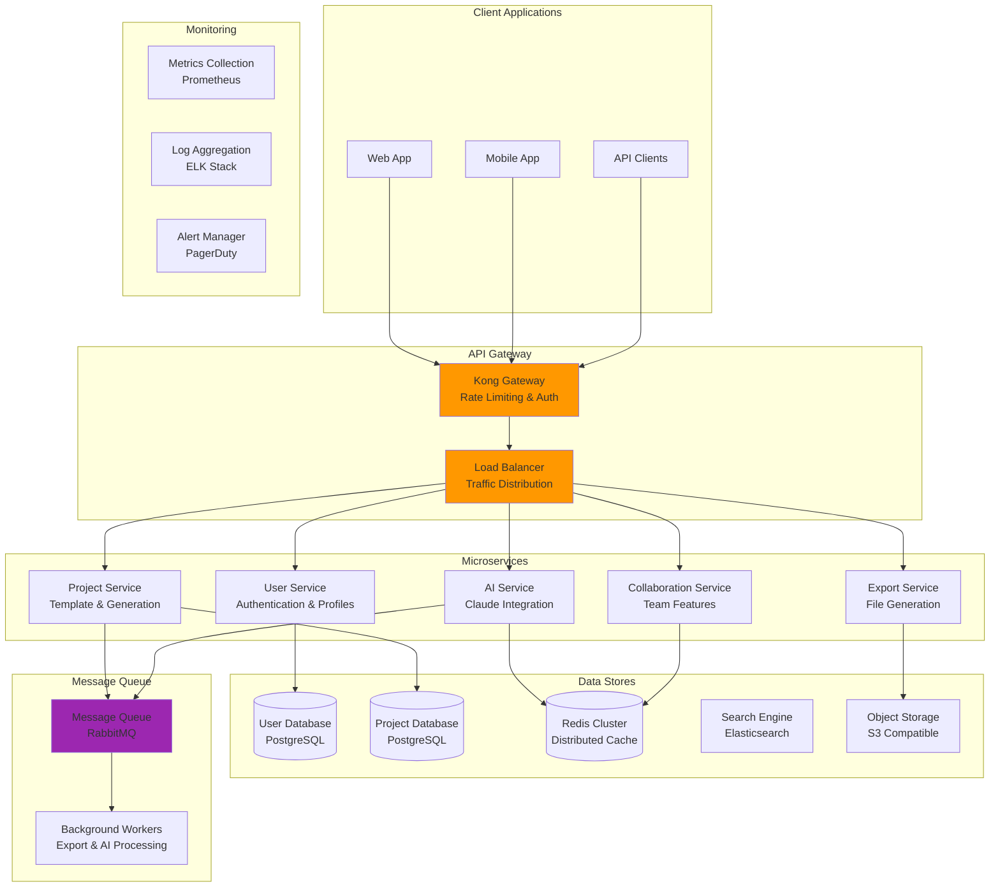

# 🏗️ Atelier: Intelligent Visual Architecture Platform
## *Complete Development Guide – From MVP to Full Platform*

---

## 🎯 Why "Atelier"?

Just as Renaissance masters taught apprentices in their **ateliers** (workshops), modern developers need a **visual workspace** where they can learn architecture through hands-on practice with intelligent guidance.

**The Visual Workshop Metaphor:**
- **Traditional Coding Tutorials** = Teaching brush strokes in isolation
- **Atelier Platform** = Master's visual studio where you compose entire architectural masterpieces

In our digital atelier, every project becomes a **visual learning experience**, every architectural decision is **diagrammed and explained**, and every developer evolves from code writer to **system architect**.

---

## 📑 Table of Contents

<details>
<summary><strong>Complete Development Guide</strong></summary>

- [🚀 Enhanced MVP Strategy](#-enhanced-mvp-strategy)
- [🎯 Executive Summary](#-executive-summary)
- [🌍 Background & Motivation](#-background--motivation)
- [🎯 Core Vision & Objectives](#-core-vision--objectives)
- [🔥 30-Day Enhanced Development Plan](#-30-day-enhanced-development-plan)
- [💎 Enhanced Feature Set](#-enhanced-feature-set)
- [🛠️ Enhanced Technology Stack](#️-enhanced-technology-stack)
- [🎨 Visual Design System](#-visual-design-system)
- [💰 Enhanced Budget & Cost Management](#-enhanced-budget--cost-management)
- [📋 Complete Development Checklist](#-complete-development-checklist)
- [🗺️ Full Platform Development Roadmap](#️-full-platform-development-roadmap)
- [🏗️ System Architecture Evolution](#️-system-architecture-evolution)
- [🤖 AI Model Strategy](#-ai-model-strategy)
- [🔧 MCP Servers & AI Agents Integration](#-mcp-servers--ai-agents-integration)

</details>

---

## 🚀 Enhanced MVP Strategy

### Core MVP Definition: "Visual Architecture Learning Companion"

**Primary Value Proposition:** Transform abstract architectural concepts into **interactive visual experiences** that teach through practice, not theory.

### MVP Success Metrics

| Metric | Target | Timeline |
|--------|---------|----------|
| **User Registrations** | 500+ | 30 days |
| **Projects Created** | 1,000+ | 30 days |
| **Template Completion Rate** | 70%+ | Weekly tracking |
| **Daily Active Users** | 100+ | Week 4 |
| **User Session Duration** | 15+ minutes | Week 3 |
| **AI Interaction Rate** | 60%+ | Week 4 |

### 30-Day Sprint Timeline



---

## 🎯 Executive Summary

### The Problem
**73% of software projects fail due to poor architectural decisions**, yet developers learn architecture through abstract theory rather than **visual, hands-on practice**. Current educational tools focus on code syntax rather than system design thinking.

### The Solution
**Atelier** is an intelligent visual platform that teaches software architecture through:
- **Interactive project templates** with built-in architectural guidance
- **Real-time diagram generation** that visualizes system relationships
- **AI-powered mentorship** that explains architectural decisions contextually
- **Progressive complexity** that grows with developer expertise

### Target Users
1. **Junior-to-Mid Developers** (Primary): 2-5 years experience, seeking architectural skills
2. **Bootcamp Graduates** (Secondary): Need portfolio projects that demonstrate system thinking
3. **CS Students** (Secondary): Want practical application of theoretical knowledge
4. **Career Switchers** (Tertiary): Building technical credibility through quality projects

### Competitive Advantage
| Competitors | Atelier Advantage |
|-------------|-------------------|
| **GitHub Templates** | Static vs. **Interactive with AI guidance** |
| **Tutorial Platforms** | Code-focused vs. **Architecture-first visual learning** |
| **Draw.io/Lucidchart** | Manual diagramming vs. **Automated architectural visualization** |
| **Coding Bootcamps** | Generic curriculum vs. **Personalized learning paths** |

### Revenue Potential
- **Freemium Model**: Core templates free, advanced features $19/month
- **Enterprise Licensing**: Team features, custom templates $99/month per team
- **Marketplace Revenue**: 30% commission on community-created templates
- **Certification Programs**: Architectural competency credentials $199/certification

---

## 🌍 Background & Motivation

### Market Pain Points

**Developer Skills Gap:**
- 📊 **89%** of CS graduates feel unprepared for architectural responsibilities
- 💰 **$2.84 trillion** in global technical debt from poor architectural decisions
- 📈 **340%** increase in "Software Architect" job postings since 2020
- 🎓 **67%** of side projects abandoned due to poor initial structure

### Current Reality vs. Atelier Visual Solution

| Current Reality | Atelier Visual Solution |
|----------------|-------------------------|
| **Abstract architectural concepts** | **Interactive visual diagrams** showing system relationships |
| **Generic boilerplate templates** | **Intelligent templates** that adapt to specific requirements |
| **No guidance on architectural decisions** | **AI mentor** explaining why patterns were chosen |
| **Text-based documentation** | **Living visual documentation** that updates with code |
| **Isolated learning experiences** | **Progressive learning paths** with measurable skill development |
| **Portfolio projects look identical** | **Unique architectures** tailored to specific problem domains |

### The Architecture Education Crisis

**Current State:**
- Developers learn by copying code without understanding system design
- Architecture knowledge comes from expensive mistakes in production
- No structured path from junior coding to senior architectural thinking
- Visual learners struggle with text-heavy architectural resources

**Atelier's Approach:**
- **Visual-first learning** that makes abstract concepts concrete
- **Practice-based education** through real project construction
- **AI-guided mentorship** providing contextual architectural insights
- **Progressive skill building** with measurable advancement

---

## 🎯 Core Vision & Objectives



### Five Core Technical Objectives

#### 1. 🎨 **Visual Architecture Engine**
Transform abstract system designs into **interactive, explorable diagrams** that update in real-time as projects evolve.

#### 2. 🧩 **Intelligent Template System**
Replace static boilerplate with **adaptive project foundations** that customize based on requirements and learning objectives.

#### 3. 🤖 **AI Learning Companion**
Provide **contextual architectural mentorship** that explains decisions, suggests improvements, and guides skill development.

#### 4. 📊 **Progressive Skill Tracking**
Measure and visualize **architectural competency growth** through project analysis and decision quality assessment.

#### 5. 🌐 **Community Knowledge Network**
Enable **collaborative learning** where architectural expertise is shared, validated, and continuously improved.

---

## 🔥 30-Day Enhanced Development Plan

### High-Level Workflow Dependencies



### Weekly Breakdown

#### **Week 1: Visual Foundation & Setup**
**Focus:** Establish technical foundation and visual design system

**Key Deliverables:**
- ✅ Project initialization with Next.js 14 + TypeScript
- ✅ Tailwind CSS configuration with custom design tokens
- ✅ Database schema design and Prisma setup
- ✅ Authentication system with NextAuth.js
- ✅ Basic component library with Storybook

**Success Criteria:**
- Clean development environment with hot reload
- Database connection and migrations working
- Authentication flow (GitHub OAuth) functional
- Design system components documented

#### **Week 2: Interactive Features**
**Focus:** Build core template engine and diagram visualization

**Key Deliverables:**
- ✅ Interactive template builder with form-based customization
- ✅ Mermaid.js integration for real-time diagram rendering
- ✅ Project structure visualization with file tree explorer
- ✅ Template metadata system and categorization
- ✅ Basic project dashboard with creation workflow

**Success Criteria:**
- Users can create projects from 3 different templates
- Diagrams render correctly and update with customizations
- Project data persists and loads reliably
- Template customization options work as expected

#### **Week 3: AI Integration**
**Focus:** Implement Claude-powered features for architectural guidance

**Key Deliverables:**
- ✅ Claude API integration with proper error handling
- ✅ Smart diagram generation from project requirements
- ✅ Contextual Q&A system for architectural decisions
- ✅ Automated ADR (Architecture Decision Record) generation
- ✅ AI-powered project analysis and recommendations

**Success Criteria:**
- AI generates relevant architectural diagrams 80% of the time
- Q&A responses are contextually accurate and helpful
- System handles API rate limits and errors gracefully
- ADR generation produces professional-quality documentation

#### **Week 4: Polish & Launch**
**Focus:** Testing, optimization, and production deployment

**Key Deliverables:**
- ✅ Comprehensive testing suite (unit, integration, E2E)
- ✅ Project export functionality (zip download, GitHub creation)
- ✅ Performance optimization and bundle analysis
- ✅ SEO optimization and meta tag configuration
- ✅ Production deployment with monitoring

**Success Criteria:**
- All critical user flows pass automated tests
- Page load times under 2 seconds for 95% of requests
- Export functionality works for all template types
- Production environment stable with monitoring alerts

---

## 💎 Enhanced Feature Set

### Five Rich Project Templates

#### 1. **E-commerce Microservices Architecture**
```typescript
interface EcommerceTemplate {
  services: {
    userService: MicroserviceConfig
    productService: MicroserviceConfig
    orderService: MicroserviceConfig
    paymentService: MicroserviceConfig
    notificationService: MicroserviceConfig
  }
  infrastructure: {
    apiGateway: GatewayConfig
    serviceDiscovery: DiscoveryConfig
    messageQueue: QueueConfig
    database: DatabaseConfig[]
  }
  patterns: ['CQRS', 'Event Sourcing', 'Saga Pattern']
  complexity: 'Advanced'
  estimatedTime: '2-3 weeks'
}
```

#### 2. **Real-time Chat Application**
```typescript
interface ChatTemplate {
  architecture: {
    frontend: 'React + Socket.io'
    backend: 'Node.js + Express'
    realtime: 'WebSocket connections'
    database: 'MongoDB + Redis'
  }
  features: {
    messaging: MessageConfig
    userPresence: PresenceConfig
    fileSharing: FileConfig
    roomManagement: RoomConfig
  }
  patterns: ['Publisher-Subscriber', 'Connection Pool', 'Event-Driven']
  complexity: 'Intermediate'
  estimatedTime: '1-2 weeks'
}
```

#### 3. **AI-Powered Content Management System**
```typescript
interface AICMSTemplate {
  components: {
    contentEditor: EditorConfig
    aiProcessor: AIConfig
    mediaManager: MediaConfig
    userManagement: UserConfig
  }
  aiFeatures: {
    contentGeneration: 'GPT-4 integration'
    imageProcessing: 'DALL-E + Vision'
    seoOptimization: 'Automated meta generation'
    contentAnalysis: 'Sentiment + readability'
  }
  patterns: ['Plugin Architecture', 'Strategy Pattern', 'Observer Pattern']
  complexity: 'Advanced'
  estimatedTime: '2-4 weeks'
}
```

#### 4. **Serverless Data Pipeline**
```typescript
interface DataPipelineTemplate {
  pipeline: {
    ingestion: 'AWS Lambda + API Gateway'
    processing: 'Step Functions + Lambda'
    storage: 'S3 + DynamoDB'
    analysis: 'Athena + QuickSight'
  }
  dataFlow: {
    sources: DataSourceConfig[]
    transformations: TransformationConfig[]
    destinations: DestinationConfig[]
  }
  patterns: ['Event-Driven Architecture', 'ETL Pipeline', 'CQRS']
  complexity: 'Intermediate'
  estimatedTime: '1-3 weeks'
}
```

#### 5. **Progressive Web App (PWA) Framework**
```typescript
interface PWATemplate {
  architecture: {
    frontend: 'React + Service Worker'
    state: 'Redux Toolkit + RTK Query'
    storage: 'IndexedDB + Cache API'
    sync: 'Background Sync + Push API'
  }
  pwaFeatures: {
    offline: OfflineConfig
    installation: InstallConfig
    notifications: NotificationConfig
    backgroundSync: SyncConfig
  }
  patterns: ['Offline-First', 'App Shell', 'Cache-First']
  complexity: 'Intermediate'
  estimatedTime: '1-2 weeks'
}
```

### Interactive Diagram Engine

#### Real-Time Architecture Visualization
```typescript
interface DiagramEngine {
  renderers: {
    mermaid: MermaidRenderer
    d3: D3Renderer
    cytoscape: CytoscapeRenderer
  }
  
  diagramTypes: {
    systemArchitecture: SystemDiagramConfig
    dataFlow: DataFlowConfig
    sequenceDiagram: SequenceConfig
    componentRelationship: ComponentConfig
  }
  
  interactivity: {
    nodeSelection: NodeSelectionHandler
    zoomPan: ZoomPanHandler
    tooltips: TooltipHandler
    animations: AnimationHandler
  }
}

// Mermaid Integration Example
class MermaidRenderer {
  generateSystemDiagram(projectConfig: ProjectConfig): string {
    return `
    graph TB
      ${projectConfig.services.map(service => 
        `${service.id}[${service.name}]`
      ).join('\n      ')}
      
      ${projectConfig.connections.map(conn => 
        `${conn.from} --> ${conn.to}`
      ).join('\n      ')}
    `
  }
  
  generateSequenceDiagram(userFlow: UserFlow): string {
    return `
    sequenceDiagram
      ${userFlow.actors.map(actor => 
        `participant ${actor.id} as ${actor.name}`
      ).join('\n      ')}
      
      ${userFlow.interactions.map(interaction => 
        `${interaction.from}->>+${interaction.to}: ${interaction.message}`
      ).join('\n      ')}
    `
  }
}
```

### AI Q&A System

#### Contextual Architecture Assistant
```typescript
interface AIAssistant {
  capabilities: {
    architecturalGuidance: ArchitecturalGuidanceConfig
    patternRecommendation: PatternRecommendationConfig
    codeReview: CodeReviewConfig
    documentationGeneration: DocumentationConfig
  }
  
  contextSources: {
    projectStructure: ProjectStructureAnalyzer
    userHistory: UserHistoryAnalyzer
    industryBestPractices: BestPracticesDB
    communityKnowledge: CommunityKnowledgeBase
  }
}

// Claude API Integration
class ClaudeAssistant {
  async analyzeArchitecture(projectData: ProjectData): Promise<ArchitecturalAnalysis> {
    const prompt = this.buildAnalysisPrompt(projectData)
    const response = await this.claudeAPI.complete({
      prompt,
      max_tokens: 1000,
      temperature: 0.3
    })
    
    return this.parseArchitecturalAnalysis(response.completion)
  }
  
  async generateADR(decision: ArchitecturalDecision): Promise<ADRDocument> {
    const template = await this.getADRTemplate(decision.type)
    const context = await this.gatherDecisionContext(decision)
    
    return await this.claudeAPI.generateDocument({
      template,
      context,
      format: 'markdown'
    })
  }
}
```

### Learning Analytics Engine

#### Progress Tracking System
```typescript
interface LearningAnalytics {
  skillAssessment: {
    architecturalPatterns: PatternKnowledgeTracker
    systemDesign: SystemDesignTracker
    bestPractices: BestPracticesTracker
    technicalDecisions: DecisionQualityTracker
  }
  
  progressVisualization: {
    skillRadar: SkillRadarChart
    learningPath: LearningPathProgress
    projectComplexity: ComplexityTrendChart
    communityComparison: PeerComparisonChart
  }
  
  recommendations: {
    nextProjects: ProjectRecommendationEngine
    skillGaps: SkillGapAnalyzer
    learningResources: ResourceRecommendationEngine
    mentorMatching: MentorMatchingAlgorithm
  }
}
```

---

## 🛠️ Enhanced Technology Stack

### Frontend Architecture


### Data Architecture
```typescript
// Redis Caching Strategy
interface CacheStrategy {
  templates: {
    key: 'templates:all'
    ttl: 3600 // 1 hour
    invalidation: 'manual'
  }
  
  userProjects: {
    key: 'user:${userId}:projects'
    ttl: 900 // 15 minutes
    invalidation: 'on-update'
  }
  
  aiResponses: {
    key: 'ai:${hash}:response'
    ttl: 86400 // 24 hours
    invalidation: 'time-based'
  }
}

// Database Connection Pool
const prisma = new PrismaClient({
  datasources: {
    db: {
      url: process.env.DATABASE_URL
    }
  },
  log: ['query', 'error', 'warn'],
})
```

---

## 🎨 Visual Design System

### UI Philosophy
**"Architectural Clarity"** - Every interface element should reflect the clarity and intentionality we want users to bring to their system designs.

---


### AI Cost-Saving Strategies

```typescript
interface AICostOptimization {
  caching: {
    strategy: 'Redis-based response caching'
    expectedSavings: '60% on repeated queries'
    implementation: {
      keyGeneration: 'Hash user query + project context'
      ttl: '24 hours for architectural advice'
      invalidation: 'Project structure changes'
    }
  }
  
  tokenOptimization: {
    contextCompression: 'Summarize large project structures'
    responseStreaming: 'Stream responses to reduce perceived latency'
    batchProcessing: 'Group similar requests for efficiency'
    modelSelection: 'Use appropriate model size for query complexity'
  }
  
  usageControls: {
    rateLimiting: '10 AI queries per user per hour (free tier)'
    costAlerts: 'Alert at 80% of monthly budget'
    gracefulDegradation: 'Fallback to cached responses during high usage'
  }
}
```

### Cost Scaling Projection



### Revenue Projections

| User Tier | Monthly Users | Conversion Rate | Monthly Revenue | Annual Revenue |
|-----------|---------------|-----------------|-----------------|----------------|
| **Month 1** | 500 | 0% | $0 | $0 |
| **Month 3** | 1,500 | 5% | $1,425 | $17,100 |
| **Month 6** | 5,000 | 8% | $7,600 | $91,200 |
| **Month 12** | 15,000 | 12% | $34,200 | $410,400 |

*Assuming $19/month premium tier with 15% taking annual discount*

---

## 📋 Complete Development Checklist

### Master TODO List

#### **Core Infrastructure** ✅
- [ ] Next.js 14 project initialization with TypeScript
- [ ] Tailwind CSS setup with custom design tokens
- [ ] Database schema design and Prisma configuration
- [ ] Authentication system with NextAuth.js + GitHub OAuth
- [ ] tRPC API setup with type-safe routes
- [ ] Redis caching layer configuration
- [ ] Error monitoring with Sentry integration

#### **Template System** 🎯
- [ ] Template data structure and validation schemas
- [ ] Interactive template customization forms
- [ ] Project generation engine from templates
- [ ] Template versioning and update system
- [ ] Community template submission workflow

#### **Visual Architecture Engine** 🎨
- [ ] Mermaid.js integration for diagram rendering
- [ ] Interactive diagram editor with pan/zoom
- [ ] Real-time diagram updates from project changes
- [ ] Diagram export functionality (PNG, SVG, PDF)
- [ ] Architecture pattern visualization library

#### **AI Integration** 🤖
- [ ] Claude API integration with error handling
- [ ] Contextual Q&A system for architectural guidance
- [ ] Automated diagram generation from requirements
- [ ] Smart ADR (Architecture Decision Record) creation
- [ ] AI-powered project analysis and recommendations

---

### Week 1: Visual Foundation & Setup

#### **Day 1-2: Project Initialization**
```bash
# Development Setup Checklist
□ Create Next.js 14 project with TypeScript
  npx create-next-app@latest atelier --typescript --tailwind --eslint --app

□ Configure essential dependencies
  npm install @prisma/client prisma next-auth @auth/prisma-adapter
  npm install @trpc/server @trpc/client @trpc/react-query @trpc/next
  npm install @tanstack/react-query zustand
  npm install zod react-hook-form @hookform/resolvers
  npm install lucide-react @headlessui/react

□ Set up development environment
  - Configure ESLint + Prettier
  - Set up Husky pre-commit hooks
  - Configure TypeScript strict mode
  - Set up VSCode workspace settings
```

#### **Day 3-4: Design System Foundation**
```typescript
// Design System Implementation Checklist
□ Create design token system
  // tokens/colors.ts
  export const colors = {
    primary: {
      50: '#eff6ff', 100: '#dbeafe', 500: '#3b82f6',
      600: '#2563eb', 900: '#1e3a8a'
    },
    semantic: {
      success: '#10b981', warning: '#f59e0b',
      error: '#ef4444', info: '#3b82f6'
    }
  }

□ Build core component library
  - Button variants (primary, secondary, ghost)
  - Input components with validation states
  - Card layouts with consistent spacing
  - Modal and dropdown components
  - Loading states and skeleton screens

□ Configure Tailwind with custom tokens
  // tailwind.config.js
  theme: {
    extend: {
      colors: tokens.colors,
      spacing: tokens.spacing,
      fontFamily: tokens.typography.fontFamily
    }
  }
```

#### **Day 5-7: Database & Authentication**
```typescript
// Database Schema Implementation
□ Design Prisma schema
  // prisma/schema.prisma
  model User {
    id            String    @id @default(cuid())
    email         String    @unique
    name          String?
    image         String?
    githubId      String?   @unique
    
    projects      Project[]
    templates     Template[]
    
    createdAt     DateTime  @default(now())
    updatedAt     DateTime  @updatedAt
  }

  model Project {
    id            String   @id @default(cuid())
    name          String
    description   String?
    templateId    String
    userId        String
    
    configuration Json
    architecture  Json
    progress      Json
    
    template      Template @relation(fields: [templateId], references: [id])
    user          User     @relation(fields: [userId], references: [id])
    
    createdAt     DateTime @default(now())
    updatedAt     DateTime @updatedAt
  }

□ Configure NextAuth.js
  // pages/api/auth/[...nextauth].ts
  providers: [
    GitHubProvider({
      clientId: process.env.GITHUB_ID,
      clientSecret: process.env.GITHUB_SECRET,
    })
  ],
  adapter: PrismaAdapter(prisma),
  callbacks: {
    session: ({ session, user }) => ({
      ...session,
      user: { ...session.user, id: user.id }
    })
  }
```

---

### Week 2: Interactive Features

#### **Day 8-10: Template Builder Engine**
```typescript
// Template Builder Implementation
□ Create template data structure
  interface TemplateConfig {
    id: string
    name: string
    category: 'frontend' | 'backend' | 'fullstack' | 'mobile'
    complexity: 'beginner' | 'intermediate' | 'advanced'
    
    structure: {
      directories: DirectoryNode[]
      files: FileTemplate[]
      dependencies: DependencyConfig[]
    }
    
    customization: {
      fields: CustomizationField[]
      conditionals: ConditionalLogic[]
      validation: ValidationRules[]
    }
    
    learning: {
      objectives: string[]
      concepts: string[]
      patterns: string[]
      estimatedTime: string
    }
  }

□ Build interactive customization forms
  // components/TemplateCustomizer.tsx
  const TemplateCustomizer = ({ template }: { template: Template }) => {
    const [config, setConfig] = useState<CustomizationConfig>({})
    const [errors, setErrors] = useState<ValidationErrors>({})
    
    return (
      <div className="space-y-6">
        {template.customization.fields.map(field => (
          <CustomizationField 
            key={field.id}
            field={field}
            value={config[field.id]}
            onChange={(value) => setConfig(prev => ({ ...prev, [field.id]: value }))}
            error={errors[field.id]}
          />
        ))}
        
        <ProjectPreview config={config} template={template} />
        <GenerateButton onClick={() => generateProject(config)} />
      </div>
    )
  }

□ Implement project generation engine
  // lib/projectGenerator.ts
  export class ProjectGenerator {
    async generateProject(template: Template, config: CustomizationConfig): Promise<ProjectStructure> {
      const structure = await this.processTemplate(template, config)
      const files = await this.generateFiles(structure, config)
      const documentation = await this.generateDocumentation(template, config)
      
      return { structure, files, documentation }
    }
  }
```

#### **Day 11-14: Architecture Visualizer**
```typescript
// Mermaid Renderer Implementation
□ Create dynamic diagram generation
  // lib/diagramRenderer.ts
  export class MermaidRenderer {
    generateSystemDiagram(project: ProjectConfig): string {
      const services = project.services || []
      const connections = project.connections || []
      
      return `
        graph TB
          ${services.map(service => 
            `${service.id}[${service.name}<br/>:${service.type}:]`
          ).join('\n          ')}
          
          ${connections.map(conn => 
            `${conn.from} -->|${conn.protocol}| ${conn.to}`
          ).join('\n          ')}
          
          ${this.generateStyling(services)}
      `
    }
    
    generateDataFlowDiagram(dataFlow: DataFlowConfig): string {
      return `
        flowchart LR
          ${dataFlow.sources.map(source => 
            `${source.id}[(${source.name})]`
          ).join('\n          ')}
          
          ${dataFlow.processes.map(process => 
            `${process.id}{${process.name}}`
          ).join('\n          ')}
          
          ${dataFlow.destinations.map(dest => 
            `${dest.id}[${dest.name}]`
          ).join('\n          ')}
          
          ${dataFlow.flows.map(flow => 
            `${flow.from} --> ${flow.to}`
          ).join('\n          ')}
      `
    }
    
    generateSequenceDiagram(interactions: UserInteraction[]): string {
      const actors = new Set(interactions.flatMap(i => [i.from, i.to]))
      
      return `
        sequenceDiagram
          ${Array.from(actors).map(actor => 
            `participant ${actor}`
          ).join('\n          ')}
          
          ${interactions.map(interaction => 
            `${interaction.from}->>+${interaction.to}: ${interaction.message}`
          ).join('\n          ')}
      `
    }
  }

□ Build interactive diagram viewer
  // components/DiagramViewer.tsx
  const DiagramViewer = ({ project }: { project: Project }) => {
    const [diagramType, setDiagramType] = useState<DiagramType>('system')
    const [zoom, setZoom] = useState(1)
    const diagramRef = useRef<HTMLDivElement>(null)
    
    const diagrams = {
      system: renderer.generateSystemDiagram(project.configuration),
      dataflow: renderer.generateDataFlowDiagram(project.dataFlow),
      sequence: renderer.generateSequenceDiagram(project.userFlows)
    }
    
    useEffect(() => {
      mermaid.render('diagram', diagrams[diagramType], (svg) => {
        if (diagramRef.current) {
          diagramRef.current.innerHTML = svg
        }
      })
    }, [diagramType, project])
    
    return (
      <div className="diagram-container">
        <DiagramControls 
          type={diagramType} 
          onTypeChange={setDiagramType}
          zoom={zoom}
          onZoomChange={setZoom}
        />
        <div 
          ref={diagramRef} 
          className="diagram-content"
          style={{ transform: `scale(${zoom})` }}
        />
        <DiagramExportMenu project={project} />
      </div>
    )
  }
```

---

### Week 3: AI Integration

#### **Day 15-18: Claude-Powered Diagram Generation**
```typescript
// AI Diagram Generation API Routes
□ Implement Claude API integration
  // pages/api/ai/generate-diagram.ts
  export default async function handler(req: NextApiRequest, res: NextApiResponse) {
    const { requirements, projectType, complexity } = req.body
    
    try {
      const prompt = buildDiagramPrompt(requirements, projectType, complexity)
      const response = await claudeClient.complete({
        prompt,
        max_tokens: 1500,
        temperature: 0.3
      })
      
      const diagramSpec = parseDiagramResponse(response.completion)
      const mermaidCode = convertToMermaid(diagramSpec)
      
      res.status(200).json({ 
        diagram: mermaidCode,
        explanation: diagramSpec.explanation,
        alternatives: diagramSpec.alternatives
      })
    } catch (error) {
      res.status(500).json({ error: 'Failed to generate diagram' })
    }
  }

□ Create intelligent diagram suggestions
  // lib/aiDiagramGenerator.ts
  export class AIDiagramGenerator {
    async generateFromRequirements(requirements: string, context: ProjectContext): Promise<DiagramSuggestion[]> {
      const prompt = `
        Given these requirements: "${requirements}"
        And this project context: ${JSON.stringify(context)}
        
        Generate 3 different architectural approaches as Mermaid diagrams.
        For each approach, explain:
        1. Why this architecture fits the requirements
        2. Trade-offs and considerations
        3. Scalability implications
        4. Implementation complexity
        
        Format as JSON with diagram code and explanations.
      `
      
      const response = await this.claudeClient.complete({ prompt })
      return this.parseMultipleDiagramResponse(response.completion)
    }
    
    async explainArchitecturalDecision(decision: ArchitecturalDecision, project: Project): Promise<ADRDocument> {
      const context = await this.gatherProjectContext(project)
      const prompt = this.buildADRPrompt(decision, context)
      
      const response = await this.claudeClient.complete({ prompt })
      return this.parseADRResponse(response.completion)
    }
  }
```

#### **Day 19-21: Smart Q&A API Routes**
```typescript
// Contextual Q&A System
□ Build smart Q&A API endpoints
  // pages/api/ai/ask-question.ts
  export default async function handler(req: NextApiRequest, res: NextApiResponse) {
    const { question, projectId, context } = req.body
    
    try {
      // Get project context
      const project = await prisma.project.findUnique({
        where: { id: projectId },
        include: { template: true, user: true }
      })
      
      // Build contextual prompt
      const prompt = buildContextualPrompt(question, project, context)
      
      // Get cached response if available
      const cacheKey = generateCacheKey(prompt)
      const cached = await redis.get(cacheKey)
      
      if (cached) {
        return res.status(200).json(JSON.parse(cached))
      }
      
      // Generate new response
      const response = await claudeClient.complete({
        prompt,
        max_tokens: 1000,
        temperature: 0.4
      })
      
      const answer = parseAIResponse(response.completion)
      
      // Cache the response
      await redis.setex(cacheKey, 86400, JSON.stringify(answer))
      
      res.status(200).json(answer)
    } catch (error) {
      res.status(500).json({ error: 'Failed to generate answer' })
    }
  }

□ Create intelligent context gathering
  // lib/contextGatherer.ts
  export class ContextGatherer {
    async gatherProjectContext(project: Project): Promise<ProjectContext> {
      return {
        architecture: project.architecture,
        template: project.template,
        configuration: project.configuration,
        recentChanges: await this.getRecentChanges(project.id),
        userSkillLevel: await this.assessUserSkillLevel(project.userId),
        similarProjects: await this.findSimilarProjects(project)
      }
    }
    
    buildContextualPrompt(question: string, project: Project, context: ProjectContext): string {
      return `
        You are an expert software architect helping a developer with their project.
        
        Project Details:
        - Name: ${project.name}
        - Template: ${project.template.name}
        - Complexity: ${project.template.complexity}
        - Architecture: ${JSON.stringify(project.architecture)}
        
        Developer's Question: "${question}"
        
        Please provide a helpful, specific answer that:
        1. Addresses the specific question in context of their project
        2. Explains the reasoning behind architectural decisions
        3. Suggests best practices and alternatives
        4. Considers the project's complexity level
        5. Provides actionable next steps
        
        Keep the response practical and focused on their specific situation.
      `
    }
  }
```

---

### Week 4: Polish & Launch

#### **Day 22-25: Export Tools & Testing**
```typescript
// Project Export System
□ Implement comprehensive export functionality
  // lib/projectExporter.ts
  export class ProjectExporter {
    async exportToZip(project: Project): Promise<Buffer> {
      const zip = new JSZip()
      
      // Generate project files
      const files = await this.generateProjectFiles(project)
      files.forEach(file => {
        zip.file(file.path, file.content)
      })
      
      // Add documentation
      const readme = await this.generateReadme(project)
      const architecture = await this.generateArchitectureDoc(project)
      
      zip.file('README.md', readme)
      zip.file('ARCHITECTURE.md', architecture)
      
      return zip.generateAsync({ type: 'nodebuffer' })
    }
    
    async createGitHubRepository(project: Project, token: string): Promise<GitHubRepo> {
      const octokit = new Octokit({ auth: token })
      
      // Create repository
      const repo = await octokit.rest.repos.createForAuthenticatedUser({
        name: project.name,
        description: project.description,
        private: false,
        auto_init: false
      })
      
      // Upload files
      const files = await this.generateProjectFiles(project)
      for (const file of files) {
        await octokit.rest.repos.createOrUpdateFileContents({
          owner: repo.data.owner.login,
          repo: repo.data.name,
          path: file.path,
          message: `Initial commit: ${file.path}`,
          content: Buffer.from(file.content).toString('base64')
        })
      }
      
      return repo.data
    }
  }

□ Build comprehensive testing suite
  // tests/integration/project-creation.test.ts
  describe('Project Creation Flow', () => {
    test('should create project from template', async () => {
      const template = await createTestTemplate()
      const config = generateTestConfig()
      
      const project = await projectGenerator.generateProject(template, config)
      
      expect(project.structure).toBeDefined()
      expect(project.files.length).toBeGreaterThan(0)
      expect(project.documentation).toContain('README.md')
    })
    
    test('should generate valid Mermaid diagrams', async () => {
      const project = await createTestProject()
      const diagram = renderer.generateSystemDiagram(project.configuration)
      
      expect(diagram).toContain('graph TB')
      expect(diagram).toMatch(/\w+\[.*\]/)
      expect(diagram).toMatch(/\w+ --> \w+/)
    })
  })
```

#### **Day 26-28: Launch Preparation**
```typescript
// Performance Optimization
□ Implement performance optimizations
  // lib/performance.ts
  export const performanceOptimizations = {
    // Code splitting for large components
    lazyComponents: {
      DiagramViewer: lazy(() => import('@/components/DiagramViewer')),
      TemplateCustomizer: lazy(() => import('@/components/TemplateCustomizer')),
      ProjectExporter: lazy(() => import('@/components/ProjectExporter'))
    },
    
    // Memoization for expensive computations
    memoizedFunctions: {
      generateDiagram: memo(renderer.generateSystemDiagram),
      processTemplate: memo(projectGenerator.processTemplate),
      calculateComplexity: memo(complexityAnalyzer.analyze)
    },
    
    // Caching strategies
    cacheConfig: {
      templates: { ttl: 3600, tags: ['templates'] },
      projects: { ttl: 900, tags: ['projects'] },
      diagrams: { ttl: 1800, tags: ['diagrams'] }
    }
  }

□ Configure monitoring and analytics
  // lib/monitoring.ts
  export const monitoringConfig = {
    sentry: {
      dsn: process.env.SENTRY_DSN,
      environment: process.env.NODE_ENV,
      tracesSampleRate: 0.1,
      profilesSampleRate: 0.1
    },
    
    analytics: {
      events: [
        'project_created',
        'template_used',
        'diagram_generated',
        'ai_question_asked',
        'project_exported'
      ],
      
      customMetrics: [
        'template_completion_rate',
        'ai_response_time',
        'diagram_generation_success',
        'export_success_rate'
      ]
    }
  }
```

---

## Pre-Launch Checklist

### Technical Readiness
```typescript
interface TechnicalReadiness {
  performance: {
    □ 'Page load times < 2 seconds'
    □ 'Diagram rendering < 5 seconds'
    □ 'AI responses < 10 seconds'
    □ 'Bundle size < 500KB gzipped'
  }
  
  reliability: {
    □ 'Error rate < 0.1%'
    □ 'Database connection pooling'
    □ 'API rate limiting implemented'
    □ 'Graceful error handling'
  }
  
  security: {
    □ 'Authentication flow tested'
    □ 'API endpoints secured'
    □ 'Input validation on all forms'
    □ 'XSS protection enabled'
  }
  
  scalability: {
    □ 'Redis caching layer active'
    □ 'Database indexes optimized'
    □ 'CDN configured for assets'
    □ 'Auto-scaling enabled'
  }
}
```

### Content Readiness
```typescript
interface ContentReadiness {
  templates: {
    □ '5 high-quality templates tested'
    □ 'Template documentation complete'
    □ 'Learning objectives defined'
    □ 'Complexity levels accurate'
  }
  
  documentation: {
    □ 'User onboarding guide'
    □ 'Architecture pattern explanations'
    □ 'FAQ section complete'
    □ 'Video tutorials recorded'
  }
  
  examples: {
    □ 'Sample projects for each template'
    □ 'Before/after architecture comparisons'
    □ 'Real-world use case studies'
    □ 'Community showcase ready'
  }
}
```

### UX Readiness
```typescript
interface UXReadiness {
  usability: {
    □ 'Mobile responsiveness tested'
    □ 'Accessibility compliance (WCAG 2.1)'
    □ 'User flow testing completed'
    □ 'Loading states implemented'
  }
  
  onboarding: {
    □ 'New user tutorial flow'
    □ 'Progressive disclosure of features'
    □ 'Clear call-to-action buttons'
    □ 'Success state celebrations'
  }
  
  feedback: {
    □ 'User feedback collection system'
    □ 'Error reporting mechanism'
    □ 'Feature request tracking'
    □ 'Usage analytics dashboard'
  }
}
```

### Infrastructure Readiness
```typescript
interface InfrastructureReadiness {
  deployment: {
    □ 'Production environment configured'
    □ 'Database migrations tested'
    □ 'Environment variables secured'
    □ 'SSL certificates active'
  }
  
  monitoring: {
    □ 'Uptime monitoring alerts'
    □ 'Performance metric dashboards'
    □ 'Error tracking configured'
    □ 'Backup systems tested'
  }
  
  compliance: {
    □ 'Privacy policy published'
    □ 'Terms of service finalized'
    □ 'GDPR compliance verified'
    □ 'Data retention policies set'
  }
}
```

---

## 🗺️ Full Platform Development Roadmap



### Phase 1: MVP Foundation (Months 1-3)

#### Success Metrics
| Metric | Target | Timeline |
|--------|---------|----------|
| **User Registrations** | 500+ | Month 1 |
| **Active Projects** | 1,000+ | Month 2 |
| **Template Usage** | 70% completion rate | Month 3 |
| **AI Interactions** | 5,000+ queries | Month 3 |
| **User Retention** | 40% 7-day retention | Month 3 |

#### Core Features
- ✅ 5 high-quality project templates
- ✅ Interactive diagram generation
- ✅ AI-powered architectural guidance
- ✅ Project export functionality
- ✅ Basic user dashboard

### Phase 2: Professional Platform (Months 4-9)

#### Success Metrics
| Metric | Target | Timeline |
|--------|---------|----------|
| **Paid Users** | 400+ subscribers | Month 6 |
| **Monthly Revenue** | $50,000 MRR | Month 9 |
| **Team Accounts** | 50+ teams | Month 8 |
| **API Usage** | 100K+ requests/month | Month 9 |
| **Template Library** | 25+ templates | Month 9 |

#### Advanced Features
- 🎯 Team collaboration tools
- 🎯 Advanced AI agents for specialized domains
- 🎯 Integration with GitHub, GitLab, Bitbucket
- 🎯 Custom template creation tools
- 🎯 Enterprise SSO and security features

### Phase 3: Ecosystem Platform (Months 10-18)

#### Success Metrics
| Metric | Target | Timeline |
|--------|---------|----------|
| **Platform Users** | 25,000+ | Month 15 |
| **Marketplace Revenue** | $100,000+ | Month 18 |
| **Third-party Integrations** | 10+ partners | Month 16 |
| **Certified Developers** | 1,000+ | Month 18 |
| **Enterprise Clients** | 25+ | Month 18 |

#### Ecosystem Features
- 🚀 Community-driven template marketplace
- 🚀 Plugin architecture for third-party tools
- 🚀 Developer API and SDK
- 🚀 Professional certification program
- 🚀 Enterprise integration platform

---

## 🏗️ System Architecture Evolution

### MVP Architecture (Phase 1)


### Scalable Architecture (Phase 2)


This enhanced MVP combines visual learning, smart AI integration, and practical architecture guidance in a package that costs less than $40 to validate. Focus on creating an experience that makes developers say "I wish I had this when I was learning architecture!" 🚀